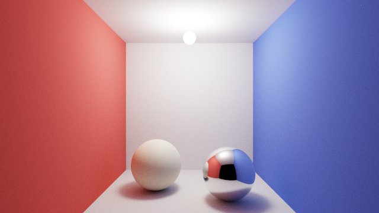
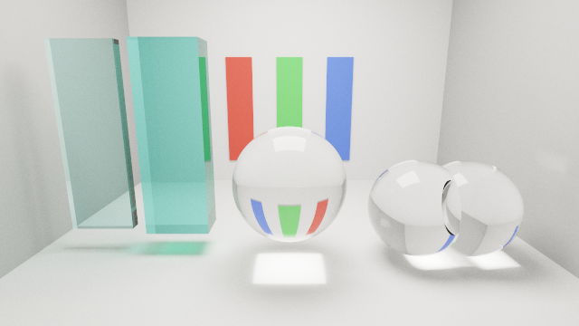
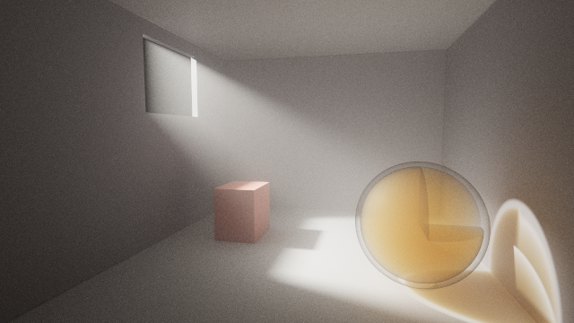

# Chroma

A GPU ray tracer for **CSG**, Constructive Solid Geometry. You describe a scene in a text
file, pass the file to the program, and it renders the solids by tracing rays against them
in a shader.

CSG builds shapes by combining simpler ones with boolean operators: a bolt is a cylinder
*union* a hex head *minus* a threaded groove. Rather than triangulating that, the renderer
intersects rays with the boolean expression directly, so the surfaces are exact at any
distance and there is no mesh anywhere in the pipeline.

| | | |
| --- | --- | --- |
|  |  |  |

More in the [gallery](documents/gallery.md); how to write one of these from scratch is in the
[illustrated manual](documents/manual.md).

```js
// scenes/csg.chroma: a box with a spherical bite taken out of it

camera { position: [0, 2, 5], lookAt: [0, 0, 0], fov: 45 }

// Radius softens the shadows without changing how bright the light is; intensity is large
// because light falls off with the square of the distance.
pointLight { position: [2, 4, 3], color: [1, 1, 1], intensity: 55, radius: 0.4 }

difference {
  box    { min: [-1, -1, -1], max: [1, 1, 1] }
  sphere { center: [0, 0, 0], radius: 1.3 }

  material: { color: [0.8, 0.2, 0.2], roughness: 0.4 }
}
```

```sh
Chroma scenes/csg.chroma
```

## Download

[**Get the latest release**](https://github.com/Alexpert/Chroma/releases/latest): one archive
per platform, each carrying both programs, the shaders, the sample scenes and the .NET runtime
itself. Nothing to install and nothing to build: unzip and run.

| Platform | Archive | How to start it |
| --- | --- | --- |
| Windows x64 | `.zip` | `.\Chroma.exe scenes\cornell.chroma` |
| Linux x64 | `.tar.gz` | `chmod +x Chroma Chroma.SceneDump`, then `./Chroma scenes/cornell.chroma` |
| macOS, Intel and Apple silicon | `.tar.gz` | the same, plus two steps [below](#macos-needs-the-binaries-signed) without which macOS kills it |

The only requirement is a GPU driver exposing **OpenGL 3.3 core** or newer. `RUNNING.txt` inside
each archive repeats the platform's own steps. Building from source is
[below](#requirements), and every `Chroma …` command in this README is
`dotnet run --project src/Chroma -- …` from a clone.

**Write the `.\` on Windows.** PowerShell never searches the current directory, so a bare
`Chroma.exe` fails there whatever the folder; cmd.exe accepts the bare name but rejects
`./Chroma.exe`, because a forward slash is not a path separator it will take at the start of a
command. `.\Chroma.exe` is the one form both shells run.

#### macOS needs the binaries signed

The archives are cross-published from Windows, which produces Mach-O binaries with **no code
signature at all**, and macOS refuses to run an unsigned binary on Apple silicon: it kills the
process at launch and prints `killed`, with no explanation. Clearing the quarantine flag does
not help, because quarantine is not what stopped it.

Signing them ad-hoc, on the Mac, is the workaround. It needs the Xcode command line tools
(`xcode-select --install`):

```sh
chmod +x Chroma Chroma.SceneDump
xattr -dr com.apple.quarantine .
find . -type f \( -name "*.dylib" -o -name "Chroma" -o -name "Chroma.SceneDump" \) \
  -exec codesign --force --sign - {} \;
```

The real fix is to publish the macOS archive **on a Mac**, where the .NET SDK signs the app host
in passing, and that is what a later release will do. Until then this is a limitation of the
download rather than of the renderer.

> Windows is the only archive that has been run end to end. macOS gets as far as the signature
> check described above and has not been seen past it, so its OpenGL context request is reasoned
> from Apple's documented 4.1 cap rather than measured. Linux is unlaunched. Reports welcome.

## Status

It is a path tracer: light bounces, so a red wall tints the white floor beside it, metals
reflect their surroundings, and shadows have real penumbrae. Solids can also be transparent, so
glass refracts what is behind it, tints with its own thickness, and throws a caustic. They can
hold a **participating medium** as well, so a solid can be fog or smoke that light scatters
inside rather than merely crosses. A beam through haze is then visible from the side.

| Iteration | Deliverable | State |
| --- | --- | --- |
| 0 | Design and reference documentation | done |
| 1 | Scene parsing + hierarchy dump tool | done |
| 2 | First render: camera, lights, sphere / box / cylinder | done |
| 3 | CSG operators: union, intersection, difference | done |
| 4 | Correct lighting: bounces, PBR materials, soft shadows | done |
| 5 | Transparency, refraction, Fresnel, caustics | done |
| 6 | Six more primitives: cone, plane, torus, prism, lathe, blob | done |
| 7 | `sphereSweep`, Bézier lathes, string literals | done |
| 8 | Language revision: conditions, loops, `import` | done |
| 10 | Participating media: scattering, fog, smoke | done |
| 11 | Speed, at equal image | done, less adaptive sampling |
| 12 | Per-scene code generation | done |
| 13 | The illustrated manual | done |

See [documents/roadmap.md](documents/roadmap.md) for what each iteration settled and why.
Iteration 9, an audit against the state of the art, is on standby rather than skipped.

Every scene renders between 1.6× and 10.6× faster than it did before iteration 11, and every
one produces a **byte-identical** image while doing so.
[documents/performance.md](documents/performance.md) gives the measured gain of each change,
including the four that were implemented, measured and taken back out.

Ten primitives are available: `sphere`, `box`, `cylinder`, `cone`, `plane`, `torus`, `prism`,
`lathe`, `blob` and `sphereSweep`. Every one of them is a solid with an inside, so every one
is a legal operand of `union`, `intersection` and `difference`. `scenes/shapes.chroma` shows
six of them and bores a hole through the prism to make the point, and
`scenes/sweeps.chroma` cuts a swept tube in half with a `difference`.

A `lathe` outline may be a cubic Bézier, flattened into segments before the scene reaches the
GPU, so a curve costs exactly what the equivalent polyline costs.

### Generating geometry

Scenes are described rather than programmed, but a description repeated a hundred times is
worth writing once. `if` and `for` are ordinary statements that may appear anywhere a field or a
child may, and `import` reuses a file. The control flow is JavaScript's, down to the braces:
`for (let i = 0; i < n; i++)`, `if`/`else`, and `condition ? a : b` where a *value* has to be
chosen. `scenes/lattice.chroma` builds 125 cells and 425 solids in twenty-five lines:

```js
for (let x = 0; x < n; x++) {
  for (let y = 0; y < n; y++) {
    for (let z = 0; z < n; z++) {
      union {
        let p      = ([x, y, z] - mid) * step;
        let corner = (x == 0 || x == n - 1) && (y == 0 || y == n - 1) && (z == 0 || z == n - 1);

        sphere { center: p, radius: node }

        if (x < n - 1) { cylinder { base: p, cap: p + [step, 0, 0], radius: strut } }

        material: corner ? gold : steel
      }
    }
  }
}
```

Control flow runs in the evaluator rather than in a preprocessor ahead of the lexer, which is
what keeps every diagnostic pointing at a line and column **in the file you wrote**, inside a
loop body and inside an imported file alike.

A shape worth repeating with a *difference* is a function. `function` is a `let` that takes
arguments, and `object` places a binding without pretending to be a boolean operator.
`scenes/colonnade.chroma` uses both:

```js
function stone(tint) {
  return material { color: tint, roughness: 0.55 };
}

function column(i) {
  let middle = i * 2 == count - 1;

  return union {
    drum(0, 0.42, 0.22)
    drum(0.22, 0.3, height - 0.46)

    translate: [(i - 2) * spacing, 0, 0]
    material: stone(middle ? [0.80, 0.68, 0.42] : [0.76, 0.74, 0.70])
  };
}

for (let i = 0; i < count; i++) { column(i) }

object { lintel, translate: [0, height, -0.9] }
```

A function's body is evaluated where it was **declared**, not where it is called, so a file of
`function` declarations is a file that can be `import`ed and used without knowing what the
scene around it happens to name.

What a function passes and returns is any value the language has, and two of those are
containers. `[ ... ]` holds anything and nests: numbers, other arrays, records, whole nodes. It
and `struct` declares a record type in the C sense, a fixed set of named fields checked where
an instance is written:

```js
struct Post { at, height, tint }

let posts = [Post { at: -3, height: 1.0, tint: warm },
             Post { at:  3, height: 1.5, tint: cool }];

for (let i = 0; i < posts.length; i++) {
  let p = posts[i];

  box { min: [p.at - 0.2, 0, -0.2], max: [p.at + 0.2, p.height, 0.2], material: p.tint }
}
```

An array of numbers **is** the language's vector rather than a second kind beside it, so the
component-wise arithmetic is unchanged and the built-in library composes with it:

```js
normalize([1, 1, 0]) * 3 + [0, 4, 0]      // a unit direction, scaled, then offset
length(cross([1, 0, 0], [0, 1, 0]))       // 1
```

`a[0] = x` and `p.x = 3` assign, and neither is visible to any other binding: assigning
rebuilds the container and rebinds the name rather than changing anything in place, so both
stay values and `let q = p;` neither copies nor shares. An array written as a *child* rather
than in a field contributes its elements, so `union { shapes }` places all of them. Beside them
is `PI` and the usual library, `sin` through `clamp`; angular *fields* are degrees unless the
scene says `render { angles: "radians" }` once.

A file of these is worth reusing, and `import` is how:

```js
import "palette.chroma";                  // its exports land here
import "warm.chroma" as warm;             // …or behind a name, so two files may both say 'gold'

sphere { material: warm.gold }
```

`private` in front of a `let`, a `function` or a `struct` keeps it inside the file that
declared it. An imported file cannot see the importing scene's bindings, so it means the same
thing wherever it is dropped, and a diagnostic raised inside one names *that* file and line.

`scenes/chess.chroma` is the other worked example, and the reason `%` exists: the colour of a
tile is `(x + z) % 2 == 0 ? gold : steel`, and nothing else in the language says that. The
operator table is C's, whole — `& | ^ ~ << >>` beside the arithmetic and the comparisons, at C's
precedence and with C's associativity — and `&`, `|` and `^` carry both of C's readings, chosen
by their operands: two booleans give the logical connective, two whole numbers the bitwise one.

A loop of a hundred posts writes a hundred *identical* posts, and `random` is what makes them
differ:

```js
render { seed: 7 }

for (let i = 0; i < 200; i++) {
  box { min: [i * 0.3, 0, 0], max: [i * 0.3 + 0.2, 1 + random(i) * 2, 0.2] }
}
```

The numbers are drawn **while the scene is being built**, on the CPU, before anything is
compiled: `random(i)` is an expression like `2 * radius`, and the shader neither knows nor could
know that a value was drawn rather than typed. It takes an argument rather than being a stream,
so no result depends on the order the evaluator happens to walk the tree, and the seed is
written in the file — so a file describes one arrangement rather than a family of them, and the
same file gives the same image on another machine. `perlin(x, y)` is beside it, one octave of
coherent noise from the same seed, for when neighbouring inputs need neighbouring outputs.

### Rendering

```sh
$ Chroma scenes/cornell.chroma
cornell.chroma: 8 primitives, 5 materials, 1 lights
```

A 1280x720 window opens on the scene. `Escape` closes it. Everything in the file, from the
camera position and the field of view to the light colours, the materials and the transforms,
takes effect on the next run, with no rebuild.

**The image arrives noisy and cleans itself up.** One light path per pixel is traced per
frame and averaged into everything before it, so a still camera converges over a few seconds
rather than presenting a finished picture immediately. Resizing the window starts it over.

How long "a few seconds" is depends on the scene, and on two different things.

`scenes/fog.chroma` is the most expensive per sample: a path in a medium stops at a scattering
point instead of at a surface, so it takes more vertices to get anywhere.
`scenes/lattice.chroma` is next, because 425 solids is 425 solids, though it used to be far
and away the slowest and is now ten times quicker, which is what iteration 11 was for.

`scenes/glass.chroma` is cheap per sample and slow to *settle*, which is not the same
complaint. Its only light is an emissive panel, and that is both what makes its caustic
possible and what makes the caustic the last thing in the image to resolve. `--error` measures
this one honestly where a sample count does not.

Adding `--samples <n>` renders that many samples, writes a PNG to `renders/` and closes,
which is what makes a render reproducible enough to measure. `--error <percent>` stops at a
noise level instead of a sample count, which is the fairer question to ask of a scene: how
long until this is clean, rather than how long until it has had 400 tries.

```sh
Chroma scenes/fog.chroma --samples 400
Chroma scenes/cornell.chroma --error 5
```

Either one prints how long the render took and how much noise is left, and the scene's own
line above it says what the shader was compiled with, which is the single thing that most
decides how fast it will be. A scene with more distinct geometry than one program can hold says
so there too, on a line of its own, and is traced in several passes instead — there is nothing
to pass and nothing to choose. See [documents/performance.md](documents/performance.md).

For a render a script can rely on, `--output <path>` writes exactly there rather than to a
dated name, `--size <w>x<h>` asks for a framebuffer, and `--headless` skips showing the window
at all. Both of the first two need a run that ends by itself, so they go with `--samples` or
`--error`. The sampler is seeded from the pixel and the frame index, so the same scene at the
same size and sample count gives the **same PNG byte for byte**, which is what lets every
illustration in the manual be rebuilt and compared:

```sh
powershell -File tools/build-manual.ps1          # render the manual and the gallery
powershell -File tools/build-manual.ps1 -Check   # and prove no image moved
```

### Inspecting a scene

`Chroma.SceneDump` prints the hierarchy the parser understood. When a picture is wrong,
this is what tells you whether the file was read the way you meant.

```sh
$ Chroma.SceneDump scenes/csg.chroma
Camera   position <0, 2, 6>  lookAt <0, 0, 0>  up <0, 1, 0>  fov 45

Lights
  +- PointLight        position <2, 4, 3>  color <1, 1, 1>  intensity 1
  `- DirectionalLight  direction <-0.57735, -0.57735, -0.57735>  color <0.25, 0.25, 0.35>  intensity 1

Solids
  +- Difference  material=red  translate <-1.8, 0, 0>
  |  +- Box  min <-1, -1, -1>  max <1, 1, 1>
  |  `- Sphere  center <0, 0, 0>  radius 1.3
  `- Difference  material=steel  translate <1.8, 0, 0>  rotate <0, 20, 0>
     +- Intersection
     |  +- Box  min <-1, -1, -1>  max <1, 1, 1>
     |  `- Sphere  center <0, 0, 0>  radius 1.35
     `- Union
        +- Cylinder  base <0, -2, 0>  cap <0, 2, 0>  radius 0.5
        +- Cylinder  base <-2, 0, 0>  cap <2, 0, 0>  radius 0.5
        `- Cylinder  base <0, 0, -2>  cap <0, 0, 2>  radius 0.5
```

Mistakes in a scene file are collected and reported together, with a line and a column,
rather than one per run:

```sh
$ Chroma.SceneDump scenes/diagnostics-demo.chroma
scenes/diagnostics-demo.chroma:8:5: error: 'radius' is already defined
scenes/diagnostics-demo.chroma:20:3: error: unknown field 'raduis' on 'sphere'
scenes/diagnostics-demo.chroma:24:8: error: field 'min' expects a vector of 3 components, found a vector of 2 components
scenes/diagnostics-demo.chroma:28:1: error: 'difference' needs at least 2 operands, found 1
4 errors; scene not loaded.
```

## How it works

The split between CPU and GPU is the design's centre of gravity, and it is what distinguishes
this from POV-Ray, the obvious point of comparison. POV-Ray parses and traces on the CPU.
Here the CPU parses and *compiles*, and the GPU traces.

```
.chroma file  ->  lex / parse / bind  ->  scene tree  ->  emit GLSL  ->  compile
                                                                            |
                one fullscreen quad, fragment shader traces every pixel  <--+
```

Three decisions carry most of the design:

**Exact intervals, not distance fields.** A primitive does not answer "where is your nearest
surface". It returns every *span* of the ray that lies inside it, and the operators merge
those span lists. This is the classic Roth formulation, and it is what makes `difference`
produce a genuinely correct cavity with correctly flipped normals, rather than the
approximation that `max(a, -b)` on signed distance fields gives.

**A shader generated for the scene.** The scene tree becomes GLSL for those solids and no
others, so nothing is sized for the worst scene anyone might write. Only the geometry is
generated; the path tracer around it, meaning the sampling, the BRDF, the lights, the media and
the accumulation, stays a hand-written file you can read. This reverses the iteration-0 decision
to interpret a tape, and [documents/code-generation.md](documents/code-generation.md) is where
that reversal is argued and measured.

**Light propagates, so it has to be sampled.** Rather than a shading formula evaluated once,
each pixel traces a light path that bounces, and frames are averaged together. That is the
only way a surface can be lit by another surface, and it is why the image converges instead
of appearing finished.

**A span knows which side of a surface you are on.** `[tIn, tOut]` says whether a ray is
entering a solid or leaving it, which is exactly what refraction needs and what a mesh
renderer has to infer from a normal, getting it wrong on any mesh that is not closed. It is
also where the thickness of glass comes from, and therefore its colour.

The first two are written up in full in
[documents/csg-raytracing.md](documents/csg-raytracing.md), the third in
[documents/lighting.md](documents/lighting.md), the fourth in
[documents/transparency.md](documents/transparency.md).

## Repository layout

| Path | Contents |
| --- | --- |
| `src/Chroma.Core` | the language and the scene model, with no graphics dependency |
| `src/Chroma` | the Silk.NET application: window, upload, ray tracing shader |
| `src/Chroma.SceneDump` | the parser front end, made observable |
| `tests/Chroma.Core.Tests` | xUnit coverage of the whole front end |
| `scenes/` | sample `.chroma` files |
| `documents/` | design and reference documentation |

## Requirements

- .NET 8 SDK
- A GPU driver exposing OpenGL 3.3 Core

```sh
dotnet build Chroma.sln
dotnet test
```

## Documentation

- [documents/manual.md](documents/manual.md): **start here to write a scene.** Every feature in
  the order you meet it, with a rendered picture beside each example, and a coverage table
  saying which image shows which field
- [documents/gallery.md](documents/gallery.md): the sample scenes, rendered, one paragraph each
- [documents/scene-language.md](documents/scene-language.md): the reference for the `.chroma`
  format. Grammar, every node and field, and an appendix of the POV-Ray syntax it was measured
  against
- [documents/csg-raytracing.md](documents/csg-raytracing.md): spans, the three merge
  operators, primitive intersection formulas, the GPU tape and buffer layout
- [documents/lighting.md](documents/lighting.md): the rendering equation, the
  metallic-roughness BRDF, importance sampling, light sampling, and convergence
- [documents/transparency.md](documents/transparency.md): Snell, Fresnel, the microfacet
  BTDF, Beer–Lambert absorption, caustics, the design for participating media, and a **Limits**
  section naming what the renderer cannot do and what each limitation looks like on screen
- [documents/architecture.md](documents/architecture.md): the three stages, the project
  split, and why the boundaries sit where they do
- [documents/code-generation.md](documents/code-generation.md): why each scene is compiled to
  its own GLSL rather than interpreted, and what the generated code looks like
- [documents/gpu-backends.md](documents/gpu-backends.md): how large a scene the driver will
  compile, everything tried against that ceiling and what each attempt measured, how instancing
  finally moved it, and how the fragment and compute paths are built from one shader body
- [documents/instancing.md](documents/instancing.md): how the compiler works out which roots are
  the same solid standing somewhere else without the language saying so, what that bought and
  cost, the two bugs it took to get right, and what is left
- [documents/cutting-unions.md](documents/cutting-unions.md): how a shape too large for any program
  is cut into the operands of its own `union`, why that turns out to be a way of finding repetition
  rather than a way of splitting a scene, what the cut costs in coalescing and where it declines to
  make one. `scenes/cube.chroma` goes from 1360% of the budget and a driver refusal to 3% and a
  render
- [documents/raymarching.md](documents/raymarching.md): the iteration-0 choice of exact intervals
  over distance fields, reopened and then measured. Sphere tracing specified, a distance function
  per primitive, and what the `--sdf` backend turned out to cost: 3.8x slower at equal image and a
  blob it cannot represent. It was also the first backend to compile `chess-full.chroma`, which
  instancing has since made unremarkable
- [documents/csg-tree-optimization.md](documents/csg-tree-optimization.md): whether the CSG tree
  is worth rewriting before it becomes a shader, measured against the WSCG 2020 optimization
  pipeline, with a verdict per stage and what each one would cost here
- [documents/implementation.md](documents/implementation.md): per-file notes and a
  symptom-to-cause pitfalls table
- [documents/roadmap.md](documents/roadmap.md): iterations and what comes after

The three reference documents are deliberately self-sufficient: implementing against them
should not require looking anything up online.

## What it does not do

Named on purpose, so a wrong-looking image can be recognised instead of investigated. Fuller
treatment, with the symptom each produces, in
[documents/transparency.md](documents/transparency.md#limits-of-this-implementation).

- **No nested media.** Glass inside glass is wrong, and so is a solid inside fog; overlapping
  glass under a `union` is not. Subtract the inner solid's space from the outer one and the
  problem goes away, which is what `scenes/fog.chroma` does.
- **No dispersion.** One `ior` per material, three colour channels rather than a spectrum, so
  a prism makes no rainbow.
- **A medium has no internal structure.** `scattering` is one density for a whole solid, so
  smoke has no wisps: it is a uniformly tinted volume with a CSG silhouette. And `scattering`
  is grey where `absorption` is per channel, so a medium's colour comes from what it absorbs,
  which rules out a blue sky.
- **Shadow rays do not refract.** Direct light through glass is dimmed, never focused; a
  caustic arrives only through the bounce loop.
- **Fixed path length.** Paths stop at `maxBounces` with no Russian roulette, which loses the
  energy of longer paths. Glass makes this visible, since crossing one sphere costs two.
- **Emissive solids are not sampled directly**, so a small bright source stays noisy however
  long it renders. Use `pointLight { radius }` to light a scene and `emission` to be seen.
- **What a scene costs is how much *different* geometry it holds, not how much.** Each scene is
  compiled into its own GLSL, and a driver will only take so large a program, so what it counts is
  one body per distinct shape. Repeats are free: the compiler works out which roots are the same
  solid standing somewhere else, emits one of them, and puts the rest in a buffer with a tree over
  them. Writing the same piece twice costs nothing; writing two different ones costs twice.
  `scenes/chess-full.chroma` was kept in the repository because it did not compile — thirty-two
  pieces and sixty-four squares now reach the ray through ten shapes, and it renders.

  A scene past what one program will take is no longer refused either: its geometry is split into
  chunks and traced a stage at a time, one pass per chunk, so nothing has to hold the whole scene
  at once. That happens on its own and needs nothing said in the scene or on the command line.
  `scenes/palisade.chroma` is two hundred posts of two hundred different sizes and is exactly that
  case. The remaining limit is a single *solid* too large to split, since a chunk cuts between
  whole shapes and never inside one. See [documents/gpu-backends.md](documents/gpu-backends.md).
- **One solid may not be arbitrarily complicated.** A `prism` or `lathe` takes 64 points after
  flattening, a `sphereSweep` 32 spheres, a `blob` 16 components. Each is refused with a
  diagnostic naming the field rather than truncated. There is no longer any limit on how many
  stretches of a ray one solid may occupy: that was the interpreter's shared array, and it went
  with it. See [documents/scene-language.md](documents/scene-language.md#limits-and-what-each-primitive-costs).

