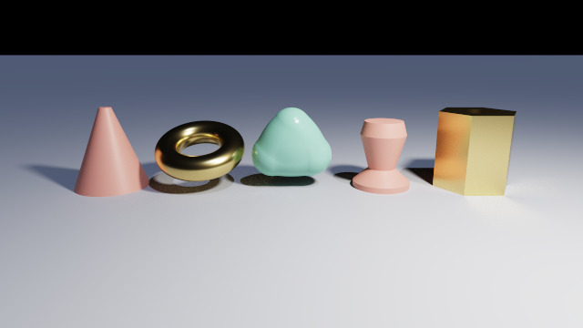
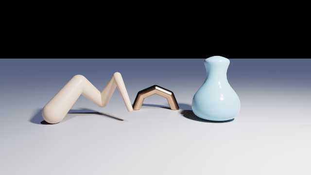
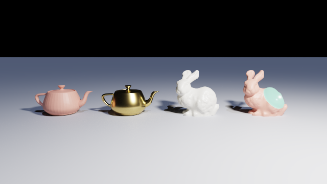
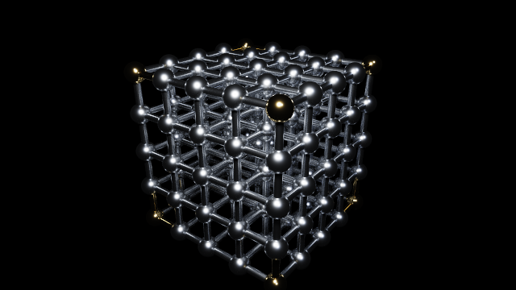
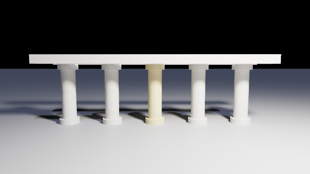
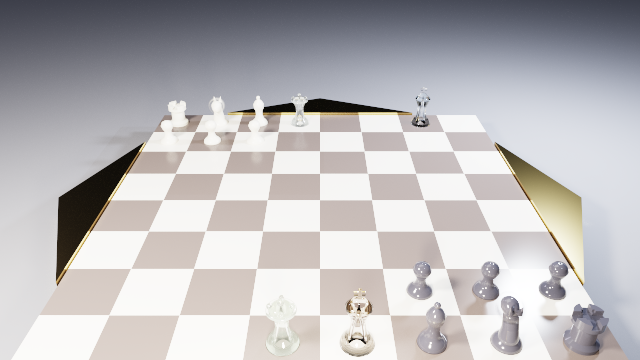

# Gallery

The sample scenes, rendered. Each one was written as the deliverable of an iteration, the thing
that had to appear on screen before that iteration could be called done, so this page is also
the shortest account of what the renderer can do.

Every image here is produced from the scene beside it by
[tools/build-manual.ps1](../tools/build-manual.ps1), at 640×360 and at the sample count that
scene needs. To open one yourself:

```sh
Chroma scenes/cornell.chroma
```

New to the language? [manual.md](manual.md) starts from one sphere and builds up.

---

### `cornell.chroma`: light bounces


The white floor and ceiling take the colour of the walls beside them, with no light aimed at
either and no wall visible in that direction. Colour bleeding is the cheapest possible proof
that light actually propagates: a direct-lighting renderer cannot fake it. The sphere is
`metallic: 1, roughness: 0.05`, and it has a room to reflect, which is the only way a metal is
worth having.

### `glass.chroma`: refraction, thickness and a caustic


Four claims in one picture: the coloured bars behind the sphere are left-right **inverted**,
because a ball of glass images what is behind it; the thicker of the two slabs of the same
glass is markedly darker, because absorption is a rate and not a tint; the two overlapping
spheres under a `union` show no interior seam; and the bright patch on the floor is a genuine
caustic, measured at **1.95×** the light the bare floor receives.

### `fog.chroma`: light that scatters in a volume


A shaft from the window, visible from the side: nothing along it is being lit, the beam itself
is what you see. The ball of smoke has an octant cut out of it with a hard edge, and the haze
carries a spherical hole around the ball. Both are `difference`s, and the medium fills exactly
the spans the operator produces. No clipping geometry, no second representation of the
boundary.

### `shapes.chroma`: six primitives on the ground that is one of them



A cone, a torus, a blob of three merged fields, a lathed vase and a hexagonal prism bored
through by a cylinder, standing on an infinite plane. Every one is a solid with a well-defined
inside, which is what lets the prism be written as a `difference`.

### `sweeps.chroma`: swept tubes and a Bézier lathe



A tapering `sphereSweep` whose joints are seamless because consecutive segments share a whole
sphere; a second sweep closed into a ring and cut in half by a `difference`; and a lathe whose
outline is three cubic Bézier curves, flattened on the CPU so the shader never learns a curve
was involved.

### `meshes.chroma`: two models from files, one with a bite out of it



The Utah teapot shaded by its faces and then by interpolated vertex normals, the Stanford bunny
at 112,402 triangles, and the same bunny with a sphere subtracted. A mesh here is a solid rather
than a surface, so it stands in a `difference` like any other shape and the scoop shows a lit
interior. The teapot is published open at its rim and is closed on load.

### `lattice.chroma`: 425 solids in twenty-five lines



Five by five by five cells of spheres and struts, with the eight corners in a different
material. Written out by hand it would be some four hundred lines; with `for` and a ternary it
is twenty-five. It is also the scene that most rewarded iteration 11, at **10.6×** faster than
before it.

### `colonnade.chroma`: functions and `object`



A column is three drums and a placement, written once as a `function` and called five times.
The lintel is a `let` placed twice with `object`; the two sit one behind the other and read as
one slab from this angle. A function's body is evaluated where it was declared, which is what
makes a file of them safe to `include` into a scene that knows nothing about the names inside
it.

### `chess-half.chroma`: everything at once



Ten primitives, three operators, glass, metal and a medium in one scene: 32 primitives, 10 shapes,
80 placements and 3342 lines of generated GLSL.

The *full* set is in the repository as `chess-full.chroma`. It was **not** in this gallery for
several iterations, and that was worth saying rather than hiding: at 162 primitives it generated
7434 lines, and the driver refuses to compile a fragment program that large. Roughly 65 000
assembly instructions is the cap, and it was the ceiling per-scene code generation traded for its
speed.

Instancing removed the reason. A chess set holds six different pieces however many stand on the
board, and the compiler now works that out for itself, so the full set costs the same ten shapes
as the half set and differs only in how many records are in a buffer.
[gpu-backends.md](gpu-backends.md) is where that is written up.
