# The illustrated manual

How to write a scene, in the order you meet the parts. Every example below is a real file
under [scenes/manual/](../scenes/manual/) and every picture on this page was rendered from the
file beside it by [tools/build-manual.ps1](../tools/build-manual.ps1), so a picture that has
drifted away from its scene is a command anyone can catch rather than something a reader has
to notice.

> **This is not the reference.** [scene-language.md](scene-language.md) is: the grammar, every
> node, every field, every default. Nothing is *defined* here; each section links there for
> the exact rule. Two documents describing the same thing at the same depth is how one of them
> quietly becomes wrong.

**Contents.** [Running it](#running-it) · [A first scene](#a-first-scene) ·
[Where things are](#where-things-are) · [Light](#light) · [Surfaces](#surfaces) ·
[Glass](#glass) · [Fog and smoke](#fog-and-smoke) · [Shapes](#shapes) ·
[Combining shapes](#combining-shapes) · [Saying it once](#saying-it-once) ·
[Rendering](#rendering) · [Coverage](#coverage)

---

## Running it

[Download the archive for your platform](https://github.com/Alexpert/Chroma/releases/latest),
unzip it, and you have everything: both programs, the shaders, the sample scenes and the .NET
runtime. Nothing needs installing. The one requirement is a GPU driver exposing **OpenGL 3.3
core** or newer.

The renderer takes one scene file and any number of options:

```sh
Chroma <scene-file> [options]
```

Written `.\Chroma.exe` on Windows and `./Chroma` on Linux and macOS; this manual writes `Chroma`
for both. The `.\` is worth the keystrokes: PowerShell never searches the current directory, so
a bare `Chroma.exe` fails there, and cmd.exe rejects the forward-slash spelling, so the
backslash form is the only one both shells accept.

On Linux and macOS there are setup steps the archive's own `RUNNING.txt` gives in full: the
executable bit, which an archive built on Windows does not carry, and on macOS an ad-hoc
`codesign`, without which the binary is killed at launch.

> **Working from a clone instead?** Every `Chroma …` command below is the same thing as
> `dotnet run --project src/Chroma -- …`, and `Chroma.SceneDump …` the same as
> `dotnet run --project src/Chroma.SceneDump -- …`. The options are identical.

The scene file is the only required argument, and it is resolved as written, relative to the
working directory rather than to the executable. Everything else is optional, and every option that is
given a value is refused rather than guessed at if the value does not parse.

| Option | What it does |
| --- | --- |
| `--samples <n>` | accumulate `n` samples per pixel, save a PNG, and close. A whole number above 0 |
| `--error <percent>` | stop when the mean relative error falls to that level instead. Give it as a percentage, `--error 5`, because that is how the overlay reports it |
| `--output <path>` | write the PNG exactly there, creating the directory if it does not exist, rather than to a dated name in `renders/` |
| `--size <w>x<h>` | ask for that framebuffer instead of 1280×720, as in `--size 640x360` |
| `--headless` | do not show the window at all |
| `--emit-shader <path>` | write the GLSL this scene was compiled into, exactly as the driver received it. The answer to "a generated shader is a shader you cannot read" |
| `--compute` | run the tracer as a compute shader where the machine allows it. Opt-in, and on the hardware it was measured on it is a wash. See [gpu-backends.md](gpu-backends.md) |
| `--tbo` | on the compute path, read the scene tables through a sampler rather than a storage buffer. A measurement lever, nothing more |
| `--wavefront` | trace the path one stage at a time over ray state in buffers, on a scene that does not need it. Implies `--compute`. A scene that *does* need it uses it without being asked, so this is here to compare the two paths on one picture |
| `--budget <n>` | override how large a program the compiler believes it may emit, forcing a scene to be split that would otherwise fit. The other half of the same comparison: a scene that genuinely has to be split has nothing to be compared against |
| `--sdf` | find geometry by sphere tracing a distance field rather than by exact spans. A demonstrator, kept so that the choice iteration 0 made on reasoning alone can be measured: at equal image it is 3.8x slower, and a shape whose field is only an estimate renders with holes in it. See [raymarching.md](raymarching.md) |
| `--enhanced` | march by the planar extrapolation of Bálint and Valasek 2018 instead of the plain sphere trace. Measured slower at every step count tried, so it is here to be compared rather than to be used |
| `--march <n>` | how many marching steps a ray may take, 128 by default. A whole number above 0 |

The last two only mean anything with `--sdf`, since the default backend has no marcher to tune;
given on their own they are accepted and do nothing.

`--march` is the lever for the two ways sphere tracing goes wrong. Too few steps and whatever a ray
reaches only by grazing it never converges, so a ground plane fades out short of the horizon; the
scene looks trimmed rather than noisy, and raising the count is what fills it in. Too many and one
frame can run past the two seconds the operating system allows a single GPU command, which restarts
the driver and ends this program without a message. That is why the driver-reset advice names
`--march` beside `--size`, and why a slow first frame is warned about before it is drawn.

```sh
Chroma scenes/shapes-bezier.chroma --sdf --march 512 --samples 300
Chroma scenes/shapes-bezier.chroma --sdf --enhanced --samples 300
```

Three rules about combining them:

- **`--samples` and `--error` together** stop at whichever comes first, which is how a noise
  target is given a ceiling on a scene that might never reach it.
- **`--output` and `--headless` need one of those two.** Neither makes sense for a run that only
  ends when someone closes the window, and a window nobody can see would never end at all.
- **`--enhanced` and `--march` need `--sdf`**, as above.

With no options at all, a window opens and stays open: that is the interactive mode the rest of
this manual is written against. `Escape` closes it.

The process exits **0** on success, **1** if the scene has errors (every diagnostic is printed
first, and nothing is rendered), and **2** on a bad command line or a file that is not there.

**If nothing happens for a while, it is the graphics driver compiling.** A scene is compiled into
GLSL for that scene and no other, and the driver's own compiler is what turns that into something
the card runs. That is seconds on a small scene and, the *first* time a large one is ever built,
minutes. Any step that takes longer than a second says so and counts itself out:

```
  compiling 7 programs, 4 back   14 s
```

The line disappears when the step finishes. It is worth knowing that this cost is almost always
paid once: the driver keeps what it compiled in a cache of its own, so the same scene starts at
once next time. The exception is a scene too large to compile at all, which is refused and
therefore never cached, and so waits just as long on every run. [gpu-backends.md](gpu-backends.md)
has the measurements.

There is a second program, which renders nothing and prints the hierarchy the parser understood:

```sh
Chroma.SceneDump <scene-file>
```

It takes no options. [When a picture is wrong](#when-a-picture-is-wrong) is what it is for.

---

## A first scene

A scene file is a list of nodes. Each one is a type name followed by a block of `field: value`
entries, and the whole file is read top to bottom.

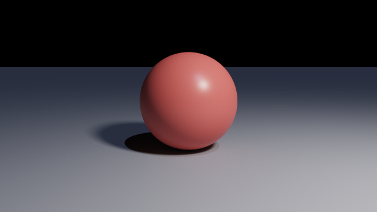

<!-- from: scenes/manual/first-scene.chroma -->
```js
camera {
  position: [0, 1.7, 6],
  lookAt:   [0, 0.9, 0],
  fov:      40
}

pointLight {
  position:  [4, 6, 5],
  color:     [1, 0.97, 0.92],
  intensity: 105,
  radius:    0.6
}

plane {
  normal:   [0, 1, 0],
  distance: 0,
  material: material { color: [0.45, 0.46, 0.5], roughness: 0.6 }
}

sphere {
  center:   [0, 1, 0],
  radius:   1,
  material: material { color: [0.8, 0.2, 0.18], roughness: 0.35 }
}
```

Run it:

```sh
Chroma scenes/manual/first-scene.chroma
```

A window opens and the picture **arrives noisy and cleans itself up**: one light path per
pixel is traced per frame and averaged into everything before it. `Escape` closes it.

Four things are worth knowing about that file before anything is added to it:

- **A camera is required and there is exactly one.** Without it there is no picture to render
  and the loader says so.
- **Commas are optional**, everywhere. So are newlines. `sphere { center: [0 1 0] radius: 2 }`
  is the same scene.
- **A material written inline can drop its type name.** `material: { color: [...] }` and
  `material: material { color: [...] }` are the same thing: the field says what the block is.
- **Anything below `y = 0` is inside that `plane`**, which is why the sphere has something to
  cast a shadow on. A plane here is a solid half-space, not a sheet.

The full file adds a second light, a dim blue `directionalLight`, for the side of the sphere
the point light never reaches. With one light and a black background, everything facing away
from it is lit only by what bounces off the floor.

---

## Where things are

The coordinate system is right-handed: **+X right, +Y up, +Z towards the viewer**.

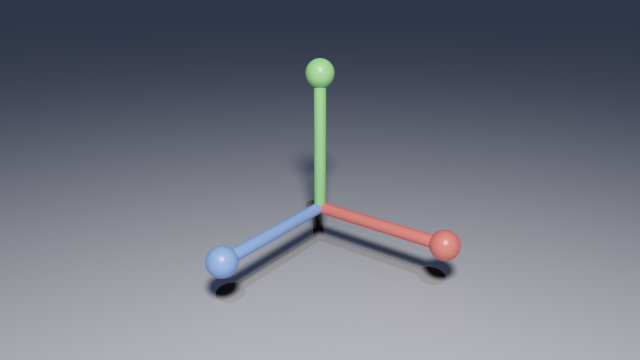

<!-- from: scenes/manual/coordinates.chroma -->
```js
union {
  cylinder { base: [0, 0, 0], cap: [arm, 0, 0], radius: stem }
  sphere   { center: [arm, 0, 0], radius: 0.16 }
  material: red
}
```

**Put the camera at positive Z.** With `position: [0, 0, 7]` looking at the origin, the camera
faces down `-Z` and world `+X` lands on the right of the image, which is what everyone expects.
Placing it at negative Z is legal and mirrors the result left to right, with no error to
explain it. That is the one trap a POV-Ray habit walks into, and
[scene-language.md](scene-language.md#coordinate-system) spells it out.

`fov` is the **vertical** angle the image covers, in degrees. These two renders are the same
file with one number changed:

| `fov: 28` | `fov: 70` |
| --- | --- |
| 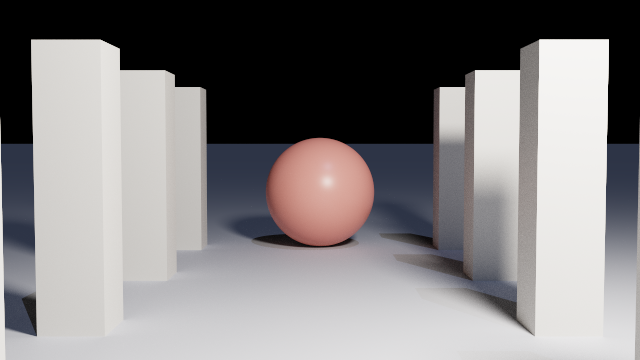 | 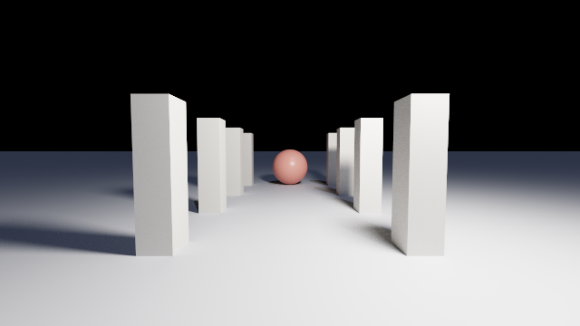 |

The camera does not move between them. A narrow angle flattens depth: the far columns are
nearly the size of the near ones. A wide angle exaggerates it.

Fields: [`camera`](scene-language.md#camera--required-exactly-one).

---

## Light

Two kinds of light: `pointLight`, which has a position and falls off with distance, and
`directionalLight`, which arrives from infinitely far away with no falloff at all.

**Brightness falls off with the square of the distance**, so useful `intensity` values are much
larger than they look. A room-sized scene typically wants tens to hundreds.

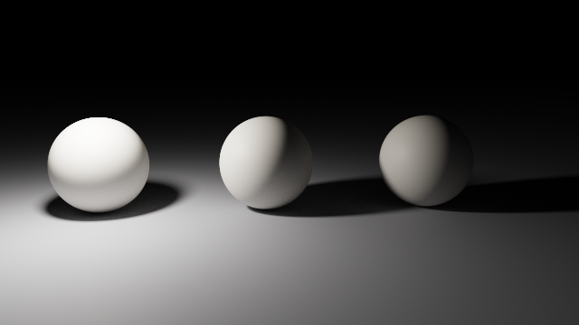

Three identical spheres, one light beside the left one. The middle is twice as far and gets a
quarter as much; the right is three times as far and gets a ninth.

### Soft shadows

`radius` turns the light from an idealised point into a sphere. It is a **pure softness
control**: the light is normalised so widening it does not change how brightly anything is
lit. Only the shadows change:

| `radius: 0` | `radius: 1.2` |
| --- | --- |
| 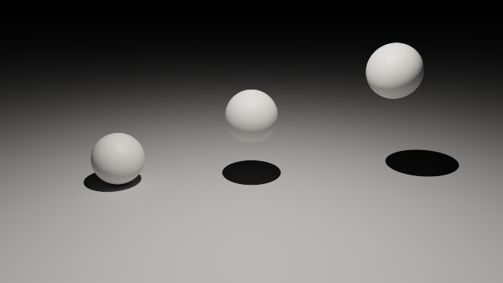 | 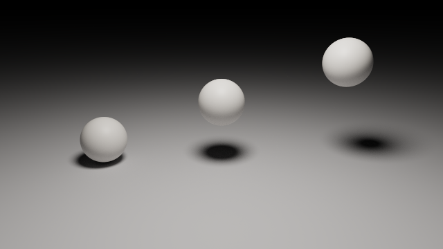 |

Same file, same brightness, one number. Note *which* shadow softens most: the penumbra widens
with the gap between the occluder and the floor, as it does in life.

### A light with no position

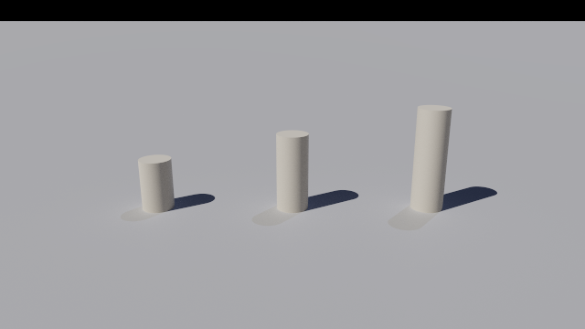

<!-- from: scenes/manual/light-directional.chroma -->
```js
directionalLight {
  direction: [0.55, -0.75, -0.35],
  color:     [1, 0.96, 0.88],
  intensity: 1.9
}
```

`direction` is the way the light **travels**, not the way it comes from. Every shadow leaves
its post at the same angle and stays the same width, and the far post is no dimmer than the
near one.

Fields: [`pointLight`](scene-language.md#pointlight),
[`directionalLight`](scene-language.md#directionallight).

---

## Surfaces

One `material` node covers every surface, in the metallic-roughness form. The two fields that
do most of the work are `roughness` and `metallic`.

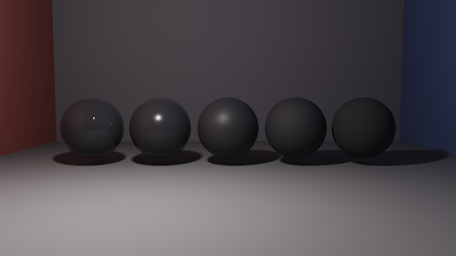

<!-- from: scenes/manual/material-roughness.chroma -->
```js
for (let i = 0; i < count; i++) {
  sphere {
    center:   [(i - 2) * 1.55, 0.85, 0],
    radius:   0.7,
    material: material {
      color:     [0.06, 0.06, 0.07],
      roughness: i / (count - 1)
    }
  }
}
```

`roughness` runs `0` (mirror-smooth) to `1` (fully matte) and decides how widely a reflection
is spread. The spheres above are deliberately near-black: a dielectric reflects about 4% of
the light head-on, which is invisible against a pale base and is the whole picture against a
dark one.

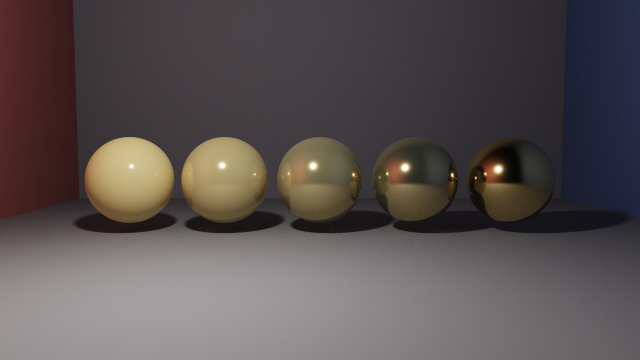

`metallic` crosses from dielectric to metal. **A metal has no diffuse component at all**: it
only reflects its surroundings, so a metal solid in an empty scene renders nearly black. That
is correct rather than broken. Give it something to reflect. The gold sphere on the right is showing
the red wall on one side and the blue on the other.

### A surface that is a light

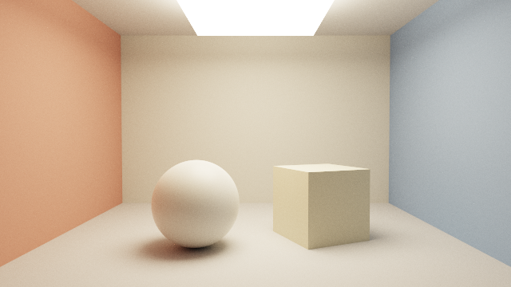

`emission` is radiance, and it is not clamped, because a light is not limited to the brightness
of white paint. There is no `pointLight` anywhere in that file; the panel is an ordinary `box`
with an emissive material, and the colour on the floor is the walls bouncing into it.

**An emissive solid is *seen* rather than used to light a scene.** It is found only when a
bounced ray happens to land on it, so a large panel converges reasonably and a small bright
source stays noisy however long it renders. That image needs 20 000 samples where most on this
page need two or three thousand. Use `pointLight { radius }` to light a scene, and `emission`
to be visible in it. [lighting.md](lighting.md#emissive-surfaces-are-not-sampled) explains why
the two are not interchangeable.

Fields: [`material`](scene-language.md#material).

---

## Glass

`transmission: 1` with a low `roughness` is glass.

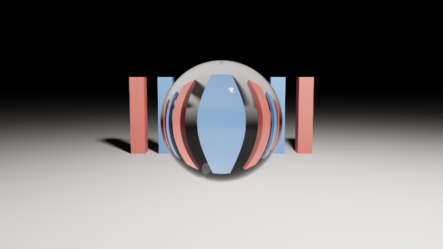

<!-- from: scenes/manual/material-transmission.chroma -->
```js
render { maxBounces: 12, exposure: 0.7 }

let glass = material { roughness: 0, transmission: 1, ior: 1.5 };
```

Three things happen at once there, and all three are visible: the bars behind the ball arrive
**left-right inverted**, because a ball of glass is a lens; the rim brightens where the surface
turns away, which is Fresnel; and the pool under it is brighter than the floor beside it,
because light that would have passed by has been bent into it.

**Raise `maxBounces`.** Crossing a glass surface costs a bounce each way, so the default of 4
does not get through a sphere and on to what is behind it. That is the field's whole job: it is
the path length, `1` is direct lighting only, and the range is 1 to 16.

### What `ior` does

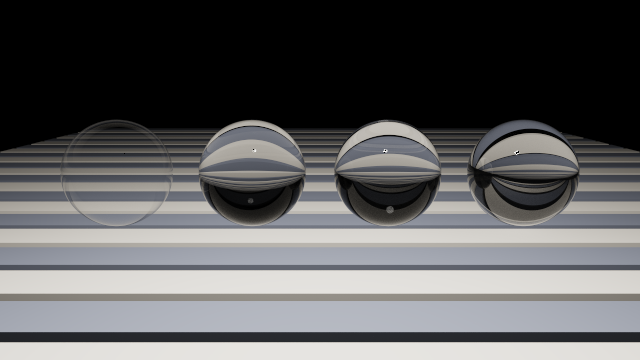

`ior` does two jobs at once. It decides how hard light bends (at `1` the ball is optically
invisible, at `2.2` it throws the stripes about), and it sets how much the surface reflects,
since a dielectric reflects `((n-1)/(n+1))²` head-on. The rim brightens across the row for that
second reason.

An `ior: 1` solid is invisible and **not free**: it still spends two bounces being crossed.

### Colour comes from absorption

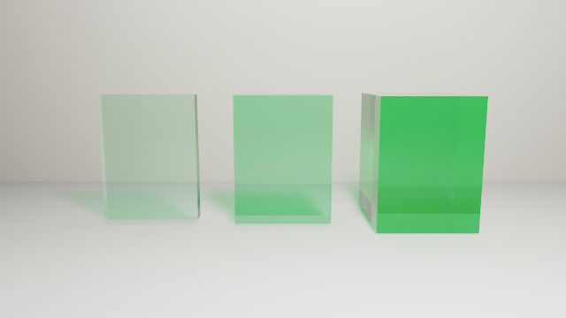

<!-- from: scenes/manual/material-absorption.chroma -->
```js
let bottle = material {
  roughness:    0,
  transmission: 1,
  ior:          1.5,
  absorption:   [1.6, 0.25, 1.1]
};
```

One material, three thicknesses: 0.2, 0.6 and 1.4 units. `absorption` is a **rate per world
unit**, so doubling a thickness squares what gets through, which is exactly why real glass
looks pale in a window and deep in a bottle.

At `transmission: 1` the material's own `color` does nothing, because what is not reflected
passes through instead of scattering and there is no diffuse lobe left to tint. To colour
glass, absorb.

The model is written up in [transparency.md](transparency.md), including a **Limits** section
naming what it cannot do, such as nested media and dispersion, and what each looks like on
screen.

---

## Fog and smoke

A medium is what happens *between* a solid's surfaces rather than at them, and it is three
fields on the same `material`: `transmission` to let light inside at all, `ior: 1` so the
volume is air rather than a lens, and `scattering` for how often light changes direction in
there.

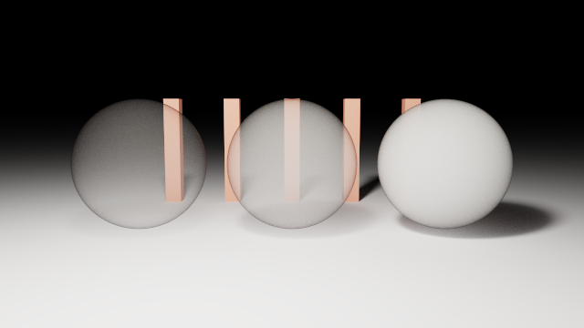

<!-- from: scenes/manual/medium-scattering.chroma -->
```js
material: material {
  transmission: 1,
  ior:          1,
  scattering:   i == 0 ? 0.15 : i == 1 ? 0.6 : 2.4,
  anisotropy:   0.3
}
```

Same shape, same glass, three densities. The left ball is a haze you can read a bar through;
the right one stops nearly everything at its surface.

**Raise `maxBounces` for a medium.** A scattering event costs a bounce like any other vertex,
and crossing the boundary costs two before any scattering happens. Too few and a dense medium
reads as too dark, which is the path length's bias and not the fog's.

### What makes a beam

`anisotropy` is the direction light prefers to keep. Both images below are the same room, the
same window and the same haze, with `0` on the left and `0.7` on the right:

| `anisotropy: 0` | `anisotropy: 0.7` |
| --- | --- |
| 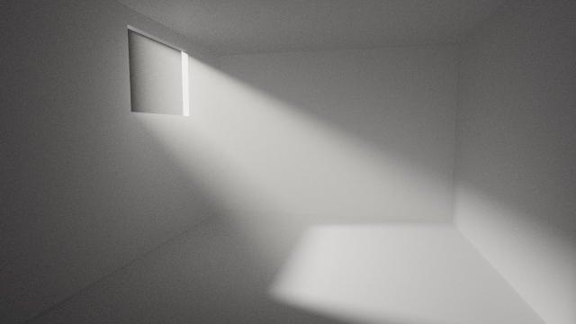 | 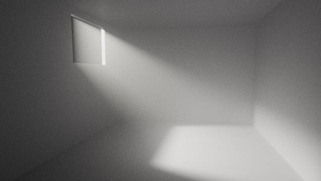 |

At `0` the haze scatters equally in every direction and the shaft is broad and washed out
against a milky room. At `0.7` it scatters mostly forwards, which concentrates what is
scattered into the beam's own direction: the shaft sharpens and the room dims, so the same
light buys far more contrast. Nothing along that beam is being lit: the beam is what you see.

Two things to keep in mind, both of which produce a picture that looks like a renderer bug:

- **A medium needs a solid to live in, and the solid must be sealed.** The volume is bounded by
  CSG, so `difference { box, sphere }` filled with fog is fog with a spherical hole in it. That
  costs nothing extra: the medium fills whatever spans the operator produces.
- **No nested media.** A solid inside another transmissive solid is wrong and is not reported.
  Subtract the inner solid's space from the outer one and the problem goes away, which is what
  `scenes/fog.chroma` does.

A medium's colour comes from `absorption`, which is per channel; `scattering` is one number for
all three. [transparency.md](transparency.md#the-trap-one-distance-three-channels) gives the
reason.

---

## Shapes

Ten primitives. **Every one of them is a solid with an inside**, which is what lets any of them
stand in a CSG operator. None has POV-Ray's `open` modifier and none will, because an uncapped
shape has no well-defined inside.

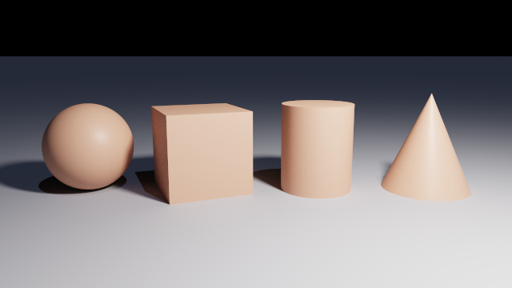

<!-- from: scenes/manual/primitives-basic.chroma -->
```js
sphere {
  center:   [-3.3, 0.85, 0],
  radius:   0.85,
  material: clay
}

cone {
  base:       [3.4, 0, 0],
  baseRadius: 0.85,
  cap:        [3.4, 1.9, 0],
  capRadius:  0,
  material:   clay
}
```

A `box` is axis-aligned as written, so turn it with `rotate`. A `cylinder` is capped at both
ends, because a tube has no inside. A `cone` is truncated: `capRadius: 0` is what makes the
familiar point, and equal radii give a cylinder.

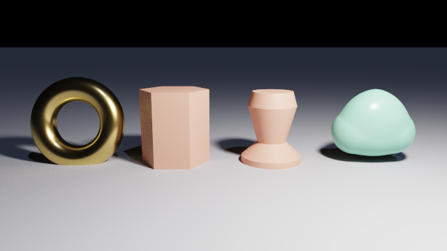

- **`torus`** lies in the XZ plane with Y through the hole. It is the first shape here that is
  not convex: a ray through the hole crosses it twice.
- **`prism`** sweeps a flat contour up the Y axis between `bottom` and `top`, and caps both.
- **`lathe`** revolves an outline in `(radius, y)` about the Y axis.
- **`blob`** is not a shape but a **threshold on a sum of fields**: overlapping components merge
  into one smooth surface instead of showing a seam, which is not something `union` can do.

`prism` and `lathe` take a **flat list of interleaved pairs**, `[x0, z0, x1, z1, ...]`, because
a vector in this language is a list of numbers and does not nest. The contour closes on its own.

### The ground is a shape too

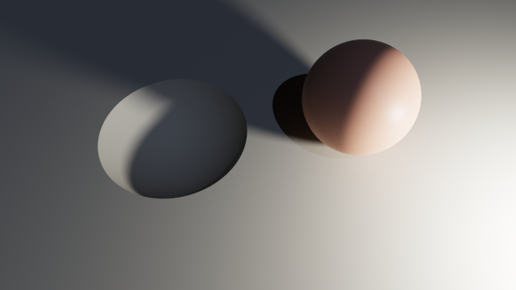

<!-- from: scenes/manual/primitive-plane.chroma -->
```js
difference {
  plane  { normal: [0, 1, 0], distance: 0 }
  sphere { center: [-1.5, 0.5, 0], radius: 1.4 }

  material: ground
}
```

`plane` is an **infinite half-space**: everything on the side its normal points away from. Being
a solid rather than a sheet is what makes that crater a `difference` of two ordinary operands,
and the inside of the hollow is lit rather than black because a subtracted surface keeps a
normal pointing into the room.

### Curves

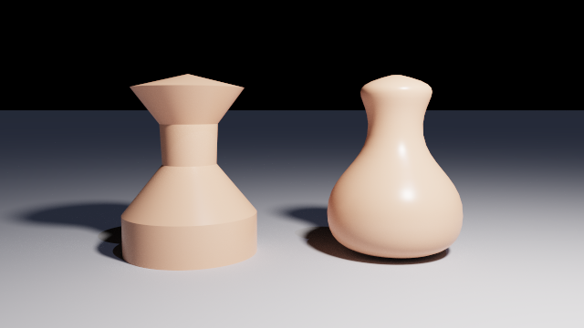

<!-- from: scenes/manual/primitive-lathe.chroma -->
```js
lathe {
  spline: "bezier",
  steps:  10,
  points: [
    // P0        control     control     P3
    0,    0,     0.55, 0,    0.75, 0.1,   0.75, 0.45,
    0.75, 0.45,  0.75, 0.9,  0.28, 1.0,   0.30, 1.45,
    0.30, 1.45,  0.32, 1.8,  0.62, 1.85,  0,    2.0
  ],
  translate: [1.15, 0, 0],
  material:  clay
}
```

With `spline: "bezier"` the points are read as **groups of four** (start, two controls, end),
and each curve is flattened into `steps` segments before the scene reaches the GPU. A curve
therefore costs exactly what the polyline of the same vertex count costs.

A curved outline also gets its **normals blended across the joints** and a hand-written one does
not, which is the difference you can see above: the left vase keeps the hard edges its corners
ask for, the right one has a continuous highlight instead of a stack of rings.

### A swept tube


<!-- from: scenes/manual/primitive-spheresweep.chroma -->
```js
sphereSweep {
  spheres: [
    -2.3, 0.42, 0.3,   0.34,
    -1.2, 1.5,  0,     0.28,
     0.1, 0.55, -0.3,  0.2,
     1.2, 1.7,  0,     0.14,
     2.3, 0.6,  0.35,  0.1
  ],
  material: copper
}
```

`sphereSweep` is the volume swept by a sphere whose centre **and radius** vary along a path:
groups of four numbers, `x, y, z, radius`. The joints are seamless without any special
treatment, because consecutive segments share a whole sphere rather than meeting at a face. The
path is **open**, so repeat the first sphere at the end to close a loop.

Fields, defaults and the cost of each shape:
[Primitives](scene-language.md#primitives).

---

## Combining shapes

Three operators, taking their operands as **children** rather than as a field.

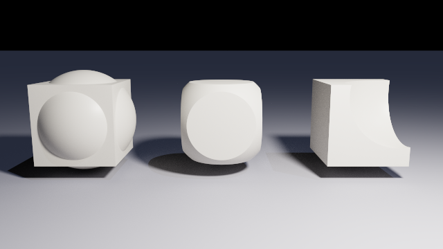

<!-- from: scenes/manual/csg-operators.chroma -->
```js
difference {
  box    { min: [-unit, -unit, -unit], max: [unit, unit, unit] }
  sphere { center: [0.55, 0.55, 0.55], radius: 0.98 }

  translate: [2.7, 1.05, 0],
  material:  stone
}
```

Same two operands throughout: `union` is everything inside either, `intersection` only what is
inside both, `difference` the **first** operand minus the rest. Only `difference` cares about
order.

There is **no `merge` operator and none is needed**: `union` here merges intervals, so the
faces buried inside an overlap stop existing. POV-Ray needs one because its `union` keeps them.

### Placement

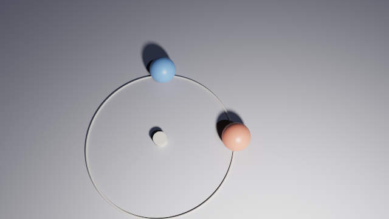

<!-- from: scenes/manual/transforms.chroma -->
```js
sphere {
  radius:    0.45,
  center:    [0, 0.45, 0],
  rotate:    [0, 90, 0],
  translate: [2.4, 0, 0],
  material:  material { color: [0.8, 0.3, 0.22], roughness: 0.4 }
}
```

**Transform modifiers apply in the order they are written.** The red ball rotates first, which
does nothing to a ball on the origin, and then moves out to `[2.4, 0, 0]`. The blue one moves
first and is then carried a quarter turn around the origin by the same rotation, landing at
`[0, 0, -2.4]`. The ring is the arc it travelled.

`rotate` is Euler angles in **degrees**, applied X then Y then Z. A parent's transform composes
on top of its children's, as in any scene graph.

### Writing a shape once

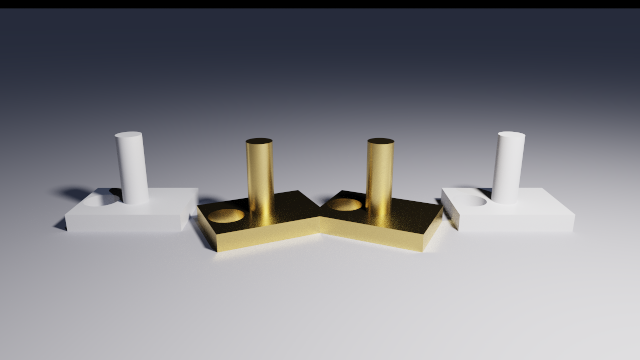

<!-- from: scenes/manual/object-binding.chroma -->
```js
let bracket = difference {
  union {
    box      { min: [-0.7, 0, -0.5], max: [0.7, 0.22, 0.5] }
    cylinder { base: [0, 0.22, 0], cap: [0, 1.1, 0], radius: 0.16 }
  }

  cylinder { base: [-0.45, -0.1, 0], cap: [-0.45, 0.32, 0], radius: 0.22 }
};

object { bracket, translate: [-2.4, 0, 0], material: pewter }
object { bracket, translate: [-0.8, 0, 0], rotate: [0, 25, 0], material: brass }
```

A `let` can hold a whole subtree, and referencing it **instantiates** it: four independent
solids above, not four references to one.

A reference on its own takes no modifiers, because `bracket { translate: ... }` would read as a
node type called `bracket`. That is what [`object`](scene-language.md#object) is for: it wraps
exactly one solid and carries the placement and the material the bare reference cannot. It
costs nothing, since a `union` of one operand is that operand and no instruction is emitted
for it.

### The one rule that only bites on glass

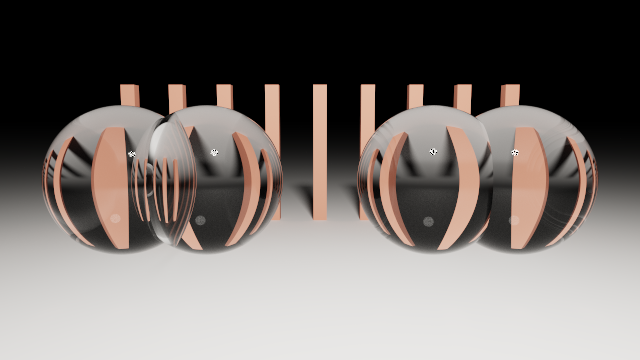

Solids written one after another at the top level of a file are unioned, but **not merged**.
The renderer resolves each top-level solid separately, so their spans are never combined and
the faces buried inside an overlap survive. The left pair above has a lens-shaped seam through
its middle; the right pair is one `union` and has none.

For opaque solids the two are indistinguishable, which is why this only surfaces once something
is transparent. **If two overlapping glass solids are meant to be one object, write the union.**

Semantics: [Operators](scene-language.md#operators).

---

## Saying it once

A scene is described rather than programmed, but a description repeated a hundred times is
worth writing once. `if` and `for` are ordinary statements that may appear anywhere a field or a
child may, including the top level of a file, and what they produce is spliced into the list
around them.


<!-- from: scenes/manual/loop-grid.chroma -->
```js
for (let x = 0; x < n; x++) {
  for (let z = 0; z < n; z++) {
    let dx     = x - (n - 1) / 2;
    let dz     = z - (n - 1) / 2;
    let far    = dx * dx + dz * dz;
    let height = 0.3 + far * 0.11;

    if (far > 1) {
      box {
        min:       [-0.22, 0, -0.22],
        max:       [0.22, height, 0.22],
        translate: [dx * step * 2, 0, dz * step * 2],
        material:  far < 5 ? warm : pale
      }
    }
  }
}
```

The loop is C's and JavaScript's, braces included. Three rules are worth stating because they
are where a scene file goes wrong:

- **`if` is a statement and produces entries, never a value.** To choose a *value*, such as the
  material above, use the ternary `condition ? a : b`.
- **There is no truthiness.** `if (count)` is an error, not a shortcut. A condition is a
  boolean, and a boolean comes only from a comparison or a literal.
- **Nothing shadows.** A name already visible cannot be bound again, loop counters included. A
  binding is mutable, so `let` inside a loop body is fresh each time round rather than colliding
  with itself.

### Functions

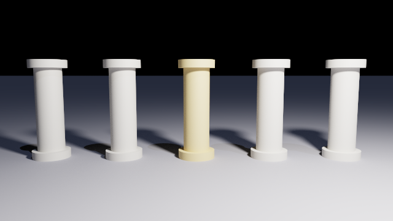

<!-- from: scenes/manual/function-row.chroma -->
```js
function stone(tint) {
  return material { color: tint, roughness: 0.55 };
}

function column(i) {
  let middle = i * 2 == count - 1;
  let shaft  = 1.9;

  return union {
    drum(0, 0.42, 0.18)
    drum(0.18, 0.3, shaft)
    drum(0.18 + shaft, 0.42, 0.18)

    translate: [spacing(i), 0, 0],
    material:  stone(middle ? [0.82, 0.66, 0.36] : [0.76, 0.74, 0.7])
  };
}

for (let i = 0; i < count; i++) { column(i) }
```

**A function is a `let` that takes arguments.** Its body is a statement list and the result
comes out through `return`, so the work leading to a value is written in the function rather
than folded into one expression. What it returns is an ordinary value: a solid, a material, a
number, a vector.

The arguments are evaluated where the call is written; the **body is evaluated where the
function was declared**. So a function means the same thing wherever it is called from, which is
what makes a file of functions worth including.

### Every other one

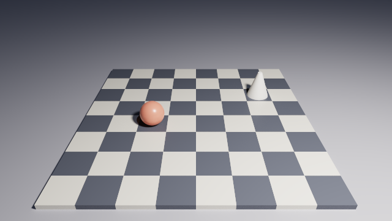

<!-- from: scenes/manual/checkerboard.chroma -->
```js
material:  (x + z) % 2 == 0 ? dark : light
```

That line is why `%` exists. It follows C and JavaScript: a remainder, taking the sign of its
left operand, and it does not insist on whole numbers.

**The operator table is C's**, whole: `& | ^ ~ << >>` beside the arithmetic and the
comparisons, at C's precedence and with C's associativity. Two of those places are inconvenient
and are kept anyway, because a scene written by someone who knows C must not quietly mean
something else — a shift binds looser than `+`, so `1 << 1 + 2` shifts by three; and `&`, `^`
and `|` bind looser than `==`, so `x & 1 == 0` reads as `x & (1 == 0)`, which is an error here
rather than a wrong number.

`&`, `|` and `^` carry both of C's readings, chosen by their operands: two booleans give the
logical connective, two whole numbers the bitwise one. Nothing mixes the kinds. `^` is the one
that had no spelling at all before — "exactly one of these" had to be written
`(a || b) && !(a && b)`.

### Variation

A loop of a hundred posts writes a hundred *identical* posts. `random` is what makes them
differ, and it is a function of its argument rather than a stream:

```js
render { seed: 7 }

for (let i = 0; i < 200; i++) {
  box {
    min: [i * 0.3, 0, 0],
    max: [i * 0.3 + 0.2, 1 + random(i) * 2, 0.2]
  }
}
```

**The numbers are drawn while the scene is being built**, on the CPU, before anything is
compiled. `random(i)` is an expression like `2 * radius`; its result is an ordinary number in a
field, and the shader neither knows nor could know that a value was drawn rather than typed. It
is a different thing entirely from the per-pixel hash inside the shader, which draws a fresh
number every sample because averaging those samples is what the image *is*.

**The seed is in the file, so the file describes one arrangement rather than a family of
them.** `render { seed: 7 }`, changing the number gives another set of posts, putting it back
gives the first set again, and the same file gives the same image on another machine. That is
why the seed may not be an expression: it is read from the text of the file before anything is
evaluated, because the numbers it decides are drawn long before the `render` block is bound.
Absent, it is `0` — a fixed default and never a clock, since a scene that looks different every
time it is opened cannot be reviewed.

`perlin(x, y)` is the same idea with one property added: **neighbouring inputs give
neighbouring outputs**, which is the difference between scattering a hundred posts and growing
a landscape. One octave, in `[-1, 1]`, from the same seed; stacking octaves is a loop in the
scene, not a parameter of the function.

Rules: [Built-in functions](scene-language.md#built-in-functions).

### Reusing a file

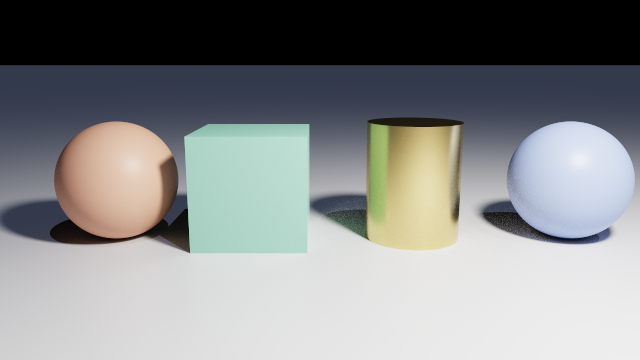

<!-- from: scenes/manual/include-palette.chroma -->
```js
include "palette.chroma";
```

The path is resolved **relative to the file that wrote it**, not to the working directory, so a
folder of fragments that include each other keeps working wherever the renderer is run from.

Visibility is deliberately **asymmetric**: the fragment's bindings become visible to the scene
that included it, and the scene's bindings are *not* visible to the fragment. A fragment that
exports nothing is not worth including; one that can read its host means something different in
every scene it is dropped into. Parameterising it is what functions are for. A diagnostic
raised inside a fragment names *that file*, with its own line and column.

Rules: [Conditions and loops](scene-language.md#conditions-and-loops),
[Functions](scene-language.md#functions).

---

## Rendering

```sh
Chroma scenes/manual/first-scene.chroma
```

A 1280×720 window opens, an overlay reports resolution, samples, elapsed time, sample rate and
how much noise is left, and a **Save PNG** button writes the current image to `renders/` under a
dated name. `Escape` closes the window. Everything in the file takes effect on the next run,
with no rebuild.

**The image arrives noisy and cleans itself up**, and the overlay's noise bar is how far along
that is. It is logarithmic rather than linear, because Monte Carlo error falls as 1/√N: going
from 20% noise to 10% costs four times the samples already spent, and from 10% to 5% four times
that again. On a log scale each of those equal-cost steps is an equal step along the bar.
Resizing the window starts the accumulation over, since every sample taken so far described
different pixels.

The options that end a run by itself are listed [at the top](#running-it). Together they are
what makes a render something a script can rely on:

```sh
Chroma scenes/manual/first-scene.chroma \
  --samples 1500 --size 640x360 --headless --output documents/images/manual/first-scene.png
```

That is what produced the first picture on this page. The sampler is seeded from the pixel and
the frame index, so a fixed sample count at a fixed size gives the **same PNG byte for byte**,
which is what makes regenerating this manual a check rather than a commit. From a clone of the
repository, where the scenes and the images both live:

```sh
powershell -File tools/build-manual.ps1           # render every illustration
powershell -File tools/build-manual.ps1 -Check    # and prove nothing moved
powershell -File tools/build-manual.ps1 -Verify   # every example loads, every quote matches
```

`--error` is the fairer question to ask of a scene (how long until this is clean, rather than
how long until it has had 400 tries), and it is what the sample counts in that script were
chosen with. [performance.md](performance.md) has the measurements.

### When a picture is wrong

`Chroma.SceneDump` prints the hierarchy the parser understood, which is what tells you whether
the file was read the way you meant:

```sh
Chroma.SceneDump scenes/manual/object-binding.chroma
```

Mistakes are collected and reported together, each with a file, a line and a column, and any
error means no render at all:

```
scenes/demo.chroma:12:11: error: unknown field 'raduis' on 'sphere'
scenes/demo.chroma:19:3:  error: 'difference' needs at least 2 operands, found 1
```

Two symptoms that are *not* bugs, because both cost more to diagnose than to recognise:

- **A metal solid in an empty scene is nearly black.** It has nothing to reflect.
- **A face pointing away from every light is black**, not broken. The background is a black
  environment, so unlit means unlit. Render it from another angle before investigating.

[implementation.md](implementation.md) has the full symptom-to-cause table.

---

## Coverage

Every node and every field in [scene-language.md](scene-language.md), against the picture that
shows it, or the reason it has none.

| Node | Field | Shown by |
| --- | --- | --- |
| `camera` | `position`, `lookAt` | [first-scene](#a-first-scene), and every other image |
| | `fov` | [the fov pair](#where-things-are) |
| | `up` | **No picture.** It is a roll reference; a tilted horizon teaches nothing a sentence does not |
| `render` | `maxBounces` | [material-transmission](#glass), raised to 12 so the ball is see-through |
| | `exposure` | Used across the plates; it multiplies before tone mapping and changes no geometry |
| | `seed` | **No picture.** It changes which arrangement `random` draws, not what the renderer does with it — every image on this page would be unchanged by any value of it. See [Variation](#variation) |
| `pointLight` | `position`, `intensity` | [light-falloff](#light) |
| | `color` | **No picture of its own.** It multiplies the light; the warm key and cool fill in every scene are it |
| | `radius` | [the radius pair](#soft-shadows) |
| `directionalLight` | `direction`, `intensity` | [light-directional](#a-light-with-no-position) |
| | `color` | as `pointLight.color` |
| `material` | `color` | [first-scene](#a-first-scene), [material-metallic](#surfaces) |
| | `roughness` | [material-roughness](#surfaces) |
| | `metallic` | [material-metallic](#surfaces) |
| | `emission` | [material-emission](#a-surface-that-is-a-light) |
| | `transmission` | [material-transmission](#glass) |
| | `ior` | [material-ior](#what-ior-does) |
| | `absorption` | [material-absorption](#colour-comes-from-absorption) |
| | `scattering` | [medium-scattering](#fog-and-smoke) |
| | `anisotropy` | [the anisotropy pair](#what-makes-a-beam) |
| `sphere` | `center`, `radius` | [primitives-basic](#shapes) |
| `box` | `min`, `max` | [primitives-basic](#shapes) |
| `cylinder` | `base`, `cap`, `radius` | [primitives-basic](#shapes) |
| `cone` | `base`, `baseRadius`, `cap`, `capRadius` | [primitives-basic](#shapes) |
| `plane` | `normal`, `distance` | [primitive-plane](#the-ground-is-a-shape-too) |
| `torus` | `majorRadius`, `minorRadius` | [primitives-more](#shapes) |
| `prism` | `points`, `bottom`, `top` | [primitives-more](#shapes) |
| `lathe` | `points` | [primitives-more](#shapes) |
| | `spline`, `steps` | [primitive-lathe](#curves) |
| `sphereSweep` | `spheres` | [primitive-spheresweep](#a-swept-tube) |
| `blob` | `threshold`, children | [primitives-more](#shapes) |
| `blobSphere` | `center`, `radius` | [primitives-more](#shapes) |
| | `strength` | **No picture.** A negative strength hollows a blob where it overlaps a positive one; the three components shown are all at the default 1 |
| `union` | operands | [csg-operators](#combining-shapes) |
| `intersection` | operands | [csg-operators](#combining-shapes) |
| `difference` | operands | [csg-operators](#combining-shapes), [primitive-plane](#the-ground-is-a-shape-too) |
| `object` | one operand | [object-binding](#writing-a-shape-once) |
| modifiers | `translate`, `rotate` | [transforms](#placement) |
| | `scale` | Used on the prism in [primitives-more](#shapes); it is `translate`'s sibling and shows nothing new |
| | `material` | Inherited through a parent in [object-binding](#writing-a-shape-once), where the wrapper carries it |

And the language itself:

| Feature | Shown by |
| --- | --- |
| `let`, and a binding holding a subtree | [object-binding](#writing-a-shape-once) |
| `function`, `return` | [function-row](#functions) |
| `for` | [loop-grid](#saying-it-once), and most plates on this page |
| `if` / `else` | [loop-grid](#saying-it-once) |
| the ternary | [loop-grid](#saying-it-once), [material-ior](#what-ior-does) |
| `%` | [checkerboard](#every-other-one) |
| `include` | [include-palette](#reusing-a-file) |
| a string naming a variant | `spline: "bezier"` in [primitive-lathe](#curves) |
| booleans | `middle` in [function-row](#functions), compared and never converted |
| top level unioned but not merged | [union-vs-top-level](#the-one-rule-that-only-bites-on-glass) |

---

## Where to go next

- [scene-language.md](scene-language.md): the reference. Grammar, every node, every field, and
  an appendix of the POV-Ray syntax this was measured against
- [gallery.md](gallery.md): the sample scenes, rendered
- [lighting.md](lighting.md): the rendering equation, the BRDF, and why convergence works the
  way it does
- [transparency.md](transparency.md): refraction, absorption, participating media, and the
  **Limits** section naming what the renderer cannot do
- [csg-raytracing.md](csg-raytracing.md): spans, the three merge operators, and the intersection
  formula for every primitive above
