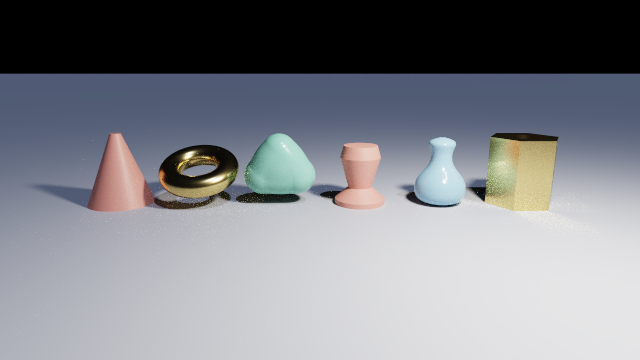
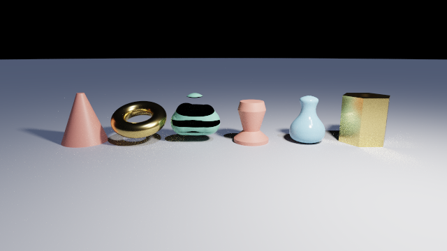
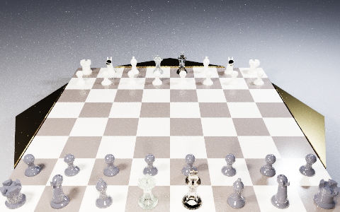

# Ray marching, and the iteration-0 decision it reopens

Iteration 0 chose how this renderer finds geometry, and wrote the choice down in one line:

| Question | Decision | Rationale |
| --- | --- | --- |
| Ray/CSG method | Exact analytic intervals (Roth), not SDF raymarching | Exact silhouettes and strict CSG semantics; an approximate `max(a, -b)` is not the same solid |

**That decision has never been tested.** It was taken before a line of the renderer existed, on
reasoning alone, and thirteen iterations have treated it as settled. This document reopens it.

The point is not to replace the span machinery. It is that "exact intervals are better" is a claim,
and Chroma is in an unusual position to price it honestly: the two methods can be made to differ in
exactly one thing. This document specifies how, what to measure, and what each outcome would mean,
so that the answer is allowed to be inconvenient.

The occasion for it is Hadji-Kyriacou and Arandjelović, *Raymarching Distance Fields with CUDA*,
Electronics 10(22):2730, 2021, in `documents_local/`. Section 1 assesses that paper. Sections 2 to
7 are the specification, written before any code.

**The demonstrator now exists**, as `--sdf`, and section 8 is what it measured. The predictions in
sections 5 and 6 are marked with what happened to them.

---

## 1. What the paper is worth

Plainly, because it is the reason for this work and it is weaker than its abstract suggests.

About half of it does not apply here at all: CUDA and OpenGL interoperability, pixel buffer and
frame buffer plumbing, bindless texture management. Chroma is an OpenGL renderer that already
ping-pongs an accumulation buffer through framebuffer objects, and
[gpu-backends.md](gpu-backends.md) already measured the compute path and found it a wash.

Another quarter is standard physically based rendering that Chroma has in a stronger form. The
paper derives Cook-Torrance, Trowbridge-Reitz GGX, Smith-Schlick and Fresnel-Schlick over eight
pages; all four are in [lighting.md](lighting.md) and in the shader. Its global illumination is one
bounce towards a sky hemisphere, resolved by temporal accumulation. Chroma path-traces to
`render.maxBounces` with next-event estimation, transmission, and participating media.

And the central algorithm is the 1994 one. The paper marches with Hart's basic sphere trace and a
constant understep coefficient `k`, and cites neither Keinert et al. 2014, nor Bálint and Valasek
2018, nor Galin et al. 2020. A comparison built on the paper's marcher would handicap ray marching
on the single axis where it has thirty years of published progress, and its verdict would be
worthless. Section 3 specifies the state of the art instead.

**Three things in it are worth taking**, and they are worth stating as clearly as the rest.

1. **Bounding volumes (§3.3).** The paper's one hard measurement: skipping distance-function
   evaluations for objects outside a bounding volume took its demo scene from 41 ms to 21 ms, about
   2x. Chroma computes an axis-aligned box for every node of the tree and currently discards all but
   the roots' (see [csg-tree-optimization.md](csg-tree-optimization.md)). This is independent
   corroboration that those boxes are worth spending, and it applies to the existing span backend as
   much as to any new one.

2. **Jittering the understep coefficient (§2.7.2).** Where a field is not a true distance the step
   must be scaled by `k < 1` to avoid overstepping. Rather than pick one `k`, the paper varies it
   between neighbouring pixels and between consecutive frames and lets temporal accumulation average
   the resulting noise away. Chroma has a per-pixel PCG hash and a running average across frames
   already, so this arrives into machinery that exists. It matters here specifically because of the
   blob, which is section 4's problem case.

3. **The instrumentation views (Figures 10 to 14).** Depth, march count, clock cycles, field
   evaluation count, per pixel. Chroma has no way at all to see where its time goes across an image.
   This is the item that pays whether or not a distance-field backend is ever built: the CSG tree
   optimisations already argued for in [csg-tree-optimization.md](csg-tree-optimization.md) are
   currently unmeasurable for want of exactly this.

Everything else in the paper is either inapplicable or already surpassed here.

---

## 2. Why the comparison is cheap, and what makes it honest

`raytrace.glsl` splices the generated scene in at a single marker, `// @chroma:geometry`, and
everything above that marker reaches the scene through two functions and one struct:

```glsl
struct Hit { bool found; float t; int primitive; bool flip; bool entering; };

Hit  traceScene(vec3 ro, vec3 rd, bool anyHit, float maxT);
vec3 hitNormal(Hit hit, vec3 point);
```

The path tracer, the BRDF, next-event estimation, the transmissive shadow walk, the medium
bookkeeping, the accumulation buffer and the tone map all sit above that line, and **none of them
knows how the geometry was found**. A distance-field backend replaces what is below it and changes
nothing above.

That is what makes the experiment worth running rather than merely interesting. Same scenes, same
sampler, same bounce count, same accumulation, same `--error` convergence criterion, same tone map.
One variable. Any difference in the image is attributable to the geometry query and to nothing else.

The comment already sitting at the marker constrains one thing, and it should be respected rather
than rediscovered: there is deliberately no `trace` wrapper, because each call site is a copy after
inlining and the shader is close to the driver's instruction ceiling. A distance-field backend must
define `traceScene` itself, not wrap something.

**Two things have moved under that line since, and neither reaches this backend.** The span path is
now compiled per *chunk* of geometry for a scene too large for one program, and a scene it splits
is traced a stage at a time rather than by one kernel. The distance-field backend produces exactly
one chunk and is neither costed nor split: a sphere-traced scene is one distance function reached
from a march loop, so there is no per-shape body to divide and nothing a second program could hold.
`SceneCompiler.CompileDistanceField` says so where it fills the field. It also does not instance,
for the reason this document exists — it is the demonstrator for one question, and a second axis to
differ on would make neither comparison mean anything.

---

## 3. Sphere tracing, specified

Enough to implement without further reading. Write `f` for the field, `p` the ray origin, `v` the
unit direction, `r_i = f(p + t_i·v)` the *unbounding radius* at step `i` (the radius of a sphere
guaranteed to contain no surface), `d_i` the step taken, and `ω ∈ [1, 2)` the relaxation parameter.

Hart's insight is that `f` need not be an exact distance. It suffices that it never *overestimates*
the distance to the surface. Any such lower bound works, and this is what lets CSG operators, which
destroy exactness, still be marched.

### Basic (Hart 1994)

```
t_{i+1} = t_i + f(p + t_i·v)
```

Terminates when `f` falls below a threshold, when `t` passes the far limit, or at an iteration cap.
Never oversteps, and is slow wherever the ray runs nearly parallel to a surface, because the
unbounding sphere is then small for many consecutive steps.

### Relaxed (Keinert et al. 2014)

Take a step longer than the radius, and detect afterwards whether that was safe:

```
d_i = r_i + ω·r_i
r_{i+1} = f(p + (t_i + d_i)·v)

if d_i > r_i + r_{i+1}:          // the two unbounding spheres are disjoint
    d_i = r_i                    // fall back to a basic step
    r_{i+1} = f(p + (t_i + d_i)·v)
```

The test is the whole of the method. If consecutive unbounding spheres overlap, the space between
the two sample points was covered and nothing was skipped. If they are disjoint, a surface may lie
in the gap, so the step is retaken conservatively. The fallback costs one extra field evaluation and
happens only where the surface is locally concave.

### Enhanced (Bálint and Valasek 2018)

Instead of scaling the previous radius, *predict* the next one by assuming the surface is locally
planar, from the previous two radii and the previous step:

```
r_{i+1} ≈ r_i · (d_i·r_{i-1} + r_i) / (d_i + r_{i-1} - r_i)
```

and step by `d_i = r_i + ω · that`, with the same disjointness fallback. Because a plane is exactly
the case basic sphere tracing handles worst, this converges fastest precisely where the others
crawl, and it falls back rarely: overlapping spheres are automatic on locally convex geometry.

Their measurements, on three scenes including a Mandelbulb: **up to 50% better than basic**, and
**up to 1.5x better than relaxed** on the time-to-error-threshold metric. Their figures, not ours.

### The termination threshold, derived rather than tuned

Worth recording because it removes a magic constant. Rather than compare `f` against a fixed
epsilon, tie the threshold to the pixel's footprint, which grows with `t`. Bálint and Valasek fold
this into the field itself: with `α` derived from the resolution,

```
F(t) = f(p + t·v)/(1 + α) − α·t
```

Marching `F` instead of `f` needs no special termination test at all, and it gives distance-adaptive
precision for free. Chroma's `EPS` is a hand-tuned `1e-4` in world units, stated as such in
`raytrace.glsl`, and a scene at a different scale has always been able to embarrass it. This is the
principled version, and it is the same idea as cone tracing.

### Beyond: segment tracing (Galin et al. 2020)

Computes a Lipschitz bound *locally over a segment* rather than assuming a global bound of 1, and
derives those bounds per primitive and per operator. It reduces field queries substantially with no
acceleration structure. It is out of scope for a first backend, and it is named here because it is
the principled answer to section 4's blob problem, and because a reader should know the ceiling is
higher than what section 3 specifies.

---

## 4. A distance function per primitive, and the one that has none

Whether the backend is possible at all comes down to this table. Chroma has ten primitives, and
every one is already reduced to a **canonical local space** with its transform baked into an inverse
matrix (see [csg-raytracing.md](csg-raytracing.md#transforms)), so each distance function is written
once, in canonical form, exactly as each span function already is.

| Primitive | Distance function in canonical space | Exact? |
| --- | --- | --- |
| sphere | `length(p) − 1` | exact |
| box | the standard `q = abs(p) − 1` form | exact |
| plane | `p.y` | exact |
| cylinder | capped cylinder, radial and axial distance combined | exact |
| cone | capped cone, tapered, the same two-part construction | exact |
| torus | `length(vec2(length(p.xz) − 1, p.y)) − minor` | exact |
| prism | 2D polygon distance in XZ, combined with the slab | exact |
| lathe | 2D polyline distance in the `(radius, y)` half-plane, revolved about Y | exact |
| sphereSweep | minimum over the round cones, which is a union, so the minimum is exact | exact |
| **blob** | **there is none** | **bound only** |

Nine of ten are exact and none of the nine is difficult. The prism and the lathe need the contour,
which `LeafEmitter` already emits as a `const` array per leaf, and the sign of the result comes from
the same even-odd containment test the span path already uses.

### The blob is the whole difficulty, and it is a result rather than an obstacle

A blob is an **isosurface of a field**, not a distance field. The field is
`Σ strength·(1 − (d/radius)²)²` and its value at a point says nothing directly about how far the
surface is. The usual repair is a first-order estimate,

```
distance ≈ f(p) / |∇f(p)|
```

which is **not a lower bound**. Where the field's curvature is high the estimate overshoots, the
march steps through the surface, and the blob renders with holes in it. The mitigations are the
paper's jittered `k` (section 1, item 2), which trades holes for noise that accumulation removes, or
a real Lipschitz bound, which is what segment tracing exists to provide.

Now put that beside the other backend. In the span machinery the blob is one of the *easiest*
primitives, because along a ray each component contributes a quartic, a sum of quartics is still one
quartic however many components there are, and Ferrari solves it exactly. Iteration 6 wrote that up
as the reason the shape is tractable at all.

**Two backends, the same shape, opposite difficulty.** That is the clearest single illustration in
this document of what each representation is actually good at, and it is worth more than any timing:
a distance field is a statement about *proximity to a surface*, and an interval is a statement about
*membership of a solid*. Shapes defined by proximity are easy for one and shapes defined by
membership are easy for the other.

### What CSG does to the field

- **Union** is `min(a, b)`, and it is exact.
- **Intersection** is `max(a, b)`, and it is a **lower bound, not a distance**.
- **Difference** is `max(a, −b)`, and likewise.

Sphere tracing tolerates lower bounds by construction, so the surface produced is correct. What
degrades is the *step size* near concave seams, where the bound is loosest and the march therefore
slowest. This is the precise and honest form of iteration 0's "an approximate `max(a, -b)` is not
the same solid": for a closed exact-distance operand the resulting **solid is right**; it is the
**field** that stops being a distance, and the price is iterations, not geometry. Iteration 0's
rationale as written overstates the case, and this document is the place that says so.

The genuine geometric objection survives and is different: the surface is where the march *stops*,
which is within a threshold of the true surface rather than on it, so silhouettes and thin features
depend on that threshold in a way exact intersection never does.

---

## 5. The contract the backend must satisfy, and where it strains

`Hit` carries five fields and the code above the seam reads every one.

| Field | Where a marcher gets it | Difficulty |
| --- | --- | --- |
| `found`, `t` | the march itself | none |
| `primitive` | `map` must carry an argmin, as the paper's `materialId` does | register pressure |
| `flip` | from `entering`, as the span path derives it | none |
| `entering` | the sign of the field at the ray origin | delicate at grazing angles |

Two points deserve more than a row.

### Chroma can keep analytic normals, and the paper cannot

`hitNormal` fetches the primitive record, transforms the hit point into the primitive's local space,
evaluates the **analytic** normal, and returns it through the inverse transpose. Because `map`
returns a leaf index, that function works unchanged under a distance-field backend.

The paper has no such index and is forced onto gradient normals, paying four `map` evaluations per
hit for the tetrahedron approximation, and it notes the resulting inaccuracy where surfaces meet at
a sharp angle. Chroma would be handing that up for free.

Both should be built and compared, because the hybrid is the interesting configuration: **a
distance field to find the hit, an analytic normal to shade it.** It is not obvious in advance which
is better in the image, since a gradient normal is consistent with the marched surface while an
analytic normal is consistent with the true one, and near a threshold-limited hit those differ.

### Media and transmission are where intervals earn their keep

This is the part the document must not soften.

`pathTrace` reads `hit.t` and `hit.entering` and re-traces from each boundary, so a marcher can in
principle serve it. `shadowTransmittance` is harder: it walks up to `MAX_SHADOW_STEPS` occluders,
multiplying `exp(-medium * hit.t)` at each, flipping `inMedium` from `hit.entering`, and advancing
by `hit.t + SHADOW_BIAS`. Every one of those steps depends on the boundary being located and
classified correctly.

The interval backend knows both exactly: a span **is** `[tIn, tOut]`, and `entering` is which end of
it was hit. The roadmap records this as the interval algorithm paying off a third time, because a
medium is then bounded by CSG for free, with no clipping geometry and no second representation of
the boundary.

A marcher converges on a boundary asymptotically and classifies it from the sign of a field that is
near zero exactly where the classification is being made. **Prediction, not measurement:** at
grazing angles this will misclassify, and the symptom will be speckled absorption inside glass and
fireflies in fog rather than an obviously wrong shape. `glass.chroma` and `fog.chroma` are where to
look, and the comparison should look there deliberately rather than notice it later.

> **Still untested.** The demonstrator's scene has no transmissive material and no medium, so this
> prediction stands exactly where it was. It is the largest gap in section 8.

---

## 6. What each representation makes possible that the other cannot

Probably the most valuable half of the comparison, and the half that is not about speed.

### Only ray marching

- **Smooth minimum**, so shapes genuinely blend rather than meeting at a seam. There is no interval
  equivalent, because the operation is defined on the field.
- **Domain repetition** by `mod`, which is unbounded instancing from one body of code.
- **Displacement** from a heightmap, which is the paper's carpet demonstration.
- **Fractals**, and any field with no analytic intersection.

Domain repetition deserves emphasis because it lands on what was this project's live problem.
[gpu-backends.md](gpu-backends.md) concluded that instancing was "the only source-side change that
can work" against the driver's roughly 65,000-instruction ceiling, and priced it at giving back the
folded `const mat4` and re-encoding the packed `surf` reference. A distance-field backend gets the
same property from `mod` with no encoding change at all.

That argument has since been overtaken from the other side: instancing was built for the span
backend and cost the folded matrix but *not* the `surf` encoding, and it applies to any repeated
shape rather than only to one laid out on a lattice. `mod` remains the cheaper trick where a scene
happens to be periodic, which is the narrower case.

There is a second and stronger reason to suspect the ceiling moves. `chess-full.chroma` was, when
this was written, refused because sixteen-plus turned pieces unroll their **lathe bodies**, which
solve a quadratic per segment, fill a crossing array and insertion-sort it. A lathe's *distance* function is a minimum
over segment distances: no solver, no array, no sort. **Prediction:** the SDF backend's leaf bodies
are several times smaller, and `chess-full.chroma` may compile under it. That is the single most
interesting measurable outcome available here, and it is stated in advance so that failing to
achieve it counts.

> **Confirmed.** `chess-full.chroma` compiles under `--sdf` and renders with all thirty-two men on
> the board. 4,011 generated lines against the span backend's 7,434, which the driver refused at
> the time. See section 8.
>
> The prediction was right and it stopped mattering: the span backend compiles that scene too now,
> at 3,342 lines, because instancing made it hold ten shapes rather than a hundred roots. The
> distance-field backend does not instance, so this figure is a comparison against a version of
> the span backend that no longer exists.

### Only exact intervals

- **Exact silhouettes**, independent of any threshold.
- **Strict CSG semantics**, with membership decided rather than approached.
- **The span length**, which is what Beer-Lambert absorption integrates over.
- **The medium's integration domain**, per section 5.
- **`entering` known rather than inferred.**
- **Thin geometry**, which a marcher can step past entirely.

---

## 7. What the comparison measures

Specified before the experiment. This partly discharges iteration 9, which is on standby.

| Measurement | How | Why it decides something |
| --- | --- | --- |
| Equal-image time | both backends to one `--error` target, per scene | the only fair speed number when one backend is approximate |
| Image difference | against the span backend as ground truth, in **linear HDR before tone mapping** | exposure and ACES can hide a real difference or invent one |
| Instruction cost | generated lines, and whether the driver accepts the program | the live constraint; `chess-full.chroma` is the test |
| Per-pixel instrumentation | march count, field evaluations, span count, leaf calls | turns "it feels slower" into a picture of where |

**Scenes, chosen for what each one interrogates:** `csg.chroma` for operator semantics,
`shapes.chroma` for the awkward primitives and the blob, `glass.chroma` for transmission,
`fog.chroma` for media, `lattice.chroma` for many leaves, `chess-full.chroma` for the ceiling.

### What each outcome would mean

Written now so that the answer is allowed to be inconvenient.

- **The SDF backend is slower and no less correct.** Iteration 0 was right for the wrong reason: the
  win was speed, not semantics. Keep intervals, take the instrumentation.
- **The SDF backend is faster and visibly approximate.** Iteration 0 was right. Record the number,
  because "we chose exactness and it cost us N%" is worth far more than an untested assertion.
- **The SDF backend is faster and the difference is below noise on every scene except the blob.**
  Iteration 0 was wrong on the evidence, and the honest conclusion is a hybrid rather than a
  replacement: intervals where membership is the question, distance fields where proximity is.
- **`chess-full.chroma` compiles under it.** Independently of every other result, that reframes the
  ceiling from a wall into a property of the representation, and it is the strongest argument for
  keeping both backends permanently.

---

## 8. What the demonstrator measured

`--sdf` exists. `scenes/shapes-bezier.chroma` is the scene it was built to answer on: the six
solids of `shapes.chroma` plus a second lathe whose outline is three cubic Bézier curves, standing
beside the linear one. The two vases are the control, since both have exact distance functions and
both backends see the same flattened polyline. The blob is the variable.

All figures below: RTX 4070 SUPER, 640x360, 300 samples, fragment path.

### The image





**Everything agrees except the blob, and the blob is destroyed.** The two vases are
indistinguishable, which is the control passing: a distance field reproduces a revolved Bézier
outline exactly, and reproduces the polyline one the same way. So do the cone, the torus and the
bored prism, whose agreement is the negation-parity check, since a subtracted operand whose normal
was not turned over renders its cavity black and this one does not. The blob is cut through by
horizontal bands where the march stepped past the surface, exactly as section 4 said it would and
for exactly the reason it gave.

Nothing was tuned to produce that. The understep coefficient is a flat 0.4 and the artifact
survives it, which is the honest form of "the estimate is not a bound".

### Speed, at equal image

Every row below is one command: `--march <n>` sets the step bound, 128 by default, and `--enhanced`
selects section 3's variant in place of the plain trace. Both are read only on this backend, so
both are written after `--sdf`.

```sh
Chroma scenes/shapes-bezier.chroma --sdf --size 640x360 --samples 300
Chroma scenes/shapes-bezier.chroma --sdf --march 512 --size 640x360 --samples 300
Chroma scenes/shapes-bezier.chroma --sdf --enhanced --size 640x360 --samples 300
```

The default 128 march steps leave the horizon truncated: rays that graze the ground plane converge
too slowly to reach it. That is sphere tracing's textbook worst case and precisely the case section
3's enhanced variant exists for. At 512 steps the horizon matches the span render.

| Backend | March steps | Samples/s | Image |
| --- | ---: | ---: | --- |
| Exact intervals | | **360.3** | reference |
| Sphere tracing, basic | 128 | 154.9 | horizon truncated |
| Sphere tracing, basic | 512 | 94.3 | matches, except the blob |
| Sphere tracing, enhanced | 128 | 81.6 | horizon truncated |
| Sphere tracing, enhanced | 256 | 62.3 | horizon still truncated |

**At equal image the span backend is 3.8x faster.**

**The enhanced marcher lost, and lost badly.** It is slower than the basic trace at every step
count tried, and 256 enhanced steps still do not reach a horizon that 512 basic steps do while
running 1.5x faster. The published result is up to 1.5x *better* than relaxed tracing, so this
disagrees with its source and the disagreement is not resolved. The likely cause is that the
disjointness fallback fires on most steps, which turns the variant into two field evaluations per
step for no gain, and the scene's `min` over eight unrelated solids would do that: the nearest
surface changes identity constantly, and "locally planar" is then false almost everywhere. Whether
that is the algorithm meeting a scene it does not suit or a fault in this implementation is
**unsettled**, and it needs the per-pixel step-count view that section 1 argued for and that this
demonstrator deliberately does not have.

### Generated code, and the ceiling

| Scene | Spans | Distance field |
| --- | ---: | ---: |
| `shapes-bezier.chroma` | 1,182 lines | 461 lines |
| `chess-full.chroma` | 7,434 lines, **driver refused** | 4,011 lines, **compiles and renders** |



This was the result worth having, and it is worth being precise about what has happened to it
since. `scenes/chess-full.chroma` was kept in the repository *because* it did not compile;
[gpu-backends.md](gpu-backends.md) records six things tried against that wall and what each
measured, and concluded that instancing was the only source-side change that could work. The
distance-field backend rendered it first, with all thirty-two men, because a lathe's distance
function is a minimum over segment distances where its span function is a quadratic solve, a
crossing array and an insertion sort that the driver unrolls.

**Instancing was then built, and the span backend renders it too** — 3,342 lines rather than 7,434,
because thirty-two pieces are ten distinct shapes and the rest are placements in a buffer. So the
comparison in that table is no longer a compiles-against-refuses; it is 3,342 span lines against
4,011 distance-field lines, and the distance field's advantage on this scene has largely gone. What
survives is the claim the experiment was run to test, and it survives intact: **the ceiling is a
property of the representation, not of the renderer.** Two representations of one scene differ by
almost a factor of two in generated code, and that was true before anyone knew which side would
win.

It renders slowly, at 0.5 samples/s for 480x300, and the image above is noisy at 60 samples. That
did not blunt the point then and does not now.

It is slow enough to meet a limit this project had not previously hit, and the two are easy to
confuse. Two seconds per frame is where the operating system's GPU watchdog starts killing the
process, with a fatal abort that no handler can catch and no message at all. `--sdf` therefore
prints a note before its first frame and a measured warning after it;
[gpu-backends.md](gpu-backends.md) has the mechanism and why only the warning is reliable. Running
`chess-full.chroma` under `--sdf` at the default 1280x720 is the case to avoid.

### Verdict against section 7

Section 7 wrote four possible outcomes before the experiment. What happened is the first of them,
with a fifth nobody listed:

- Exact intervals are **3.8x faster at equal image**, and the only visible difference is a blob the
  distance field cannot represent. Iteration 0's decision holds, and the conclusion of section 4
  stands beside it: iteration 0's stated *reason* was still overstated, because the solid a
  distance field produces is right everywhere the field is a real distance.
- And the outcome section 7 flagged as the strongest argument for keeping both backends did happen:
  a scene that the span backend cannot compile at all renders under this one.

So the answer is not "distance fields are worse". It is that they are worse at what this renderer
already does well and better at the one thing it cannot do, which is the shape of a hybrid rather
than of a replacement.

### What this did not measure

Named rather than left for someone to discover:

- **Transmission and media**, which section 5 argues is where intervals earn their keep. The scene
  has neither. This is the largest gap.
- **Linear HDR difference.** The images above are tone-mapped PNGs compared by eye, which section 7
  warned is coarse. The renderer exposes no pre-tone-map output.
- **The bounding-volume optimisation** of the paper's §3.3 is not implemented, so the field
  evaluates every leaf at every step. The span backend's root guards have no counterpart here, and
  some of the 3.8x is that.
- **Why the enhanced marcher lost**, above.

---

## 9. How the backend was built

The sketch below is what was specified in advance. `Codegen/SdfEmitter.cs` is what exists, and it
follows it; the two notes after it are what the sketch did not anticipate.

A second emitter beside `GeometryEmitter`, writing a different `CompiledScene.Geometry` string.
`CompiledScene` needs no change: `Geometry` is a string, and `Primitives`, `Materials` and `Shapes`
are read by the shading path, which is above the seam and stays as it is.

- One `map(vec3 p, out int leaf)` built from the same bound tree, with `min` and `max` where
  `GeometryEmitter` emits span operators.
- One distance function per leaf, reusing the folded `const mat4` and the `const` point arrays
  `LeafEmitter` already emits, in the same canonical spaces the span functions use.
- One `traceScene` that sphere-traces `map`, defined at the marker rather than wrapping anything.
- The per-node AABBs that `GeometryEmitter` currently computes and discards become the paper's §3.3
  bounding volumes. **Not built.** The demonstrator evaluates every leaf at every step.

Selection follows two established patterns: a flag in `Program.cs` beside `--compute` and `--tbo`,
which is `--sdf`, and a `#define` in the `defines` array beside `CHROMA_TRANSMISSION` and
`CHROMA_MEDIA`, which is `CHROMA_SDF`.

The marching variant of section 3 is a third `#define`, `CHROMA_SDF_ENHANCED` behind `--enhanced`,
so basic and enhanced share one `map` and one backend and differ only in the loop. That is what makes the marcher itself measurable rather
than confounded with everything else.

### Two things the sketch did not anticipate

**A distance measured in the primitive's own space is not a distance in the world.** Every leaf is
evaluated after its baked inverse matrix, and if that matrix scales, the canonical answer is wrong
by the scale factor. Sphere tracing needs a value that never *over*estimates, so the leaf's answer
is multiplied by `sigmaMin(A)` for the local-to-world linear part `A`, which is `1/sigmaMax(M)` for
the inverse `M` that is actually baked. `SdfEmitter.LargestSingularValue` computes it by power
iteration at compile time. Omitting it renders every scaled solid full of holes; using a loose
bound such as the Frobenius norm instead makes every scene pay about 1.7x the march steps for
nothing.

**The normal flip is static here, where the span path decides it at run time.** A surface reached
through a `difference`'s subtrahend has its normal pointing into the result. The span path carries
that in the sign of a span's surface reference; the emitter knows it from the path down the tree,
so it bakes the sign into the leaf code the field returns, borrowing the same `±(index + 1)`
encoding. `Hit.flip` is then `(code < 0) != startedInside`, which is `resolveRoot`'s rule verbatim.
The bored prism in the test scene is there to check it: get it wrong and the bore renders black.

---

## Sources

- Hart, J. C. *Sphere tracing: a geometric method for the antialiased ray tracing of implicit
  surfaces.* The Visual Computer 12, 1996, 527-545. The basic algorithm and the lower-bound
  argument.
- Hart, Sandin, Kauffman. *Ray tracing deterministic 3D fractals.* SIGGRAPH 1989, 289-296. The
  first use.
- Keinert, Schäfer, Korndörfer, Ganse, Stamminger. *Enhanced Sphere Tracing.* Smart Tools and Apps
  for Graphics, Eurographics, 2014. Over-relaxation with the disjoint-sphere fallback.
- Bálint, Valasek. *Accelerating Sphere Tracing.* Eurographics 2018 Short Papers. The planar
  extrapolation, the cone-traced termination criterion, and the measurements quoted in section 3.
- Galin, Guérin, Paris, Peytavie. *Segment Tracing Using Local Lipschitz Bounds.* Computer Graphics
  Forum 39(2), 2020, 545-554. The principled answer to a field that is not a distance.
- Hadji-Kyriacou, Arandjelović. *Raymarching Distance Fields with CUDA.* Electronics 10(22):2730,
  2021. The occasion for this document; assessed in section 1.
