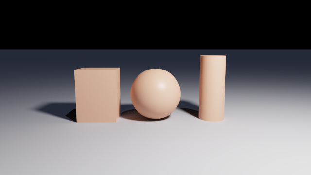
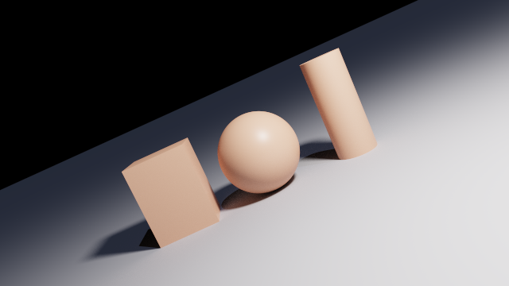
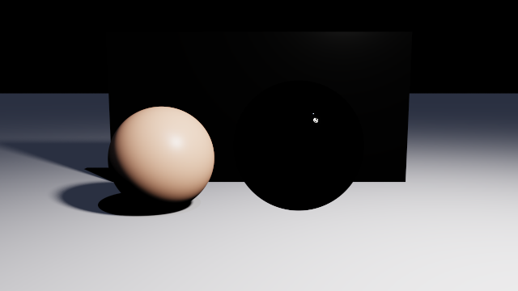
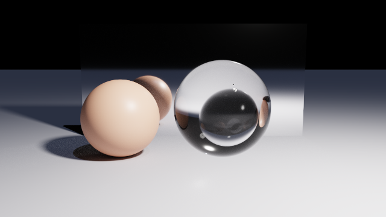
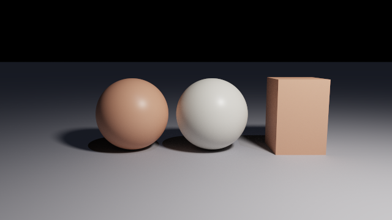
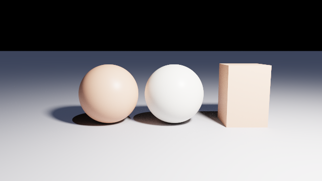
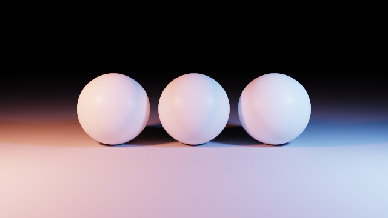
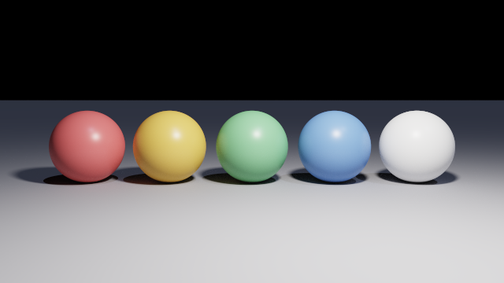
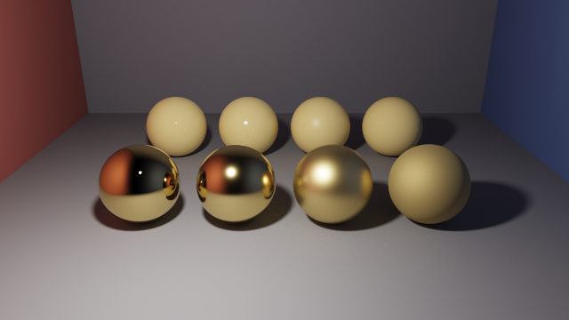
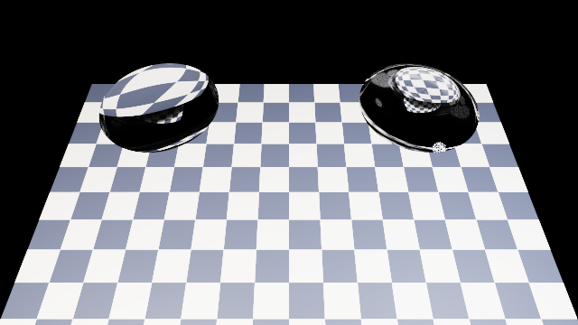

# The camera, the lights and the materials

Everything that decides what a scene looks like rather than what shape it is. This is one of
the four parts of the reference:

| Document | What is in it |
| --- | --- |
| [scene-language.md](scene-language.md) | the language: values, operators, bindings, loops, functions, `import` |
| [scene-primitives.md](scene-primitives.md) | the shapes: every primitive, field by field |
| [scene-composition.md](scene-composition.md) | combining and placing shapes: `union`, `difference`, transforms |
| **scene-appearance.md** | **the camera, the lights and the materials** |

| Node | How many | What it does |
| --- | --- | --- |
| [`camera`](#camera) | **exactly one, required** | where the picture is taken from |
| [`render`](#render) | at most one, optional | settings for the whole scene |
| [`pointLight`](#pointlight) | any number | a lamp at a place |
| [`directionalLight`](#directionallight) | any number | light from a direction, with no source |
| [`material`](#material) | any number | how a surface, and the inside of a solid, behave |

## `camera`

| Field | Type | Default | Meaning |
| --- | --- | --- | --- |
| `position` | vec3 | **required** | where the eye is |
| `lookAt` | vec3 | `[0, 0, 0]` | the point it aims at |
| `up` | vec3 | `[0, 1, 0]` | which way is up in the image |
| `fov` | number | `45` | the **vertical** field of view, in degrees |

```js
camera {
  position: [0, 2, 5],
  lookAt:   [0, 0, 0],
  fov:      45
}
```

**`fov` is vertical**, and it is what a scene changes to zoom without moving:

| `fov: 28` | `fov: 70` |
| --- | --- |
|  |  |

Same camera position in both. A narrow angle flattens the scene and a wide one exaggerates the
depth, which is what a lens does.

`up` is the roll reference: it is the direction that comes out of the top of the image.

| `up: [0, 1, 0]`, the default | `up: [0.45, 1, 0]` |
| --- | --- |
|  |  |

Nothing in the world moved between those two: only the camera's idea of which way is up.

**Refuses** a camera looking at its own position, and an `up` parallel to the direction of
view, which leaves the image with no way round.

Where to put the camera, and the one trap that has no error message, are in
[scene-composition.md](scene-composition.md#coordinate-system): **put it at positive Z**.

## `render`

Settings that belong to the scene rather than to the command line. Leaving the block out means
all of the defaults.

| Field | Type | Default | Meaning |
| --- | --- | --- | --- |
| `maxBounces` | whole number, `1` to `16` | `4` | how many times a ray may bounce |
| `exposure` | number | `1` | multiplies the image before tone mapping |
| `seed` | whole number | `0` | what [`random` and `perlin`](scene-language.md#random) draw from |
| `angles` | `"degrees"` or `"radians"` | `"degrees"` | the unit `rotate` and `camera.fov` are written in |

```js
render {
  maxBounces: 8,
  exposure:   1.3,
  seed:       7
}
```

### `maxBounces`

| `maxBounces: 1` | `maxBounces: 12` |
| --- | --- |
|  |  |

`1` is direct lighting only: every surface is lit by the lights and by nothing else, so glass
has no path through itself and a mirror reflects nothing. Raise it when a scene has glass,
mirrors or a medium; an ordinary matte scene looks much the same at 2 as at 12, and costs less.

An out-of-range or fractional value is an **error** rather than a clamp: the loop runs per pixel
per frame, so an absurd depth is a typing mistake worth reporting.

### `exposure`

| `exposure: 0.45` | `exposure: 1.8` |
| --- | --- |
|  |  |

It multiplies the image and changes nothing about the scene. It is the field to reach for when
a picture is right but too dark or too bright, in preference to moving the lights.

### `seed`

`seed` is what `random` and `perlin` draw from, and the same file with the same seed gives the
same picture on every run and every machine. It has to be a **plain number written in the scene
file itself**: not an expression, and not in an imported file. See
[`random`](scene-language.md#random) for what it does and a picture of the difference.

### `angles`

`angles` says which unit `rotate` and `camera.fov` are written in. It applies to the whole file
wherever the block is written, and it has no picture, since the same geometry written both ways
is the same geometry:

```js
render { angles: "radians" }

camera { position: [0, 3, 8], lookAt: [0, 0, 0], fov: PI / 4 }
sphere { rotate: [0, PI / 2, 0] }
```

It does **not** change the trigonometric built-ins, which take radians in either mode.

## `pointLight`

A lamp at a place, radiating in every direction.

| Field | Type | Default | Meaning |
| --- | --- | --- | --- |
| `position` | vec3 | **required** | where it is |
| `color` | vec3 | `[1, 1, 1]` | what colour it emits |
| `intensity` | number | `1` | how bright. See the falloff note |
| `radius` | number, `0` or more | `0` | how large the lamp is, which is how soft its shadows are |

```js
pointLight { position: [2, 4, 3], color: [1, 1, 1], intensity: 55, radius: 0.4 }
```

**Brightness falls off with the square of the distance.**


A light 5 units away delivers 1/25 of what the same `intensity` delivers at 1 unit, so useful
values are much larger than they look: a room-sized scene usually wants tens or hundreds.

`radius` is a **pure softness control**. Widening it does not change how brightly anything is
lit; only the shadows change.

| `radius: 0` | `radius: 1.2` |
| --- | --- |
|  |  |

At `0` the lamp is an idealised point and the shadows have hard edges. Above `0` it is a sphere,
and the penumbra widens with the distance between the caster and the surface, as it does in
life.

`color` multiplies what the light emits:

<!-- from: scenes/reference/light-color.chroma -->
```js
pointLight {
  position:  [-4, 3, 3],
  color:     [1, 0.35, 0.25],
  intensity: 90,
  radius:    0.4
}
```



**Refuses** a negative `radius`.

## `directionalLight`

Light arriving from a direction, as sunlight does: infinitely far away, with no falloff and no
position.

| Field | Type | Default | Meaning |
| --- | --- | --- | --- |
| `direction` | vec3 | **required** | the direction the light **travels towards**. Normalised on load |
| `color` | vec3 | `[1, 1, 1]` | what colour it emits |
| `intensity` | number | `1` | how bright. No falloff, so this is the whole story |

```js
directionalLight { direction: [-1, -1, -1], color: [0.8, 0.8, 1.1], intensity: 0.6 }
```


The shadows it casts are parallel, which is the giveaway. `direction: [0, -1, 0]` is light
coming straight down.

**Refuses** a `direction` of all zeros.

A scene with no lights at all is not an error. Unless something in it has an `emission`, it
renders black.

## `material`

One node describes a surface and, where light can get inside it, the medium within. Every field
has a neutral default, so a material only ever says what differs.

| Field | Type | Default | Range | Meaning |
| --- | --- | --- | --- | --- |
| `color` | vec3 | `[0.8, 0.8, 0.8]` | 0 to 1 | the base colour: what a dielectric scatters, what a metal tints its reflection with |
| `roughness` | number | `0.5` | clamped to 0..1 | `0` mirror-smooth, `1` fully matte |
| `metallic` | number | `0` | clamped to 0..1 | `0` dielectric, `1` metal |
| `emission` | vec3 | `[0, 0, 0]` | not clamped | light the surface gives off |
| `transmission` | number | `0` | clamped to 0..1 | how much light passes through instead of scattering |
| `ior` | number | `1.5` | `1` or more | index of refraction, which also sets how much the surface reflects |
| `absorption` | vec3 | `[0, 0, 0]` | not negative | how fast each colour is absorbed inside the solid, per world unit |
| `scattering` | number | `0` | not negative | how much the inside scatters light, per world unit: fog and smoke |
| `anisotropy` | number | `0` | clamped to ±0.99 | which way that scattering goes: `0` all directions, positive forward |

A material is usually bound once and used by name, and it is inherited by descendants that
declare none, which is in
[scene-composition.md](scene-composition.md#material-is-inherited).

```js
let red = material { color: [0.8, 0.2, 0.2], roughness: 0.4 };

sphere { radius: 1, material: red }
sphere { radius: 1, material: { color: [0.2, 0.5, 0.9] } }   // the name may be left out here
```

### `color`



Linear values from 0 to 1 per channel. On a dielectric it is what the surface scatters, which
is what reads as "the colour of the object". On a metal it tints the reflection instead. White
is `[1, 1, 1]` and is no brighter than the light falling on it: a colour reflects light rather
than making any. To make light, use `emission`.

### `roughness`


From `0`, where the surface is a mirror and its highlight is a point, to `1`, where it is
completely matte. It applies to reflection and to transmission alike, so a high `roughness` with
`transmission: 1` is frosted glass.

### `metallic`


`0` is a dielectric: plastic, stone, wood, glass. `1` is a metal. Values between the two are not
a material anything is made of; they exist so a gradient can cross an edge.

**A metal has no diffuse component at all.** It only reflects its surroundings, so a metal in an
otherwise empty scene renders nearly black. That is correct rather than broken: give it
something to reflect.

The two fields are read together, and this is what they do across each other:

<!-- from: scenes/reference/material-metallic-roughness.chroma -->
```js
sphere {
  center:   [(i - 1.5) * 1.7, 0.7, 1.6],
  radius:   0.7,
  material: material { color: [0.9, 0.72, 0.35], roughness: steps[i], metallic: 1 }
}
```



Back row `metallic: 0`, front row `metallic: 1`, and `roughness` `0`, `0.15`, `0.4` and `0.8`
across each.

### `emission`


`emission` is radiance rather than a colour, so it is **not** clamped: values above 1 are
ordinary and are how a panel gets bright.

An emissive surface is **seen** rather than used to light the scene. It is found only when a
bounced ray happens to land on it, so a large emissive surface converges well and a small one
stays noisy for a long time. To light a scene, use a `pointLight`; to make the source visible
in the picture, give the shape an `emission` as well.

### `transmission` and `ior`

Glass is `transmission: 1, roughness: 0`.


`transmission` is how much of the light that is not reflected passes through the solid instead
of scattering off it. `1` is clear glass, `0` is opaque, and the field needs bounces to be
worth anything: with `maxBounces: 1` glass renders dark.

**`color` does nothing at `transmission: 1`.** What is not reflected goes through rather than
scattering, so there is no diffuse lobe left to tint. To tint glass, use `absorption`.


`ior` is how much the surface bends light, and it also sets how much it reflects: a dielectric
reflects `((ior - 1) / (ior + 1))²` of what hits it head-on, which at the default 1.5 is 4%.
`ior: 1` bends nothing at all, which is what makes a volume of air.

| Material | `ior` |
| --- | --- |
| air, and any medium that should not act as a lens | `1` |
| water | `1.33` |
| ordinary glass | `1.5` |
| sapphire | `1.77` |
| diamond | `2.42` |

What the number actually decides is how sharply a shape bends the light crossing it. Two lenses,
the same solid written twice, held at the same height over the same chequered floor:

<!-- from: scenes/reference/ior-lens.chroma -->
```js
// A biconvex lens: the lens-shaped overlap of two balls of the same radius, 1.55 across and
// 0.4 thick, floating 1.2 above the tiles.
intersection {
  sphere { center: [-1.7, -0.2, 0], radius: 1.6 }
  sphere { center: [-1.7, 2.6, 0], radius: 1.6 }

  translate: [0, 1.2, 0],
  material:  glass
}
```



Left is `ior: 1.5`, ordinary glass: it works as a magnifier, and the squares under it are
enlarged and still the right way up. Right is `ior: 2.4`, which is diamond, and it bends the
same rays nearly three times as hard: it gathers a much wider piece of the floor into a small
inverted image. Nothing but that one number differs between them.

### `absorption`


`absorption` is how fast each channel is absorbed **per world unit** inside the solid, which is
what gives glass its colour. It is per channel: `[0.4, 0.1, 0.1]` takes red out fastest and
leaves the solid cyan.

**It is a rate, not a multiplier.** Doubling a solid's thickness squares the transmittance,
which is why the same glass looks pale in a thin slab and deep in a thick one, exactly as real
glass does.

### `scattering` and `anisotropy`

Fog is `transmission: 1, ior: 1, scattering: 0.05`. These two fields describe what happens
**between** the surfaces of a solid rather than at them.


`scattering` is how much light is scattered per world unit: `0` is clear glass, and raising it
gives fog, smoke or milk. It is one number for all three channels; a medium's colour comes from
`absorption`, which is per channel.

Two things to know before the first attempt:

- **A medium needs `transmission`.** Light that cannot get inside a solid cannot scatter in it,
  so `scattering` on an opaque material does nothing, and says so as a warning.
- **`ior: 1` is what makes a volume of air.** Left at the default 1.5, a box of fog is a giant
  lens and bends the whole scene behind it.

| `anisotropy: 0` | `anisotropy: 0.7` |
| --- | --- |
|  |  |

`anisotropy` is which way the medium scatters what it catches. At `0` it is a uniform veil from
every direction. Positive is forward scattering, which is what makes a visible beam: `0.6` to
`0.8` is the range for a shaft of light through haze. Negative scatters back towards the light.

### Recipes

| Material | Written |
| --- | --- |
| matte plaster | `material { color: [0.8, 0.78, 0.74], roughness: 0.9 }` |
| plastic | `material { color: [0.2, 0.4, 0.8], roughness: 0.25 }` |
| mirror | `material { metallic: 1, roughness: 0 }` |
| gold | `material { color: [0.9, 0.72, 0.35], metallic: 1, roughness: 0.15 }` |
| clear glass | `material { transmission: 1, roughness: 0, ior: 1.5 }` |
| frosted glass | `material { transmission: 1, roughness: 0.35, ior: 1.5 }` |
| green glass | `material { transmission: 1, ior: 1.5, absorption: [0.6, 0.1, 0.5] }` |
| a light panel | `material { emission: [6, 5.6, 5] }` |
| fog | `material { transmission: 1, ior: 1, scattering: 0.05 }` |
| a visible beam | `material { transmission: 1, ior: 1, scattering: 0.2, anisotropy: 0.7 }` |

### What it reports

| Written | What happens |
| --- | --- |
| `ior` below 1 | error: the surrounding medium is vacuum, so nothing is thinner than it |
| a negative component of `absorption` | error |
| a negative `scattering` | error |
| `metallic` and `transmission` both above 0 | **warning**: a metal does not transmit, so `transmission` is ignored |
| `scattering` above 0 with `transmission` at 0 | **warning**: light cannot get inside, so the medium is ignored |
| `roughness`, `metallic`, `transmission` outside 0..1 | clamped, silently: these are continuous quantities with one sensible reading |

A warning is printed and the scene still renders. An error means no picture at all.
