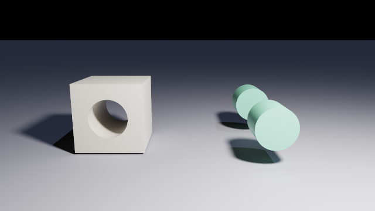
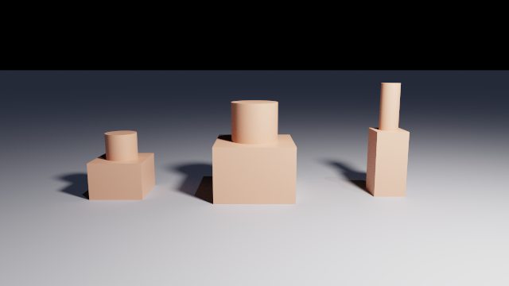
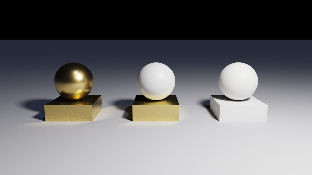

# Combining and placing shapes

The three boolean operators, the wrapper that carries a placement, the modifiers every solid
takes, and the axes they all work in. This is one of the four parts of the reference:

| Document | What is in it |
| --- | --- |
| [scene-language.md](scene-language.md) | the language: values, operators, bindings, loops, functions, `import` |
| [scene-primitives.md](scene-primitives.md) | the shapes: every primitive, field by field |
| **scene-composition.md** | **combining and placing shapes: `union`, `difference`, transforms** |
| [scene-appearance.md](scene-appearance.md) | the camera, the lights and the materials |

## The operators

`union`, `intersection` and `difference` take their operands as **children**, written one after
another inside the block, rather than as a field.

```js
union {
  sphere { center: [-1, 0, 0], radius: 1 }
  sphere { center: [ 1, 0, 0], radius: 1 }
}
```

| Node | Operands | What comes out |
| --- | --- | --- |
| `union` | 1 or more | everything inside any operand |
| `intersection` | 2 or more | only what is inside every operand |
| `difference` | 2 or more | the **first** operand, minus all the others |


The same box and sphere in all three: `union` bulges, `intersection` keeps the rounded core,
and `difference` takes a bite out of the box.

A subtracted surface is lit like any other. The inside of that bite has a normal pointing into
the hollow, so it shades rather than showing black.

**The result of an operator is a solid like any other.** It takes the same modifiers a primitive
takes, and it can be an operand of another operator, to any depth.

### Order matters for `difference` only

`union` and `intersection` do not care what order their operands are in. `difference` is the
first operand minus everything after it, so swapping two operands describes a different solid.

<!-- from: scenes/reference/csg-difference-order.chroma -->
```js
// The box, minus the cylinder: a tunnel through it.
difference {
  box      { min: [-0.8, -0.8, -0.8], max: [0.8, 0.8, 0.8] }
  cylinder { base: [0, 0, -1.6], cap: [0, 0, 1.6], radius: 0.45 }

  translate: [-1.8, 0.85, 0],
  material:  stone
}

// The cylinder, minus the box: the two ends that stuck out past it.
difference {
  cylinder { base: [0, 0, -1.6], cap: [0, 0, 1.6], radius: 0.45 }
  box      { min: [-0.8, -0.8, -0.8], max: [0.8, 0.8, 0.8] }

  translate: [1.8, 0.85, 0],
  material:  jade
}
```



The same box and the same cylinder on both sides. Box first leaves the box with a tunnel through
it; cylinder first leaves the two ends that stuck out past the box, which is one solid in two
disconnected pieces.

**Refuses** an `intersection` or a `difference` with fewer than two operands, and any operand
that is not a solid: a material or a light written as a child is reported where it is written.

There is no `merge` operator and none is needed. `union` here already removes the surfaces
buried inside the result, which is the only thing a merge would add.

## `object`

`object` wraps **exactly one** solid and does nothing to it. Its whole purpose is to carry
modifiers for something that cannot take them on its own, which is what a bound name is.

```js
let unit = sphere { radius: 1 };

object { unit, translate: [-2, 0, 0], material: glass }
object { unit, translate: [ 2, 0, 0] }
```


A reference on its own takes no modifiers, since `unit { translate: ... }` would read as a node
type called `unit`. Wrapping it in an `object` is how a copy is placed. Referencing a binding
twice **instantiates it twice**, so the copies are independent solids.

It costs nothing: a union of one operand is that operand.

**Refuses** an empty `object { }` and an `object` with two or more children, whose message names
`union` as what to write instead.

## Shared modifiers

Every solid, primitive or operator, accepts these four fields.

| Field | Type | Effect |
| --- | --- | --- |
| `material` | material | applies to this solid and to every descendant that declares none |
| `translate` | vec3 | moves it |
| `rotate` | vec3 | Euler angles, applied X then Y then Z. **Degrees**, unless [`render { angles: "radians" }`](scene-appearance.md#render) |
| `scale` | vec3 or number | resizes it. One number scales all three axes together |

### Transforms apply in the order they are written

This is the one rule about transforms worth learning, because the same two modifiers in the
other order describe a different placement:

```js
sphere { radius: 1, translate: [2, 0, 0], rotate: [0, 90, 0] }   // orbits to [0, 0, -2]
sphere { radius: 1, rotate: [0, 90, 0], translate: [2, 0, 0] }   // stays at [2, 0, 0]
```


Every transform is about the **origin**, not about the solid's own middle. Rotating a solid that
has already been moved away from the origin swings it around the origin, which is what the first
of the two lines above does and what the blue ball in the picture is doing. Rotating it before
moving it turns it in place, and the rotation of a ball centred on the origin does nothing at
all, which is the red one.

### `scale`

`scale` takes one number, which scales all three axes together, or a vector, which scales each
axis on its own.

<!-- from: scenes/reference/modifier-scale.chroma -->
```js
object { piece, translate: [-2.6, 0, 0], material: clay }

object { piece, scale: 1.5, translate: [0, 0, 0], material: clay }

object { piece, scale: [0.6, 1.8, 0.6], translate: [2.6, 0, 0], material: clay }
```



Scaling is about the origin too, so a solid away from the origin is moved by it as well as
resized. Scaling first and moving afterwards, as above, is what keeps the three in a row.

### A parent's transform composes with its children's

A child is placed in its parent's space, as in any scene graph. This moves the whole assembly:

```js
union {
  box    { min: [-1, 0, -1], max: [1, 0.4, 1] }
  sphere { center: [0, 1, 0], radius: 0.6 }

  rotate:    [0, 30, 0],
  translate: [4, 0, 0]
}
```

### `material` is inherited

A solid that declares no material takes the material of the nearest ancestor that declares one.

<!-- from: scenes/reference/material-inheritance.chroma -->
```js
// The sphere declares its own; the box still inherits the union's.
union {
  box    { min: [-0.7, 0, -0.7], max: [0.7, 0.5, 0.7] }
  sphere { center: [0, 1.1, 0], radius: 0.6, material: pewter }

  material: brass
}
```



Left: the `union` carries brass and both children inherit it. Middle: the sphere declares its
own, and the nearer material wins. Right: nothing is declared anywhere, and the solid renders in
the default grey, which is `color: [0.8, 0.8, 0.8], roughness: 0.5`.

## Solids at the top level

Solids written at the top level of a file are all rendered, and behave as though they were
unioned. For opaque solids that is the end of the story.

**For overlapping transparent solids it is not.** Top-level solids are resolved separately, so
two glass solids that overlap show the surfaces where they cross. An explicit `union` makes them
one solid and those surfaces stop existing.

```js
// A visible lens-shaped seam where they cross.
sphere { center: [-0.45, 0, 0], radius: 0.9, material: glass }
sphere { center: [ 0.45, 0, 0], radius: 0.9, material: glass }

// No seam: one solid.
union {
  sphere { center: [-0.45, 0, 0], radius: 0.9 }
  sphere { center: [ 0.45, 0, 0], radius: 0.9 }
  material: glass
}
```


**If two overlapping glass solids are meant to be one object, write the `union`.**

## Coordinate system

Right-handed: `+X` right, `+Y` up, `+Z` towards the viewer. Rotations are counter-clockwise
when looking down the positive axis towards the origin.


Angles are in degrees unless the file says
[`render { angles: "radians" }`](scene-appearance.md#render).

**Put the camera at positive Z.** With `position: [0, 0, 7]` and `lookAt: [0, 0, 0]` the camera
looks down `-Z`, and world `+X` appears on the right of the image, which is what everyone
expects.

Placing it at negative Z instead is legal and points the camera down `+Z`, and then world `+X`
appears on the **left**. The scene is not broken, it is mirrored, and there is no error to
explain it: the symptom is a layout that reads backwards. If you are porting a scene from
POV-Ray, which is left-handed, negate the Z of the camera and of every light.

## What a scene may hold

There is no limit on how many solids a scene may contain, and no limit on how deep the operators
may nest. Two things are worth knowing anyway.

**A wide solid costs what it costs.** How many spans a shape can occupy is listed in
[scene-primitives.md](scene-primitives.md#what-a-shape-costs), and the operators add them up:
`union` and `difference` add, and `intersection` is `left + right - 1`. Each top-level solid is
measured on its own, so twenty separate solids cost what one costs. The renderer prints the
widest one when the scene loads.

**A scene too large for one program is split automatically**, and nothing in the file has to say
so. What cannot be split is a single enormous solid with no `union` inside it to cut on: an
`intersection` of hundreds of operands, or one very large `lathe`. That is refused, with a
message naming the solid and its line.
