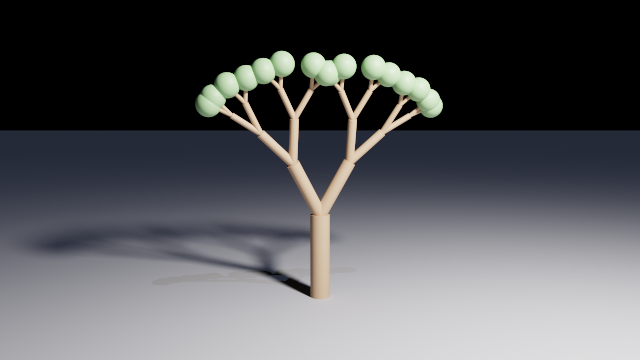
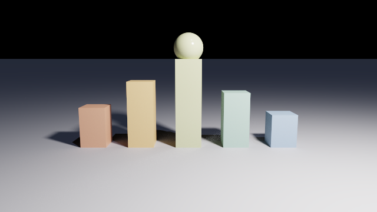
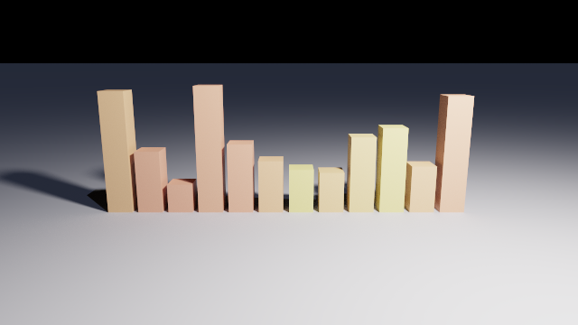

# The scene description language

A scene is a text file with the extension `.chroma`, and the renderer takes one of them as its
only argument. This document is the reference for that file: what may be written in it, what
each thing means, and what comes out.

The reference is in four parts:

| Document | What is in it |
| --- | --- |
| **scene-language.md** | **the language: values, operators, bindings, loops, functions, `import`** |
| [scene-primitives.md](scene-primitives.md) | the shapes: every primitive, field by field |
| [scene-composition.md](scene-composition.md) | combining and placing shapes: `union`, `difference`, transforms |
| [scene-appearance.md](scene-appearance.md) | the camera, the lights and the materials |

If you have never written one of these files, [manual.md](manual.md) teaches the same material
in the order you meet it, one picture at a time. This document is the one to look things up in.

## A complete scene

```js
camera {
  position: [0, 1.5, 6],
  lookAt:   [0, 0.6, 0]
}

pointLight { position: [3, 5, 4], intensity: 120 }

plane { normal: [0, 1, 0], distance: 0 }

sphere {
  center:   [0, 0.8, 0],
  radius:   0.8,
  material: material { color: [0.8, 0.25, 0.2], roughness: 0.35 }
}
```


That is the whole shape of a file: a list of blocks, each one a **type name followed by a
`{ ... }` block**, in any order.

| Written | What it does |
| --- | --- |
| `camera { ... }` | where the picture is taken from. **Exactly one is required** |
| `render { ... }` | settings for the whole scene. At most one, and optional |
| `pointLight`, `directionalLight` | light. A scene with none renders black |
| any shape | something to look at. There may be any number of them |
| `let`, `function`, `struct`, `if`, `for`, `import` | the language, described below |

Inside a block, `name: value` is a **field** and a bare value on its own is a **child**:

```js
difference {
  box    { min: [-1, -1, -1], max: [1, 1, 1] }   // a child
  sphere { radius: 1.3 }                         // another child

  material:  red,                                // a field
  translate: [0, 0.5, 0]                         // another field
}
```

Which of the two a block wants is part of what that block is: the shapes take fields, and the
operators take children. Every entry says which in its own table.

## Writing a file

| Element | Form |
| --- | --- |
| Line comment | `// to the end of the line` |
| Block comment | `/* ... */`, and they do not nest |
| Number | `12`, `1.5`, `-0.25`, `1e-3`. There is one numeric type and it holds fractions |
| String | `"bezier"`, in double quotes. No escapes, and it may not span a line |
| Boolean | `true`, `false` |
| Vector | `[1, 2, 3]`, which is an array whose elements happen to be numbers |
| Name | starts with a letter or `_`, then letters, digits or `_`. Case matters |
| Reserved | `let function return if else for true false struct import as private`, and `in`, `..`, `include` |

**Commas are optional everywhere**, between entries of a block and between elements of an
array alike, and so are newlines. These two are the same scene:

```js
sphere { center: [0, 1, 0], radius: 2 }

sphere {
  center: [0 1 0]
  radius: 2
}
```

Comments may go anywhere a space may.

## Values

Seven kinds of value, and nothing converts between them on its own.

| Kind | Written | What it is for |
| --- | --- | --- |
| Number | `1.5` | every quantity: a length, an angle, a count |
| String | `"bezier"` | naming one of a fixed set of choices, such as `spline: "bezier"` |
| Boolean | `true` | the result of a comparison, and the argument of an `if` |
| Array | `[1, 2, 3]` | a vector, a list of points, a list of anything. See [Arrays](#arrays) |
| Struct | `Post { at: 1 }` | a record with named fields. See [Structs](#structs) |
| Object | `sphere { ... }` | a block: a shape, a material, a light |
| Function | `function f(a) { ... }` | something callable. See [Functions](#functions) |

Three things follow from that list and are worth stating plainly.

**A vector is just an array of numbers.** `[1, 2, 3]` is an array whose three elements are
numbers, and a field that wants a point or a colour says so where it reads it: `center` wants a
vector of 3 components and reports anything else in those words.

**A string names a choice; it does not carry text.** The only fields that take one choose
between named forms, and each accepts a fixed set of words. Writing anything else reports the
set. There is no way to concatenate or compare strings, and nothing needs one.

**Nothing is ever true by accident.** `if (count)` is an error, not a shortcut: a number, a
string and an array are not booleans and are never treated as one.

## Operators

Arithmetic works on numbers, and on arrays whose elements are all numbers, component by
component:

```js
[1, 2, 3] * 2          // [2, 4, 6]
[1, 2, 3] + [0, 1, 0]  // [1, 3, 3]
-[1, 0, 0]             // [-1, 0, 0]
[7, 8, 9] % 3          // [1, 2, 0]
2 * radius + 0.5       // a number
```

A lone number spreads across every component, and two arrays combine element by element and so
must be the same length: `[1, 2] + [1, 2, 3]` is an error. Multiplying two vectors multiplies
them component by component; for the dot and cross products, see
[`dot` and `cross`](#vectors).

| Operator | On | Result |
| --- | --- | --- |
| `+` `-` `*` `/` | numbers, or vectors of the same length | the same, component by component |
| `%` | the same | the remainder, keeping the sign of the left side: `-1 % 2` is `-1` |
| `-x` | a number or a vector | negated |
| `<` `<=` `>` `>=` | numbers only | a boolean |
| `==` `!=` | two values of the same kind | a boolean. Arrays compare element by element, structs field by field |
| `&&` `\|\|` | booleans | a boolean, and the right side is not evaluated when the left decides the answer |
| `!` | a boolean | its opposite |
| `&` `\|` `^` | two booleans | and, or, exclusive or. Both sides are always evaluated |
| `&` `\|` `^` `~` `<<` `>>` | two whole numbers | the bitwise operations, on values up to 2^53 |
| `? :` | see [the ternary](#choosing-a-value-the-ternary) | one of two values |

`%` does not require whole numbers: `1.5 % 1` is `0.5`. What it is usually for is "every other
one", as in `(x + z) % 2 == 0`.

Comparing two different kinds of value is an error rather than `false`, because it is always a
mistake in the file. Dividing by zero is not: `1 / 0` gives infinity, as it does everywhere
else.

### Precedence

Highest first. It is C's table, and a bracket is always allowed.

| Precedence | Operators |
| --- | --- |
| 1 | unary `-`, `!`, `~` |
| 2 | `*` `/` `%` |
| 3 | `+` `-` |
| 4 | `<<` `>>` |
| 5 | `<` `<=` `>` `>=` |
| 6 | `==` `!=` |
| 7 | `&` |
| 8 | `^` |
| 9 | `\|` |
| 10 | `&&` |
| 11 | `\|\|` |
| 12 | `? :` |

Two rows of that table catch people out, in this language as in C: a shift binds looser than
`+`, so `1 << 1 + 2` shifts by three, and `&`, `^` and `|` bind looser than `==`, so
`x & 1 == 0` reads as `x & (1 == 0)` and is reported. Brackets settle both.

### Bit operations

`&`, `|` and `^` carry two readings, and their operands decide which. On two booleans they are
and, or and exclusive or; on two whole numbers they are the bitwise operations.

```js
let corner = (x == 0) ^ (z == 0);   // exactly one of the two
let bit    = (i >> 2) & 1;          // the third bit of a counter
let mask   = (1 << n) - 1;
```

The difference from `&&` and `||` is that these always evaluate both sides. `~` and the shifts
take numbers only, and `>>` keeps the sign, so `-8 >> 1` is `-4`.

Whole numbers here go up to 2^53, past which a value cannot be held exactly, and going past it
is reported rather than rounded. Mixing a boolean with a number (`true ^ 1`), or handing either
a vector, is reported too.

## Bindings

`let` gives a value a name. The name is visible from that line onward.

```js
let radius = 1.3;
let red    = material { color: [0.8, 0.2, 0.2], roughness: 0.4 };
let unit   = sphere { center: [0, 0, 0], radius: 1 };

radius = 1.5;    // assignment: the name has to exist already
radius++;        // and so do ++ and --
```

A binding may hold anything, a whole shape included.

**A binding is mutable but never redeclared.** `name = value`, `name++` and `name--` assign to
one; `let` again with a name that is already visible is an error, and so is assigning to a name
that was never bound. In a scene file, both of those are almost always a typo.

**Nothing shadows.** That includes the names of the [built-in functions](#built-in-functions):
`let floor = ...` is refused, because `floor` is one of them.

A binding belongs to the block it is written in, and to nothing outside it:

```js
sphere {
  let r = 3;          // visible to the entries below it, and nowhere else
  radius: r,
  center: [r, 0, 0]
}
```

**Referencing a binding that holds a shape instantiates that shape.** Naming it twice gives two
independent solids, and to place each one you wrap it in an
[`object`](scene-composition.md#object):

```js
let unit = sphere { radius: 1 };

object { unit, translate: [-2, 0, 0] }
object { unit, translate: [ 2, 0, 0] }
```

## Functions

A function is a binding that takes arguments. Its body is a list of statements, and `return` is
what hands the value back.

```js
function drum(y, radius, thickness) {
  return cylinder { base: [0, y, 0], cap: [0, y + thickness, 0], radius: radius };
}

function up(h)      { return [0, h, 0]; }       // a vector
function spacing(i) { return (i - 2) * 1.9; }   // a number

drum(0, 0.42, 0.22)
```

What a function returns is an ordinary value: a shape, a material, a number, a vector, an
array, a struct. Nothing about it has to be geometry.

Everything a block can hold, a body can hold:

<!-- from: scenes/manual/function-row.chroma -->
```js
function column(i) {
  let middle = i * 2 == count - 1;
  let shaft  = 1.9;

  return union {
    drum(0, 0.42, 0.18)
    drum(0.18, 0.3, shaft)
    drum(0.18 + shaft, 0.42, 0.18)

    translate: [spacing(i), 0, 0],
    material:  stone(middle ? [0.82, 0.66, 0.36] : [0.76, 0.74, 0.7])
  };
}
```


`return` ends the body wherever it is written, inside an `if` or inside a loop included, and
nothing after it runs. **Calling a function that returns a shape instantiates it**, exactly as
naming a binding does: five calls give five independent solids.

Arguments are evaluated where the call is written, and the body is evaluated where the function
was **declared**. So a function means the same thing wherever it is called from, which is what
makes a file of functions worth importing.

| Written | Reported |
| --- | --- |
| a body with no `return` | `'bead' reaches the end of its body without a 'return'` |
| a shape in a body, with no `return` in front of it | `this value is not used; 'bead' produces its result with 'return'` |
| a parameter whose name is already visible | reported at the declaration, not at the call |

### A function may call itself

A function's body can see the function's own name, so recursion is written the way it is
anywhere else: a case that stops, and a case that goes one step further.

<!-- from: scenes/reference/recursion.chroma -->
```js
function branch(from, direction, reach, thickness, depth) {
  let to = from + normalize(direction) * reach;

  return union {
    cylinder { base: from, cap: to, radius: thickness }

    // The base case: past the last branch there is a tuft of leaves instead.
    if (depth == 0) {
      sphere { center: to, radius: reach * 0.5, material: leaf }
    }

    if (depth > 0) {
      branch(to, [direction[0] + 0.55, direction[1], direction[2] * 0.7], reach * 0.72,
             thickness * 0.66, depth - 1)

      branch(to, [direction[0] - 0.5, direction[1], direction[2] * 0.7 + 0.3], reach * 0.72,
             thickness * 0.66, depth - 1)
    }
  };
}
```



Each call above returns a `union` holding its own branch and the two smaller branches growing
out of its end, and the whole tree comes back from one call at the bottom.

**A recursion may go 64 calls deep.** Past that it is reported, naming the function, which is
what catches a recursion whose base case never fires. There is no limit on how *many* calls a
scene makes, only on how deeply they nest: the tree above is 4 deep and 31 calls.

```
error: 'branch' is called 64 calls deep; a function that calls itself needs a case that does not
```

If a shape needs more than 64 levels, a loop can usually carry what the recursion was carrying.

## Choosing a value: the ternary

```js
material: corner ? gold : steel
radius:   i == 0 ? 1 : i == 1 ? 2 : 3
```

`condition ? a : b` is the **only** way to choose between two values. Both arms are required,
and only the arm taken is evaluated, so the other may safely name something that would not work
in that case.

It groups to the right, so `a ? x : b ? y : z` reads as `a ? x : (b ? y : z)`, which is the
`else if` of expressions. Its condition has to be a boolean, like every condition here.

## `if` and `for`

`if` and `for` are statements, so they may be written wherever a field or a child may: at the
top level of a file, or inside any block. What they produce is spliced into the list around
them.

### `if`

```js
for (let i = 0; i < 5; i++) {
  if (i == 0) {
    sphere { radius: 2 }         // one of these
  } else if (i < 3) {
    box { }                      // or one of these
  } else {
    // nothing at all
  }
}
```

The braces are **not** optional, even around one statement. `if` chooses between two bodies; to
choose between two values, use [the ternary](#choosing-a-value-the-ternary).

### `for`

C's loop, and JavaScript's: an init clause, a condition, a step clause. Each of the three is
optional and the two `;` are not, so `for (;;)` is the loop that never ends.

```js
for (let i = 0; i < n; i++)       { ... }
for (let i = 6; i > 0; i = i - 2) { ... }   // downwards, in twos
for (let j = n; j > 0; j--)       { ... }
for (; ready; )                   { ... }   // there is no 'while'; this is one
```

<!-- from: scenes/manual/loop-grid.chroma -->
```js
for (let x = 0; x < n; x++) {
  for (let z = 0; z < n; z++) {
    let dx     = x - (n - 1) / 2;
    let dz     = z - (n - 1) / 2;
    let far    = dx * dx + dz * dz;

    if (far > 1) {
      box {
        min:       [-0.22, 0, -0.22],
        max:       [0.22, height, 0.22],
        translate: [dx * step * 2, 0, dz * step * 2],
        material:  far < 5 ? warm : pale
      }
```


The counter lives in the loop's header and survives every turn; the body gets a **fresh** frame
each time, so a `let` inside it does not collide with itself on the second pass. Neither escapes
the loop.

**Nothing bounds a loop but its own condition.** `for (;;) { sphere { } }` runs until you stop
it, with no diagnostic and no window, exactly as it would in any other language.

## Arrays

```js
let radii  = [1, 1.5, 2];                       // numbers, and so also a vector
let points = [[0, 0], [1, 0], [1, 1]];          // arrays: a list of points
let posts  = [Post { at: 0 }, Post { at: 1 }];  // structs
let shapes = [sphere { radius: 1 }, box { }];   // shapes
let steps  = [0..5];                            // a range: [0, 1, 2, 3, 4]
let table  = array(8, 0);                       // eight zeros
let grown  = [];                                // empty, and 'push' fills it

radii[1]           // 1.5
points[2][0]       // 1
radii.length       // 3
```

One kind of bracket, holding anything: numbers, strings, booleans, other arrays, structs,
shapes or functions, and the elements need not agree. It nests to any depth. Three forms build
one whose length is not written out: [`push`](#growing-one), [`[a..b]`](#ab-a-range) and
[`array(n, value)`](#arrayn-value).

| Written | Result |
| --- | --- |
| `a[i]` | the element at `i`, a whole number from `0` to `length - 1` |
| `a.length` | how many elements. The **only** member an array has |
| `a.push(v)` | a statement: one more element on the end. See [Growing one](#growing-one) |
| `a == b` | element by element, following nesting. Different lengths are `false` |
| `-a`, `a + b`, `a * 2`, `a % 2` | component by component, and **only** when every element is a number |
| `f(a)`, `return a` | passed and returned like any other value |
| `for (let i = 0; i < a.length; i++)` | how you walk one. There is no `for ... in` |

An array that nests has no arithmetic: `[[1, 2], [3, 4]] * 2` is reported. A list of points is
not a quantity.

**Assigning to an element rebuilds the array and rebinds the name**, so no other binding sees
the change:

```js
let a = [1, 2, 3];
let b = a;

b[0] = 99;              // b is [99, 2, 3]
a[0]                    // still 1

let grid = [[1, 2], [3, 4]];
grid[1][0] = 7;         // a path of any depth works
```

`a[0]++` does not exist, and the message says to write `a[0] = a[0] + 1`. Assigning to an index
outside the array is reported rather than taken as a way to lengthen it; `push`, below, is that
way.

**An array written as a child contributes its elements**, which is how a list of shapes is
placed. A field, which has a declared meaning, keeps whatever it is given:

```js
let shapes = [sphere { radius: 1 }, box { }];

union { shapes }                         // both shapes, spliced in
union { [shapes, shapes] }               // all four; it flattens all the way down
union { shapes, cylinder { } }           // three: a splice is just more children
```

| Written | Reported |
| --- | --- |
| `a[3]` on three elements | `index 3 is out of range; the array has 3 elements, so 0 to 2` |
| `a[0.5]` | `an index must be a whole number, found 0.5` |
| `a[true]` | `an index must be a number, found the boolean true` |
| `n[0]` where `n` is a number | `cannot index a number` |
| `a.count` | `an array has no 'count'; 'length' is the only one it has` |
| `a.length = 4` | `an array has no 'length' to assign to` |

### Growing one

**`a.push(value)` puts one more element on the end.** It is a statement, like `i++`, and it is
written on its own line: there is no `let n = a.push(v)` because it produces nothing.

```js
let shapes = [];                         // an empty array is where it starts

for (let i = 0; i < 5; i++) {
  if (i != 2) { shapes.push(sphere { radius: 1 + i }); }
}

union { shapes }                         // the four spheres the loop kept
```

It rebuilds and rebinds exactly as `a[0] = x` does, so nothing else sees the change, and it
reaches through a path of any depth:

```js
let a = [1, 2];
let b = a;

b.push(9);              // b is [1, 2, 9]
a.length                // still 2

let rows = [[1], [2, 3]];
rows[1].push(5);        // rows is [[1], [2, 3, 5]]

let one = [1];
one.push([2, 3]);       // [1, [2, 3]]: the value is one element, and nothing flattens
```

| Written | Reported |
| --- | --- |
| `n.push(1)` where `n` is a number | `cannot push onto a number; 'push' adds an element to an array` |
| `a.push(1, 2)` | `'push' takes one value, found 2` |
| `let b = a.push(1)` | `'push' is a statement; write 'a.push(v);' on its own line` |
| `PI.push(1)` | `'PI' is a built-in and cannot be assigned to` |

### `[a..b]`, a range

**`[0..5]` is `[0, 1, 2, 3, 4]`**: the whole numbers from the first bound up to but not
including the second, which is the count `for (let i = 0; i < 5; i++)` runs.

```js
[0..5]                  // [0, 1, 2, 3, 4]
[-2..2]                 // [-2, -1, 0, 1, 2]
[2..2]                  // [], and so is [5..0]: it never counts down
[n..n + 3]              // the bounds are expressions like any other

let steps = [0..8];
steps.length            // 8
```

What comes out is an ordinary array; nothing downstream can tell which spelling made it. A range
is the **whole** of the literal, and it has no step: `[0..10]` every second element is a loop.

| Written | Reported |
| --- | --- |
| `[0.5..3]` | `a range bound must be a whole number, found 0.5` |
| `[true..3]` | `a range bound must be a number, found the boolean true` |
| `[1, 0..3]` | `a range is the whole of an array literal; write '[a..b]'` |

### `array(n, value)`

**`array(5, 0)` is five zeros**: the length an array literal cannot give when the count is a
variable. The second argument is any value at all, and every element is that same value.

```js
let heights = array(n, 0);               // n zeros, ready to be filled

for (let i = 0; i < n; i++) {
  heights[i] = 1 + random(i) * 2;
}

array(3, [0, 0])                         // three points
array(4, sphere { radius: 1 })           // four spheres, instantiated where they are placed
```

It is the cheap way to a long array: `push` and `a[i] = x` both rebuild what they are given, so
filling a table by index that was sized once costs what a loop costs, and pushing a thousand
times copies a thousand arrays.

| Written | Reported |
| --- | --- |
| `array(2.5, 0)` | `'n' of 'array' must be a whole number, found 2.5` |
| `array(-1, 0)` | `'n' of 'array' must not be negative, found -1` |
| `array(3)` | `'array' takes 2 arguments, found 1` |

## Structs

`struct` declares a record type: a name, and the fields an instance of it has.

```js
struct Post { at, height, tint }

let p = Post { at: 3, height: 1.5, tint: [0.8, 0.4, 0.2] };

p.height                                  // 1.5
```

A field declaration is a name and nothing else, since there are no type names to write. What
the declaration buys is that a missing field and a misspelt one are both reported where the
instance is written, rather than somewhere later.

An instance is written with the same block syntax a shape uses, and which of the two a block is
comes from what its name means: a struct type in scope wins, and anything else is a node type.
A struct may therefore not take a shape's name, and `struct sphere { r }` is reported at the
declaration.

**Structs are ordinary values.** One may hold anything, including other structs, arrays and
shapes; it may be passed to and returned from a function; and a `struct` declaration is an
ordinary binding, so an `import` publishes it beside the materials.

<!-- from: scenes/reference/arrays-structs.chroma -->
```js
struct Post { at, height, tint }

let posts = [
  Post { at: -2.6, height: 1.1, tint: [0.75, 0.42, 0.3] },
  Post { at: -1.3, height: 1.8, tint: [0.8, 0.55, 0.3] },
  Post { at:  0,   height: 2.4, tint: [0.6, 0.62, 0.4] },
  Post { at:  1.3, height: 1.5, tint: [0.4, 0.55, 0.5] },
  Post { at:  2.6, height: 0.9, tint: [0.35, 0.45, 0.6] }
];

for (let i = 0; i < posts.length; i++) {
  post(posts[i])
}
```



Assigning to a field works exactly as it does on an array: it rebuilds the struct and rebinds
the name, and nothing else sees it. So `let q = p;` neither copies nor shares, and a field
assignment inside a function is invisible to the caller.

```js
let p = Point { x: 1, y: 2 };
let q = p;

q.x = 99;                                 // q.x is 99
p.x                                       // still 1
```

`==` compares two structs of the same type field by field. Two different types are not
comparable even if their fields match, and that is reported. Arithmetic on a struct is reported
by name.

**A shape block has no fields to read**: `sphere { radius: 1 }.radius` is refused. Reading
values back out by name is what `struct` is for.

| Written | Reported |
| --- | --- |
| `Point { x: 1 }` | `'Point' is missing field 'y'` |
| `Post { at: 1 }` | `'Post' is missing fields 'height', 'tint'` |
| `Point { x: 1, y: 2, z: 3 }` | `'Point' has no field 'z'; it has 'x', 'y'` |
| `Point { x: 1, x: 2 }` | `field 'x' is set more than once on 'Point'` |
| `Point { x: 1, y: 2, sphere { } }` | `'Point' is a struct and takes only its fields, not child objects` |
| `struct Point { x, x }` | `'x' is already a field of 'Point'` |
| `struct sphere { r }` | `'sphere' is the name of a node type, so a struct cannot take it` |
| `make().x = 5` | `the left of an assignment has to start with a name` |
| `A { x: 1 } == B { x: 1 }` | `cannot compare a 'A' with a 'B'` |

## `import`

`import` runs another file and brings its declarations here.

```js
import "palette.chroma";                    // its declarations land here, flat
import "palette.chroma" as palette;         // or behind a name

palette.gold                                // a binding from it
palette.stone([0.8, 0.7, 0.5])              // a function from it
```


The path is resolved **relative to the file that wrote it**, not to the directory the renderer
was started from, so a folder of files that import each other works wherever it is run from. A
cycle is refused rather than followed.

Either form **runs** the file, so an imported file that declares shapes contributes them to the
scene. The alias changes only where its bindings land.

| Direction | Rule |
| --- | --- |
| imported to importer | its declarations are published, unless marked `private` |
| importer to imported | its bindings are **not** visible to the imported file |

The second half is what makes an imported file mean the same thing wherever it is dropped: it
cannot be broken, or silently changed, by whatever the host scene happens to have named.

### Which form to use

| | Flat | Aliased |
| --- | --- | --- |
| two files both defining `gold` | an error, reported at the second `import` | fine: they are `warm.gold` and `cool.gold` |
| where the dependency is legible | at the top of the file only | at every use |

```
'warm.chroma' defines 'tone', which is already defined here; write
'import "warm.chroma" as ...' to reach it by name instead
'palette.chroma' does not export 'silver'; it exports 'gold', 'steel'
```

### `private`

`private` goes in front of a `let`, a `function` or a `struct` and keeps it inside the file that
declared it.

```js
private let seam = 0.02;                    // stays in this file
private function bevel(x) { return x - seam; }

let gold = material { color: [1, 0.8, 0.2], roughness: bevel(0.3) };
```

It changes nothing inside that file: a private name is an ordinary binding to everything beside
it. Written anywhere but a file's outermost level it is accepted and does nothing, since nothing
exports a block or a loop body.

## Built-in functions

These names are always in scope, in an imported file as well as in the scene file.

| | |
| --- | --- |
| **Constant** | `PI` |
| **Randomness** | [`random(i)`](#random), [`perlin(x, y)`](#perlin) |
| **Trigonometry**, in radians | `sin` `cos` `tan` `asin` `acos` `atan` `atan2(y, x)` |
| **Powers** | `sqrt` `exp` `log` `pow(x, y)` |
| **Rounding and sign** | `abs` `sign` `floor` `ceil` `round` |
| **Range** | `min(a, b)` `max(a, b)` `clamp(x, lo, hi)` |
| **Vectors** | `length(v)` `normalize(v)` `dot(a, b)` `cross(a, b)` |
| **Arrays** | [`array(n, value)`](#arrayn-value) |

Every one of those names is **taken**: a scene that writes `let floor = ...` or
`function random(i)` is reported, since nothing shadows here. Some of them are words a scene
reaches for, `floor`, `min`, `max`, `length` and `round` in particular, so rename the binding
when one collides.

### Numbers

The scalar functions each take numbers and give a number.

```js
sqrt(9)                                   // 3
pow(2, 10)                                // 1024
clamp(count, 1, 8)                        // never outside the range
round(0.5)                                // 1: a half goes away from zero
floor(-1.5)                               // -2
sign(-3)                                  // -1
```

- **Trigonometry is always in radians**, whatever [`render { angles: ... }`](scene-appearance.md#render)
  says: that setting is about how the `rotate` and `fov` fields are written. A file working in
  degrees writes `sin(a * PI / 180)`.
- **They are scalar.** `abs([1, -2])` is an error: the arithmetic operators spread across a
  vector and these do not.
- **A domain error answers rather than reports.** `sqrt(-1)` is not a number and `log(0)` is
  minus infinity, just as `1 / 0` is infinity.

### Vectors

The four vector functions take an array whose elements are all numbers.

```js
length([3, 4])                            // 5, at any length
normalize([1, 1, 0]) * 3 + [0, 4, 0]      // a unit direction, scaled, then offset
dot([1, 2, 3], [4, 5, 6])                 // 32
cross([1, 0, 0], [0, 1, 0])               // [0, 0, 1]
```

Three cases are reported rather than answered, because there is no number to give back:
`normalize` of a vector of length zero, `dot` of two different lengths, and `cross` of anything
but two 3-component vectors.

### `random`

`random(i)` gives a number between 0 and 1. It is a **function of its argument**: the same
argument gives the same number, wherever in the file it is written.

<!-- from: scenes/reference/seed-three.chroma -->
```js
for (let i = 0; i < 12; i++) {
  box {
    min: [(i - 6) * 0.62, 0, -0.25],
    max: [(i - 6) * 0.62 + 0.5, 0.5 + random(i) * 2.2, 0.25],

    material: material {
      color:     [0.75, 0.4 + random(i + 100) * 0.3, 0.3],
      roughness: 0.4
    }
  }
}
```

| `render { seed: 3 }` | `render { seed: 9 }` |
| --- | --- |
|  |  |

The numbers are drawn **while the scene is being built**, so by the time anything is rendered
there is no randomness left: `random(i)` is an expression like `2 * radius`, and what lands in
the field is an ordinary number.

There is one form and no second built-in for a range, because the arithmetic already exists:
`lo + random(i) * (hi - lo)`.

### `perlin`

`perlin(x, y)` is `random` with one property added: **neighbouring inputs give neighbouring
outputs**. That is the difference between scattering a hundred posts and growing a landscape.

```js
for (let i = 0; i < 40; i++) {
  for (let j = 0; j < 40; j++) {
    // Two octaves, summed here rather than inside the function.
    let h = perlin(i * 0.1, j * 0.1) + perlin(i * 0.4, j * 0.4) * 0.25;

    box { min: [i, 0, j], max: [i + 1, 2 + h, j + 1] }
  }
}
```

- **Two dimensions**, which is what terrain asks for. It pairs with
  [`heightField`](scene-primitives.md#heightfield), whose `height` field takes a function of
  exactly this shape, so `height: perlin` is a landscape in one line.
- **One octave**, landing between -1 and 1. Summing octaves is a few lines of the scene's own
  arithmetic, as above, and is left there.
- **The value is zero at every whole coordinate.** A scene that samples on integers gets a flat
  field: scale the input, as above.

### The seed

`render { seed: 7 }` is what `random` and `perlin` draw from. The same file with the same seed
gives the same numbers on every run and on every machine, which is what makes a scene something
you can come back to.

It has to be a **plain number written in the scene file itself**: not an expression, and not in
an imported file. Left out it is 0, which is a fixed value and never a clock.

## Errors

Every diagnostic carries a file, a line and a column, and a run reports as many as it can find
rather than stopping at the first:

```
scenes/demo.chroma:12:11: error: unknown field 'raduis' on 'sphere'
scenes/demo.chroma:19:3:  error: 'difference' needs at least 2 operands, found 1
scenes/demo.chroma:24:14: error: expected a vector of 3 components, found 2
```

Any error at all means no picture: the renderer prints every diagnostic and stops. A warning
does not: it is printed and the scene renders.

When a load spans several files, each diagnostic names the file it belongs to, and they are
grouped by file in the order the load reached them.

## Grammar

The whole syntax, for reference. A block, a file and a function body are the same list of
statements, which is why `if`, `for` and `let` need saying only once.

```ebnf
scene          = statement* ;

statement      = letDecl | fnDecl | structDecl | returnStmt | assign | push | field | child
               | ifStmt | forStmt | importStmt ;

letDecl        = [ "private" ] "let" IDENT "=" expr ";" ;
fnDecl         = [ "private" ] "function" IDENT "(" [ IDENT { [ "," ] IDENT } ] ")" body ;
structDecl     = [ "private" ] "struct" IDENT "{" [ IDENT { [ "," ] IDENT } ] "}" ;
returnStmt     = "return" expr ";" ;
assign         = IDENT "=" expr | IDENT ( "++" | "--" )
               | postfix ( index | member ) "=" expr ;
push           = ( IDENT | postfix ( index | member ) ) "." "push" "(" expr ")" ;
field          = IDENT ":" expr [ "," ] ;
child          = expr [ "," ] ;
ifStmt         = "if" "(" expr ")" body [ "else" ( body | ifStmt ) ] ;
forStmt        = "for" "(" [ clause ] ";" [ expr ] ";" [ clause ] ")" body ;
clause         = letDecl-without-";" | assign | expr ;
importStmt     = "import" STRING [ "as" IDENT ] ";" ;
body           = "{" statement* "}" ;

node           = IDENT objectLiteral ;
objectLiteral  = "{" statement* "}" ;

expr           = ternary ;
ternary        = or [ "?" expr ":" ternary ] ;
or             = and { "||" and } ;
and            = bitOr { "&&" bitOr } ;
bitOr          = bitXor { "|" bitXor } ;
bitXor         = bitAnd { "^" bitAnd } ;
bitAnd         = equality { "&" equality } ;
equality       = comparison { ( "==" | "!=" ) comparison } ;
comparison     = shift { ( "<" | "<=" | ">" | ">=" ) shift } ;
shift          = additive { ( "<<" | ">>" ) additive } ;
additive       = multiplicative { ( "+" | "-" ) multiplicative } ;
multiplicative = unary { ( "*" | "/" | "%" ) unary } ;
unary          = [ "-" | "!" | "~" ] postfix ;
postfix        = primary { index | member } ;
index          = "[" expr "]" ;          (* only after IDENT, call, index or member *)
member         = "." IDENT ;
primary        = NUMBER | STRING | BOOLEAN | array | node | objectLiteral | call | IDENT
               | "(" expr ")" ;
call           = [ postfix "." ] IDENT "(" [ expr { [ "," ] expr } ] ")" ;
array          = "[" [ expr { [ "," ] expr } ] "]" | "[" expr ".." expr "]" ;
```

Two notes a reader of the grammar needs:

- **A block with no type name in front of it** is allowed as a value, and its type comes from
  the field receiving it. `material: { color: [1, 0, 0] }` and
  `material: material { color: [1, 0, 0] }` are the same thing.
- **`[` indexes only after a name, a call, an index or a field.** Since commas are optional,
  `sphere { }` followed by `[1, 2, 3]` on the next line would otherwise read as one indexing
  expression rather than two statements. A literal is therefore indexed through a binding:
  `let a = [1, 2, 3];` then `a[0]`, and the same goes for `[0..5]`.
- **`push` is matched by shape, not reserved.** `push` is an ordinary word, so a struct may have
  a field called one and a module may export a function called one; what decides is what the
  target holds, and only an array is pushed onto.
