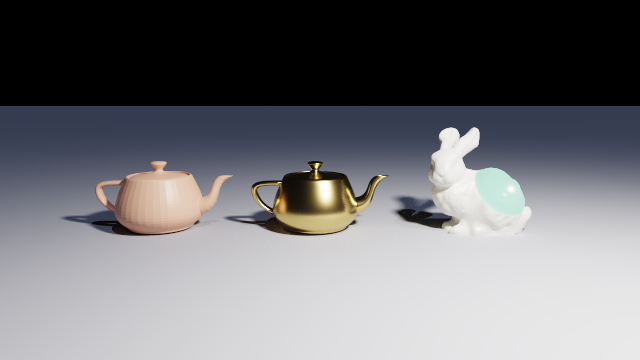

# The scene description language

The renderer takes one argument: a scene file. This document is the reference for that
file's language. Like [csg-raytracing.md](csg-raytracing.md) it is meant to be
self-sufficient — the POV-Ray material that inspired the design is reproduced in an
appendix so it never has to be looked up again.

> **Status: stable in shape.** The revision this document warned about happened in iteration
> 8 and was additive; the one after it, which brought the language the rest of the way to
> JavaScript's shape, was **not**. `function … { return … }` replaced `fn … = …;`, the
> ternary replaced `if` in expression position, `for (let i = 0; i < n; i++)` replaced the
> range loop, and the braces around a body stopped being optional. Every sample scene was
> migrated with it and each produces a byte-identical hierarchy dump, which is what says the
> change was to the *notation* rather than to the meaning. A file written against the older
> form is refused with a diagnostic naming the replacement, not left to fail obscurely.
>
> Keeping the syntax layer replaceable in one piece is an explicit architectural goal, and
> this revision is what tested it: nothing below `Sdl/` changed. See
> [architecture.md](architecture.md).

## Shape of the language

The design borrows POV-Ray's idea — a scene *is* a tree of declarative object blocks — but
not its syntax. Where POV-Ray relies on positional arguments and bare juxtaposed keywords,
this language uses a JavaScript-flavoured form that is easier to read, easier to extend
with a new field, and easier to parse without special cases:

- a node is a **type name followed by an object literal**: `sphere { ... }`
- inside a block, `name: value` is a **field** and a bare expression is a **child**
- `let` binds a reusable value, including a whole subtree, and `function` declares one that
  takes arguments and `return`s its result
- `if`/`else` and `for` decide and repeat, in a block or at the top level, with the braces
  they have in JavaScript; `import` reuses a file
- `condition ? a : b` is how a *value* is chosen; `if` produces entries, never a value
- `object` wraps one solid so that a binding can be placed without being re-typed
- `//` and `/* */` comment, `[x, y, z]` is a vector, arithmetic works on it

File extension: `.chroma`. Encoding: UTF-8. Sample scenes live in [scenes/](../scenes/).

```js
// scenes/csg.chroma

let radius = 1.3;
let red    = material { color: [0.8, 0.2, 0.2], roughness: 0.4 };

render { exposure: 1.3 }

camera {
  position: [0, 2, 5],
  lookAt:   [0, 0, 0],
  fov:      45
}

pointLight       { position: [2, 4, 3], color: [1, 1, 1], intensity: 55, radius: 0.4 }
directionalLight { direction: [-1, -1, -1], color: [0.8, 0.8, 1.1] }

difference {
  box    { min: [-1, -1, -1], max: [1, 1, 1] }
  sphere { center: [0, 0, 0], radius: radius }

  material:  red,
  translate: [0, 0.5, 0]
}
```

## Lexical structure

| Element | Form |
| --- | --- |
| Line comment | `// ... end of line` |
| Block comment | `/* ... */`, not nested |
| Number | `12`, `1.5`, `-0.25`, `1e-3` — always a 64-bit float internally |
| String | `"bezier"` — double quotes, no escapes, may not span a line |
| Boolean | `true`, `false` |
| Identifier | `[A-Za-z_][A-Za-z0-9_]*`, case-sensitive, `camelCase` by convention |
| Keyword | `let function return if else for true false struct import as private`; node names are ordinary identifiers |
| Punctuation | `{ } [ ] ( ) : , ; . ? = + - * / % ++ -- == != < <= > >= && \|\| ! & \| ^ ~ << >>` |

`in` and `..` are still **reserved** although the grammar no longer uses either. They spelled
the loop form the JavaScript revision replaced, and keeping them recognisable is what lets
`for (i in 0..n)` be answered with the new form rather than with a cascade about an
unexpected `..`.

Comments may appear anywhere whitespace may, including between a loop header and its body.
Block comments do **not** nest, and an unterminated one is reported at the `/*` that opened
it rather than at the end of the file.

Whitespace and newlines are insignificant. **Commas are optional** everywhere they may
appear — between block entries and between vector components — and are consumed and
discarded by the parser. Both of these are the same scene:

```js
sphere { center: [0, 1, 0], radius: 2 }

sphere {
  center: [0 1 0]
  radius: 2
}
```

## Grammar

```ebnf
scene          = statement* ;

statement      = letDecl | fnDecl | structDecl | returnStmt | assign | field | child
               | ifStmt | forStmt | importStmt ;

letDecl        = [ "private" ] "let" IDENT "=" expr ";" ;
fnDecl         = [ "private" ] "function" IDENT "(" [ IDENT { [ "," ] IDENT } ] ")" body ;
structDecl     = [ "private" ] "struct" IDENT "{" [ IDENT { [ "," ] IDENT } ] "}" ;
returnStmt     = "return" expr ";" ;
assign         = IDENT "=" expr | IDENT ( "++" | "--" )
               | postfix ( index | member ) "=" expr ;
field          = IDENT ":" expr [ "," ] ;
child          = expr [ "," ] ;
ifStmt         = "if" "(" expr ")" body [ "else" ( body | ifStmt ) ] ;
forStmt        = "for" "(" [ clause ] ";" [ expr ] ";" [ clause ] ")" body ;
clause         = letDecl-without-";" | assign | expr ;
importStmt     = "import" STRING [ "as" IDENT ] ";" ;
body           = "{" statement* "}" ;

node           = IDENT objectLiteral ;
objectLiteral  = "{" statement* "}" ;

expr           = ternary ;
ternary        = or [ "?" expr ":" ternary ] ;
or             = and { "||" and } ;
and            = bitOr { "&&" bitOr } ;
bitOr          = bitXor { "|" bitXor } ;
bitXor         = bitAnd { "^" bitAnd } ;
bitAnd         = equality { "&" equality } ;
equality       = comparison { ( "==" | "!=" ) comparison } ;
comparison     = shift { ( "<" | "<=" | ">" | ">=" ) shift } ;
shift          = additive { ( "<<" | ">>" ) additive } ;
additive       = multiplicative { ( "+" | "-" ) multiplicative } ;
multiplicative = unary { ( "*" | "/" | "%" ) unary } ;
unary          = [ "-" | "!" | "~" ] postfix ;
postfix        = primary { index | member } ;
index          = "[" expr "]" ;          (* only after IDENT, call, index or member *)
member         = "." IDENT ;
primary        = NUMBER
               | STRING
               | BOOLEAN
               | array
               | node
               | objectLiteral
               | call
               | IDENT
               | "(" expr ")" ;
call           = [ postfix "." ] IDENT "(" [ expr { [ "," ] expr } ] ")" ;
array          = "[" [ expr { [ "," ] expr } ] "]" ;
```

**A block, a file and a function body are the same list.** That is the shape of the grammar
above and the reason `if` and `for` need saying only once: whatever may be written at the top
level of a file may be written inside a block, and the reverse. A `field` outside a block and
a `child` that is not a scene item are rejected where the list is consumed, which is where
the useful message is.

Four points about the grammar, since they are what a parser gets wrong:

1. `IDENT` followed by `{` is a node, `IDENT` followed by `(` is a call, and `IDENT` alone is
   a reference to a binding. One token of lookahead settles all three.
2. Inside a block, `IDENT` followed by `:` is a field, one followed by `=`, `++` or `--` is
   an assignment, and anything else starts a child. Two tokens of lookahead.
3. A bare `objectLiteral` with no type name is allowed as an expression. Its type is
   inferred from the field receiving it, so `material: { color: [1, 0, 0] }` and
   `material: material { color: [1, 0, 0] }` are the same thing.
4. **`if` is only a statement**, so a `{` after its condition is always a body and never an
   object literal. That reading used to have to be settled by position, because `if` was also
   an expression; the ternary took that job, and the ambiguity went with it. It is also why
   the braces around a body can be mandatory — `if (a) b` has no second meaning left to be
   confused with.
5. **`[` indexes only after something that could name an array**: an identifier, a call, an
   index or a field. That restriction is load-bearing rather than tidy. Commas are optional
   here, so without it `[[0, 0] [1, 0]]` would read as one array indexed by another instead of
   as two points, and a `sphere { }` followed by `[1, 2, 3]` on the next line would read as one
   indexing expression instead of two statements. JavaScript closes the same hole with a
   newline rule; whitespace is insignificant here, so this closes it by noticing that nobody
   indexes a literal. Write `([1, 2, 3])[0]` if you want to.

**Entry order is preserved.** A block is a list, not a dictionary — the transform modifiers
depend on it (see below), and error messages are better when they can point at the entry as
written.

## Values and operators

Seven value types:

| Type | Literal | Notes |
| --- | --- | --- |
| Number | `1.5` | 64-bit float |
| String | `"bezier"` | names a variant; see below |
| Boolean | `true` | the result of a comparison and the argument of an `if`; see below |
| Array | `[1, 2, 3]` | any length, any element kind, nests; see [Arrays](#arrays) |
| Struct | `Point { x: 1, y: 2 }` | an instance of a declared record type; see [Structs](#structs) |
| Object | `sphere { ... }` | a node, typed or anonymous |
| Function | `function f(a) { ... }` | from a declaration, or one of the [built-ins](#built-in-functions) |

A `struct` declaration binds an eighth thing, the *type* itself, which is a name for a record
rather than a value of one. It obeys every rule an ordinary binding obeys.

**A string names a variant, it does not carry text.** The only fields that take one are those
choosing between named forms, such as `spline: "bezier"`, and each accepts a fixed set of
words — writing anything else reports the set. There are no escape sequences and a string may
not span a line: there is nothing an escape would be for, and stopping at the newline keeps a
missing closing quote a one-line mistake rather than one that swallows the rest of the file.
Strings support no operators.

**"Vector" is a word for an array of numbers, not a separate type.** `[1, 2, 3]` is an array
whose three elements happen to be numbers, and every field that wants a point, a colour or a
direction says so where it reads it. `center` wants *a vector of 3 components*, and reports
anything else in those words. So the two names describe the same value from two ends, and
nothing converts between them.

**No boolean is ever produced by accident.** `if (count)` is an error, not a shortcut: there
is no conversion from a number, a string or an array to `true`, and the only reading a scene
file could give one is the wrong one. No node takes a boolean field — booleans exist to be
compared and tested.

Arithmetic applies to numbers and to arrays whose elements are all numbers, component-wise,
with scalar promotion. Objects, strings, booleans, structs and arrays that nest support no
arithmetic.

| Precedence | Operators | Associativity |
| --- | --- | --- |
| 1 (highest) | unary `-`, `!`, `~` | right |
| 2 | `*` `/` `%` | left |
| 3 | `+` `-` | left |
| 4 | `<<` `>>` | left |
| 5 | `<` `<=` `>` `>=` | left |
| 6 | `==` `!=` | left |
| 7 | `&` | left |
| 8 | `^` | left |
| 9 | `\|` | left |
| 10 | `&&` | left |
| 11 | `\|\|` | left |
| 12 (lowest) | `? :` | right |

**The table is C's, including the two places C's is inconvenient.** A shift binds looser than
`+`, so `1 << 1 + 2` shifts by three; and `&`, `^` and `|` all bind *looser* than `==`, so
`x & 1 == 0` reads as `x & (1 == 0)` and is an error here rather than a wrong number. Both are
famous traps, and both are kept: a scene written by someone who knows C must not quietly mean
something else, and inventing a second table for one language is worse than inheriting a
known one.

```js
[1, 2, 3] * 2         // [2, 4, 6]
[1, 2, 3] + [0, 1, 0] // [1, 3, 3]
-[1, 0, 0]            // [-1, 0, 0]
2 * radius + 0.5      // number
[7, 8, 9] % 3         // [1, 2, 0]
i == 0 || i == n - 1  // true or false
```

Mixing lengths (`[1, 2] + [1, 2, 3]`) is an error. Multiplying two vectors is component-wise;
the dot and cross products are [`dot` and `cross`](#the-function-library).

**`%` is a remainder, not a modulus.** It follows C and JavaScript: the result takes the sign
of the left operand, so `-1 % 2` is `-1` and not `1`. It also does not require whole numbers —
`1.5 % 1` is `0.5` — because the language has one numeric type and rounding silently would be
worse than answering. The reason it exists is the checkerboard: `(x + z) % 2 == 0` is how a
scene says "every other one", and nothing else in the language expresses that.

**What each comparison accepts.** `==` and `!=` compare two values of the *same* kind —
numbers, strings, booleans, arrays element by element, or two structs of the same type field by
field. Comparing two kinds is an error rather than a `false`, because it is always a mistake in
the file. `<`, `<=`, `>` and
`>=` take **numbers only**: a vector has no order worth guessing at, and a string here names
a variant rather than carrying text.

`&&` and `||` **short-circuit**. The right-hand side of `false && x` is never evaluated, so
it may safely name something that does not exist in that case.

### `&`, `|`, `^`, `~` and the shifts

```js
let corner = (x == 0) ^ (z == 0);   // exactly one of them
let bit    = (i >> 2) & 1;          // the third bit of a counter
let mask   = (1 << n) - 1;
```

The three connectives carry **both of C's readings**, and the operands choose which:

| Operands | `&` | `\|` | `^` |
| --- | --- | --- | --- |
| two booleans | and | or | **exclusive or** |
| two whole numbers | bitwise and | bitwise or | bitwise exclusive or |

One spelling for both because nothing here mixes the kinds: `true ^ 1` is an error, not a
promotion, so no expression is ever ambiguous about which reading it wanted. `~` and the two
shifts take **numbers only** — `!` is the boolean complement and `~` is the numeric one.

**On booleans they do not short-circuit**, which is the difference from `&&` and `||` and the
reason C keeps both spellings. `false & f(x)` evaluates `f(x)`; `false && f(x)` does not.
`^` has no short-circuiting form and could not have one: neither operand decides the answer
alone. It is also the gap this closes — "exactly one of these" had to be written
`(a || b) && !(a && b)`.

**On numbers they are a constraint, not a second type.** The language has one numeric kind
and it is a 64-bit float, so a bitwise operator says what it needs of its operands and
reports anything else rather than rounding it:

| Written | Reported |
| --- | --- |
| `1.5 & 1` | `'&' takes two booleans or two whole numbers, found 1.5` |
| `true ^ 1` | `'^' takes two booleans or two whole numbers, found the boolean true and a number` |
| `[1,2,3] & 1` | `'&' takes two booleans or two whole numbers, found a vector of 3 components` |
| `1 << 64` | `'<<' shifts by 0 to 63 places, found 64` |
| `1 << 62` | `'<<' takes 1 past the largest whole number a scene can hold exactly` |

The magnitude limit is **2^53**, where a 64-bit float stops holding every whole number: past
it the answer would not be the answer, so it is refused at both ends — on an operand, and on
the result of a `<<` that carried two operands in range out of it. `>>` is **arithmetic** and
keeps the sign, so `-8 >> 1` is `-4`, which is C's behaviour on a signed operand and the only
reading a language whose numbers are all signed could offer.

**Vectors are refused throughout.** Arithmetic broadcasts across one because a coordinate
scaled is still a coordinate; a bit pattern per component is not something a scene has ever
wanted, and inventing it would be a rule with no user. There are no compound assignments
(`&=`, `<<=`) either, for the same reason `+=` does not exist.

## Arrays

```js
let radii  = [1, 1.5, 2];                    // numbers, and so also a vector
let points = [[0, 0], [1, 0], [1, 1]];       // arrays: a list of points
let posts  = [Post { at: 0 }, Post { at: 1 }];  // structs
let shapes = [sphere { radius: 1 }, box { }];   // nodes

radii[1]           // 1.5
points[2][0]       // 1
radii.length       // 3
```

**One `[ ... ]`, holding anything.** An array's elements may be numbers, strings, booleans,
other arrays, structs, nodes or functions, and they need not agree. It nests to any depth. The
only thing that ever requires numbers is the *field* reading one, which says so where it reads
it.

**This is the language's vector, widened.** A vector used to be a flat list of numbers that
could not nest, and `prism` and `lathe` worked around it by interleaving:
`[x0, z0, x1, z1, ...]`, paired up by the node. Both spellings are accepted now and mean the
same run of numbers, so no scene has to change:

```js
prism { points: [0, 0, 1, 0, 1, 1] }        // the flat form, still read
prism { points: [[0, 0], [1, 0], [1, 1]] }  // the same three points, said as points
```

### What you can do with one

| Written | Result |
| --- | --- |
| `a[i]` | the element at `i`, a whole number from `0` to `length - 1` |
| `a.length` | how many elements. The **only** member an array has |
| `a == b` | element by element, following nesting. Different lengths are `false`, not an error |
| `-a`, `a + b`, `a * 2`, `a % 2` | component-wise, **only** when every element is a number |
| `f(a)`, `return a` | passed to and returned from functions like any other value |
| `for (let i = 0; i < a.length; i++)` | how you walk one; there is no `for ... in` |

**Arithmetic is the vector arithmetic that was always there.** A scalar broadcasts to every
element, two arrays combine element by element and must therefore agree in length, and the
built-in functions compose with it exactly as arithmetic does:

```js
normalize([1, 1, 0]) * 3 + [0, 4, 0]      // a unit direction, scaled, then offset
length(cross([1, 0, 0], [0, 1, 0]))       // 1, the area of the unit square
dot(normalize(a), normalize(b))           // the cosine between two directions
[1, 2, 3] * 2 + [0, 1, 0]                 // [2, 5, 6]
```

An array that **nests** has no arithmetic and is refused as a whole rather than element by
element: `[[1, 2], [3, 4]] * 2` reports *arithmetic needs an array of numbers, found an array
of 2 elements*. A list of points is not a quantity, and a deeper broadcast is not the answer
anyone wanted.

**`a[i] = x` assigns to an element, and no other binding sees it.** An array is still a value:
assigning rebuilds it and rebinds the name rather than changing anything in place, so nothing
anywhere else can observe the write. That is what makes the second line below leave `a` alone,
and it is the answer this language already gives for solids, where referencing a binding twice
instantiates it twice.

```js
let a = [1, 2, 3];
let b = a;

b[0] = 99;              // b is [99, 2, 3]
a[0]                    // still 1

let grid = [[1, 2], [3, 4]];
grid[1][0] = 7;         // a path of any depth, through arrays and structs alike
```

The length is fixed: there is no `push`, no `concat` and no `a.length = n`. An array of another
size is built from a loop. `a[0]++` does not exist either: `++` steps a *name*, and widening it
would mean deciding how many times the index between the brackets is evaluated.

**Holding a node does not place it.** An element holding `sphere { ... }` is a description, and
referencing it *instantiates* it, exactly as referencing a `let` does, so placing `shapes[0]`
twice gives two independent solids.

**An array written as a child contributes its elements.** That is the asymmetry with a field,
which keeps whatever it is given: a field has a name and a declared meaning, so
`points: [[0, 0], [1, 0]]` is one list and stays one. A child position means "a thing that
belongs here", and a list of those belongs here. It flattens all the way down, so a list of rows
works, and an empty array contributes nothing:

```js
let shapes = [sphere { radius: 1 }, box { }];

union { shapes }                         // both solids, spliced
union { [shapes, shapes] }               // all four
union { shapes, cylinder { } }           // three; a splice is just more children

for (let i = 0; i < shapes.length; i++) {
  object { shapes[i], translate: [i * 3, 0, 0] }   // still how you place them apart
}
```

### What it reports

| Written | Reported |
| --- | --- |
| `a[3]` on three elements | `index 3 is out of range; the array has 3 elements, so 0 to 2` |
| `a[-1]` | `index -1 is out of range; …` |
| `a[0.5]` | `an index must be a whole number, found 0.5` |
| `a[true]` | `an index must be a number, found the boolean true` |
| `n[0]` where `n` is a number | `cannot index a number` |
| `a.count` | `an array has no 'count'; 'length' is the only one it has` |
| `a[0] = 5` on two elements | `index 5 is out of range; …` |
| `a.length = 4` | `an array has no 'length' to assign to; …, and it is not a field` |
| `a[0]++` | `'++' steps a name; write 'a[0] = a[0] + 1'` |

## Structs

```js
struct Post { at, height, tint }

let p = Post { at: 3, height: 1.5, tint: [0.8, 0.4, 0.2] };

p.height                                  // 1.5
```

**A record type, not an object literal that happens to have the right keys.** The declaration
fixes the field set, so a missing field and a misspelt one are both reported where the instance
is written rather than wherever the value was eventually needed. A field declaration is a name
and nothing else: the language has one numeric type and no type names to write, and which
fields there are is the whole of what the type has to say.

**An instance is written with the block syntax that already exists**, and which of the two a
block is comes from what its name resolves to: a struct type in scope wins, and anything else is
a node. So a struct type may not take a node's name: `struct sphere { … }` is reported at the
declaration, rather than quietly turning every `sphere` block in the file into a record.

**They are ordinary values.** A struct may hold anything, including other structs, arrays and
nodes; it may be passed to and returned from a function, which is the point of the entry; and a
`struct` declaration is an ordinary binding, so it obeys the no-shadowing rule and an `import`
exports it beside the materials:

```js
struct Point { x, y }

function scaled(p, by) { return Point { x: p.x * by, y: p.y * by }; }

let ring = [Point { x: 0, y: 1 }, Point { x: 1, y: 0 }];
scaled(ring[0], 2).y                      // 2
```

**`p.x = 3` assigns to a field, and no other binding sees it.** Exactly as for an array:
assigning rebuilds the struct along the path and rebinds the name rather than changing anything
in place, so a struct stays a value and `let q = p;` neither copies nor shares: there is
nothing to copy and nothing to share. That is the answer this language already gives for solids,
where referencing a binding twice instantiates it twice, and it is the reason a field assignment
inside a function is invisible to the caller:

```js
struct Point { x, y }

let p = Point { x: 1, y: 2 };
let q = p;

q.x = 99;                                 // q.x is 99
p.x                                       // still 1

function bump(v) { v.x = 99; return v; }
bump(p);
p.x                                       // still 1
```

The left of an assignment has to start with a **name**, because that is what the rebuilt value
is written back to: `make().x = 5` is reported rather than evaluated and discarded.

**`==` compares two structs of the same type, field by field**, following nesting. Two *different*
types are not comparable even if their fields match, and that is reported rather than answered
`false`: two types with the same field names are still two types, which is the reading a
declared record type is for.

**Arithmetic is refused by name**, as it is for strings and booleans: `Point { … } * 2` reports
*'Point' structs do not support arithmetic*.

**A node block has no fields to read.** `sphere { radius: 1 }.radius` is refused, and that
refusal is exactly what the `struct` declaration buys: a node is a description that a binder
later reads, and letting it be probed by key would make every node's field set part of the
language rather than part of its binder.

### What it reports

| Written | Reported |
| --- | --- |
| `Point { x: 1 }` | `'Point' is missing field 'y'` |
| `Post { at: 1 }` | `'Post' is missing fields 'height', 'tint'`, listed together rather than one message each |
| `Point { x: 1, y: 2, z: 3 }` | `'Point' has no field 'z'; it has 'x', 'y'` |
| `p.z` | the same message, at the use |
| `Point { x: 1, x: 2 }` | `field 'x' is set more than once on 'Point'` |
| `Point { x: 1, y: 2, sphere { } }` | `'Point' is a struct and takes only its fields, not child objects` |
| `struct Point { x, x }` | `'x' is already a field of 'Point'` |
| `struct sphere { r }` | `'sphere' is the name of a node type, so a struct cannot take it` |
| `p.z = 5` | `'Point' has no field 'z'; it has 'x', 'y'` |
| `make().x = 5` | `the left of an assignment has to start with a name; …` |
| `A { x: 1 } == B { x: 1 }` | `cannot compare a 'A' with a 'B'` |

**The hierarchy dump is unchanged by either.** Arrays and structs are values the evaluator
works with, and none of them reaches the scene model: a struct is read for its fields and an
array for its elements long before a binder sees a number. A scene that uses them dumps exactly
what the same scene written out by hand dumps.

### The ternary

```js
material: corner ? gold : steel
radius:   i == 0 ? 1 : i == 1 ? 2 : 3
```

`condition ? a : b` is the **only** way to choose a value; `if` is a statement and produces
entries rather than a value. Both arms are required — an expression has to produce something
whichever way the test goes — and **only the arm taken is evaluated**, so the other may name
something that would not work.

It groups to the **right**, so `a ? x : b ? y : z` reads as `a ? x : (b ? y : z)`, which is
the `else if` of expressions. Its condition obeys the same rule every condition does: a
boolean, with no truthiness anywhere.

### `let` bindings

```js
let radius = 1.3;
let unit   = sphere { center: [0, 0, 0], radius: 1 };

radius = 1.5;                 // assignment: the name must already exist
```

Bindings are visible from the point of declaration onward. **Nothing shadows:** a name
already visible anywhere cannot be bound again, and that includes a loop counter. A shadow in
a scene file is almost always a typo.

**A binding is mutable**, as JavaScript's `let` is, and `name = value`, `name++` and `name--`
assign to one. Assignment never *declares*: a name has to exist before it can be assigned to,
so a misspelling is reported rather than quietly creating a second binding. Mutability came
in with the loop — `for (let i = 0; i < n; i++)` is a counter that changes — and it is the
ordinary `let` that carries it, because one rule is better than an immutable `let` beside a
mutable loop variable.

A binding belongs to the innermost enclosing **frame** — a block, an `if` or `else` body, one
iteration of a `for`, or one call of a function. That is what lets a helper value sit next to
the geometry that uses it, and what stops the same `let` colliding with itself on the second
time round a loop:

```js
sphere {
  let r = 3;          // visible to the entries below it, and nowhere else
  radius: r,
  center: [r, 0, 0]
}
```

A binding may hold a whole subtree. Referencing it twice **instantiates it twice**, and the
resulting solids are independent. A reference on its own takes no modifiers — there is no
`unit { translate: ... }` form, since that would read as a node type called `unit`. To place
a copy, wrap the reference in an [`object`](#object), which is a solid like any other and
accepts the usual modifiers:

```js
let unit = sphere { radius: 1 };

object { unit, translate: [-2, 0, 0] }
object { unit, translate: [ 2, 0, 0 ] }
```

## Functions

```js
function drum(y, radius, thickness) {
  return cylinder { base: [0, y, 0], cap: [0, y + thickness, 0], radius: radius };
}

function stone(tint) {
  return material { color: tint, roughness: 0.55 };
}

drum(0, 0.42, 0.22)
```

**A function is a `let` that takes arguments.** Its body is a statement list and the value
comes out through `return`, so the work leading to that value is written in the function
rather than folded into one expression. What it returns is an ordinary value — a solid, a
material, a number, a vector — and nothing about it is geometry-shaped:

```js
function up(h)      { return [0, h, 0]; }       // a vector
function spacing(i) { return (i - 2) * 1.9; }   // a number
```

Everything a block can hold, a body can hold, and it is what the statement body is for:

```js
function column(i) {
  let shaft  = 2.14;
  let middle = i == 2;

  return union {
    drum(0, 0.42, 0.22)
    drum(0.22, 0.3, shaft)

    translate: [spacing(i), 0, 0]
    material: stone(middle ? [0.80, 0.68, 0.42] : [0.76, 0.74, 0.70])
  };
}

for (let i = 0; i < 5; i++) { column(i) }
```

`return` ends the body wherever it is written — inside an `if`, inside a loop — and the
statements after it do not run.

Calling a function that returns a solid **instantiates it**, exactly as referencing a `let`
does: five calls give five independent solids.

Two mistakes have messages of their own, because both read like correct scene files:

| Written | Reported |
| --- | --- |
| a body with no `return` at all | `'bead' reaches the end of its body without a 'return'` |
| a solid in a body with no `return` in front of it | `this value is not used; 'bead' produces its result with 'return'` |

**Two scopes are in play, and the split is the whole of the semantics.** The arguments are
evaluated where the call is written; the body is evaluated where the function was *declared*.
So a function means the same thing wherever it is called from, and a body cannot accidentally
read a name that happens to exist at some call site — the rule `import` already applies to a
whole file, applied one level down. It is also what makes a fragment of functions worth
including: they are ordinary bindings, so a fragment exports them the way it exports a `let`.

Parameters are ordinary bindings and obey the ordinary rule: **nothing shadows**. A parameter
that repeats a name already visible where the function is declared is an error, reported at
the declaration rather than at each call.

### Recursion, and how deep it may go

A function's body can see the function's own name, so it may call itself:

```js
function chain(n) {
  return union {
    sphere { center: [0, n, 0], radius: 0.2 }
    if (n > 0) { chain(n - 1) }
  };
}
```

One limit applies, and it is not about how long a recursion may run:

| Limit | Value | What it catches |
| --- | --- | --- |
| Call depth | 64 | a recursion with no base case, before the evaluator's own stack runs out |

It is reported once, naming the function, rather than at every call that meets it. The depth is
capped because exceeding it is not survivable: the evaluator recurses on the CLR stack, and a
stack overflow takes the process down with no diagnostic, no window and no exit code. There is no
cap on how *many* calls a load may make, so a recursion that branches within depth 64 runs until
it finishes or until you stop it. See [below](#a-file-that-does-not-finish).

## Built-in functions

The names the language supplies. One constant, two that draw from the scene's seed, and a
library of maths.

| | |
| --- | --- |
| **Constant** | `PI` |
| **Randomness** | [`random(i)`](#random), [`perlin(x, y)`](#perlin) |
| **Trigonometry**, in radians | `sin` `cos` `tan` `asin` `acos` `atan` `atan2(y, x)` |
| **Powers** | `sqrt` `exp` `log` `pow(x, y)` |
| **Rounding and sign** | `abs` `sign` `floor` `ceil` `round` |
| **Range** | `min(a, b)` `max(a, b)` `clamp(x, lo, hi)` |
| **Vectors** | `length(v)` `normalize(v)` `dot(a, b)` `cross(a, b)` |

**They are bindings, not syntax.** A built-in lives in a frame outside the file, which the
file's own scope nests inside, so it is visible everywhere, an imported file sees the same
ones, and the no-shadowing rule applies to it like any other name. `function random(i)` in a
scene is therefore an **error** rather than an override, and says so as a collision with a
built-in rather than with a declaration the file does not contain. Nothing assigns to one,
`PI` included: the frame is what makes a name a built-in, not the kind of value it holds.

```
'random' is a built-in of the language
'PI' is a built-in of the language, and nothing assigns to one
'i' of 'random' is a number, found the boolean true
'v' of 'normalize' is a vector, found a number
'random' takes 1 argument, found 2
```

> **Reserved words, in effect.** Every name above is taken, and some of them are words a scene
> would reach for: `floor`, `min`, `max`, `length`, `round`, `sign`, `cross`. A file that binds
> one gets *'floor' is a built-in of the language* and has to rename it; three scenes in this
> repository did. That is the cost of the no-shadowing rule, paid deliberately: an override
> that silently redefined `floor` for a whole file would be far worse to debug.

### The function library

The scalar functions each take numbers and give a number. The four vector ones take an array
whose elements are all numbers, and `normalize` and `cross` give one back, which is what
arrays bought: there was no way to hand a vector to a function or get one back before them.

```js
sqrt(9)                                   // 3
pow(2, 10)                                // 1024
clamp(count, 1, 8)                        // never outside the range
round(0.5)                                // 1, away from zero as C rounds

length([3, 4])                            // 5, at any length
normalize([1, 1, 0]) * 3 + [0, 4, 0]      // a unit direction, scaled, then offset
dot([1, 2, 3], [4, 5, 6])                 // 32
length(cross([1, 0, 0], [0, 1, 0]))       // 1
```

Four things are worth stating rather than discovering:

- **Trigonometry is in radians, always**, whatever [`render { angles: … }`](#render--optional-at-most-one)
  says. That setting is about how two *fields* are written; `sin` is mathematics, and it is
  what every language means by the name. `PI` is what makes it usable, and a file working in
  degrees writes `sin(a * PI / 180)`.
- **`round` goes away from zero at a half**, as C's does, so `round(0.5)` is `1` and
  `round(-0.5)` is `-1`. `log` is the natural logarithm, as C's is.
- **The scalar functions are scalar.** `abs([1, -2])` is an error, not a component-wise
  `abs`: the arithmetic operators broadcast and these do not, and one rule per name is
  clearer than a second broadcasting rule that only some functions have.
- **A domain error answers rather than reports.** `sqrt(-1)` is `NaN` and `log(0)` is `-∞`,
  which is what `1 / 0` has always done here. Checking the domain of `sqrt` while leaving `/`
  alone would be an inconsistency rather than a safety net. The exceptions are the three cases
  where there is no number at all to give back: `normalize` of a zero vector, `dot` of two
  different lengths, and `cross` of anything but two 3-component vectors. Those are reported.

> **One caveat about determinism**, because this document claims it elsewhere. `random` and
> `perlin` are bit-identical on every machine by construction. The trigonometric and
> exponential functions are **not**: they go to the platform's own maths library, which is not
> promised to the last bit across operating systems, so a scene whose geometry is computed
> through `sin` may differ by one float on another machine. Nothing in `scenes/manual/` uses
> them, so the manual's `-Check` is unaffected.

### `random`

```js
render { seed: 7 }

for (let i = 0; i < 200; i++) {
  box {
    min: [i * 0.3, 0, 0],
    max: [i * 0.3 + 0.2, 1 + random(i) * 2, 0.2]     // 200 posts of 200 heights
  }
}
```

**The numbers are drawn while the scene is being built**, on the CPU, by the evaluator.
`random(i)` is an expression like `2 * radius`: its result is an ordinary number in a field,
and by the time anything is compiled there is no randomness left anywhere. The shader neither
knows nor could know that a value was drawn rather than typed. That also makes it a different
thing entirely from the per-pixel hash inside the shader, which draws a fresh number every
sample because averaging those samples is what the image *is*.

**It takes an argument, and that is the whole design.** A `random()` returning the next value
of a stream would make every result depend on the order the evaluator happens to walk the tree,
so a refactor of the evaluator would silently redraw every scene that used it and no test would
name the cause. A pure function of its argument has no order to depend on: the scene supplies
what varies, usually the loop counter, and the same argument gives the same number wherever in
the file it is written.

**One form, because the arithmetic already exists.** `lo + random(i) * (hi - lo)` is the range,
and there is deliberately no second built-in for it.

### `perlin`

```js
for (let i = 0; i < 40; i++) {
  for (let j = 0; j < 40; j++) {
    // Two octaves, summed in the language rather than inside the function.
    let h = perlin(i * 0.1, j * 0.1) + perlin(i * 0.4, j * 0.4) * 0.25;

    box { min: [i, 0, j], max: [i + 1, 2 + h, j + 1] }
  }
}
```

`perlin` is `random` with one property added: **neighbouring inputs give neighbouring
outputs.** That is the whole difference between scattering a hundred posts and growing a
landscape, and it is what no amount of `random(i)` produces.

- **Two dimensions**, because terrain is what a scene file asks noise for. Three is what a
  solid texture wants, and a solid texture belongs on the other side of the compiler, where it
  would be evaluated per hit rather than per field.
- **One octave**, which lands in `[-1, 1]` and looks like nothing anyone wants on its own.
  Fractal summation is a four-line loop in a language that has loops and arithmetic, so
  octaves, lacunarity and persistence are the scene's to write and are not hidden inside.
- **The value is zero at every whole coordinate**, which is how gradient noise is built. A
  scene that samples on integers gets a flat field; scale the input, as above.

### Determinism, and the seed

**The same file gives the same numbers, on every load and on every machine.** That is a
feature rather than a caveat, and several things rest on it: the manual's `-Check` compares 38
rendered images byte for byte, and the byte-identity sweeps compare a scene across drivers and
chunk counts. A value that varied per load would retire all of them at once. So neither
function has any platform-dependent step, neither uses the framework's `Random` — whose
sequence is documented as not being stable across runtimes — and neither uses `sin` or `cos`,
which are not promised to the last bit across platforms.

The seed is `render { seed: 7 }`, and **it is read from the text of the scene file** before
anything is evaluated, because the numbers it decides are drawn long before the `render` block
is bound. Two consequences, both reported rather than silent:

| Written | Reported |
| --- | --- |
| `render { seed: 6 + 1 }` | `'seed' is read from the text of the scene file before anything is evaluated, so it must be a plain number written in the scene file itself` |
| `render { seed: 21 }` in an imported file | the same message |

A plain number, or a minus sign and a plain number. Absent, it is `0` — a fixed default, never
a clock and never a process id, since a scene that looks different every time it is opened
cannot be reviewed.

**It interacts with instancing.** A random *placement* changes nothing: the placement is buffer
data and the shape stays shared. A random *dimension* makes every copy a distinct shape,
collapses the sharing and puts the scene on the cost model — see
[instancing.md](instancing.md). `random` makes both equally short to write, which is worth
knowing before writing the second one.

## Conditions and loops

`if` and `for` are ordinary statements, so they may be written anywhere a field or a child
may — at the top level of a file, or inside any block. What they produce is spliced into the
list around them.

### `if`

```js
for (let i = 0; i < 5; i++) {
  if (i == 0) {
    sphere { radius: 2 }         // one of these
  } else if (i < 3) {
    box { }                      // or one of these
  } else {
    // nothing at all
  }
}
```

**The braces are not optional**, even around a single statement. They were until the
JavaScript revision, and what that cost was a rule to remember and a way to write
`if (a) b else c` that meant something other than it looked like. `if` chooses between two
*bodies*; to choose between two values, use the [ternary](#the-ternary).

### `for`

```js
for (let i = 0; i < n; i++) { ... }
```

C's loop and JavaScript's: an init clause, a condition, a step clause. Each is optional and
the two `;` are not, so `for (;;)` is the infinite loop. The step clause is an ordinary
statement, so counting downwards or in twos needs no new syntax:

```js
for (let i = 6; i > 0; i = i - 2) { ... }
for (let j = n; j > 0; j--)       { ... }
```

The counter lives in the loop's **header** frame and survives every iteration; the body gets
a **fresh** frame each time round, so a `let` inside it does not collide with itself on the
second pass. Neither escapes the loop.

There is no `while`, and it would now add nothing: `for (; condition; )` is one.

**What generated geometry strains is the tape, and then the span budget.** Both are reported
rather than truncated, and the diagnostic names the *loop* rather than the thousandth sphere,
because the count is what has to change:

```
error: this loop over 'i' puts 9 solids in a 'union' that can produce up to 9 spans
       along a ray; the shader holds 8
```

The obvious workaround — leaving the generated solids at the top level rather than under a
`union` — is not semantically free. Top-level solids are unioned but **not merged**
(see [below](#top-level-solids-are-unioned-but-not-merged)), which is invisible for opaque
solids and visible the moment one of them is glass.

### A file that does not finish

**Nothing bounds a loop but its own condition.** `for (;;) { sphere { } }` runs until you stop
it, and a file that loops forever produces no diagnostic, no window and no exit code.

There was a budget here once, of 100 000 iterations per load and 100 000 calls beside it, and it
existed precisely to make that failure reportable. What it cost was the scene one level up:
`scenes/cube-4.chroma` spends 328 419 iterations building 160 000 boxes, and the renderer draws
it at three percent of the instruction budget. A number large enough for that scene is not a
guard against anything, and a number small enough to be one refuses scenes that render. So the
count is gone, and a loop in a scene file behaves the way a loop behaves in every other
interpreter: it is your loop, and it runs.

What is *not* gone is the call-depth cap, because the two failures are not alike. A loop that
never ends can be interrupted; a recursion that overflows the CLR stack cannot be, and takes the
process with it.

### `import`

```js
import "palette.chroma";                    // its exports land here, flat
import "palette.chroma" as palette;         // …or behind a name

palette.gold                                // a binding
palette.stone([0.8, 0.7, 0.5])              // a function
```

The path is resolved **relative to the file that wrote it**, not to the working directory, so
a folder of files that import each other keeps working wherever the renderer is run from. A
cycle is refused rather than followed. Either form **runs** the file, so one that declares
solids contributes them; the alias changes only where its bindings land.

> The keyword was `include` until iteration 20, and the word was wrong the whole time: this
> has never been textual insertion. `include` is reported and names `import`, and nothing else
> about it changed.

Visibility is deliberately **asymmetric**, and each direction earns its keep:

| Direction | Rule | Why |
| --- | --- | --- |
| Imported → importer | its declarations are published, unless marked `private` | a file of materials that exports nothing is not worth importing |
| Importer → imported | its bindings are **not** visible to the imported file | the file means the same thing wherever it is dropped, and cannot be broken by a host scene that happens to define a name it uses |

Diagnostics inside an imported file name **that file and its own line and column**, which is
the property the whole design of this feature protects, and the one a textual `#include` ahead
of the lexer would have given away.

#### `private`, and what leaves a file

```js
private let seam = 0.02;                    // stays in this file
private function bevel(x) { return x - seam; }

let gold = material { color: [1, 0.8, 0.2], roughness: bevel(0.3) };
```

`private` goes in front of a `let`, a `function` or a `struct`, and keeps it inside the file
that declared it. The marker is on what **stays** rather than on what leaves, which is the way
round that leaves the common case unannotated: a file written to be imported is written for its
bindings, and the helpers it does not want to publish are the few.

It changes nothing inside the file itself: a private name is an ordinary binding to everything
declared beside it. And it is only ever consulted at a file's outermost level: written in a
block, a loop body or a function, it is accepted and does nothing, because nothing exports one
of those frames.

#### Which form to use

The flat form is the one a scene reaches for, and the aliased form is what settles the two
things it cannot:

| | Flat | Aliased |
| --- | --- | --- |
| Two files both defining `gold` | an error, reported at the second `import` | fine; they are `warm.gold` and `cool.gold` |
| Where the dependency is legible | only at the top of the file | at every use site |

A name defined on both sides of a flat import is an error, and the message names the aliased
form as the way round it. Parameterising an imported file is what [functions](#functions) are
for: a file of `function` declarations is the reusable, argument-taking form of one, and its
body keeps reading its own file's scope wherever it is called.

```
'warm.chroma' defines 'tone', which is already defined here; write
'import "warm.chroma" as …' to reach it by name instead
'palette.chroma' does not export 'silver'; it exports 'gold', 'steel'
the module 'palette' is not a struct, and has no fields to read
```

## Node reference

### `camera` — required, exactly one

| Field | Type | Default | Meaning |
| --- | --- | --- | --- |
| `position` | vec3 | — | eye position, world space |
| `lookAt` | vec3 | `[0,0,0]` | point the camera aims at |
| `up` | vec3 | `[0,1,0]` | roll reference; must not be parallel to the view direction |
| `fov` | number | `45` | **vertical** field of view, degrees |

### `render` — optional, at most one

Settings that belong to the scene rather than to the build. Absent means the defaults.

| Field | Type | Default | Meaning |
| --- | --- | --- | --- |
| `maxBounces` | integer | `4` | path length; `1` is direct lighting only. Must be `1..16` |
| `exposure` | number | `1` | multiplier applied before tone mapping |
| `seed` | integer | `0` | what [`random` and `perlin`](#built-in-functions) draw from. Must be a **plain number**, written in the scene file itself |
| `angles` | `"degrees"` or `"radians"` | `"degrees"` | the unit `rotate` and `camera.fov` are written in |

`maxBounces` outside its range, or written with a fraction, is an **error** rather than a
clamp: the loop runs per pixel per frame, so an absurd depth is a typing mistake and a
frozen driver costs far more to diagnose than a message.

`seed` is the one setting here the renderer never reads. Everything it decides has already
happened by the time a scene exists, and no trace of it survives into the shader. It is also
the one that is read twice — once out of the file's text before anything is evaluated, and
once as an ordinary field — which is why it may not be an expression. See
[Determinism, and the seed](#determinism-and-the-seed).

`angles` covers `rotate` and `camera.fov`, which are the only angular fields there are. It is
a property of how the *file is written* rather than of what it describes, so nothing downstream
knows it existed: the binders convert as they read, the scene model still holds degrees, and
the hierarchy dump of a scene that says nothing prints what it always printed. It applies to
the whole file wherever the block is written. The `render` block is bound before everything
else for exactly this reason, so a scene naming the mode at the bottom still means it for the
camera at the top. It does **not** change the trigonometric built-ins, which take radians in
either mode.

```js
render { angles: "radians" }

camera { position: [0, 3, 8], lookAt: [0, 0, 0], fov: PI / 4 }
sphere { rotate: [0, PI / 2, 0] }
```

### `pointLight`

| Field | Type | Default | Meaning |
| --- | --- | --- | --- |
| `position` | vec3 | — | |
| `color` | vec3 | `[1,1,1]` | |
| `intensity` | number | `1` | see the falloff note below |
| `radius` | number | `0` | `0` is an idealised point and gives hard shadows; above `0` the light is a sphere and its shadows gain a penumbra |

**Brightness falls off with the square of the distance.** A light 5 units away delivers
1/25 of what the same `intensity` delivers at 1 unit, so useful values are much larger than
they look — a room-sized scene typically wants tens.

`radius` is a **pure softness control**: the light's radiance is normalised so that widening
it does not change how brightly anything is lit. Only the shadows change, and the penumbra
widens with the distance between the occluder and the surface, as it does in life.

### `directionalLight`

| Field | Type | Default | Meaning |
| --- | --- | --- | --- |
| `direction` | vec3 | — | direction the light travels *towards*, normalised on load |
| `color` | vec3 | `[1,1,1]` | |
| `intensity` | number | `1` | infinitely far away, so no falloff |

### `material`

The metallic-roughness model. See [lighting.md](lighting.md) for the BRDF these drive.

| Field | Type | Default | Meaning |
| --- | --- | --- | --- |
| `color` | vec3 | `[0.8,0.8,0.8]` | base colour, linear, `0..1` — diffuse albedo for a dielectric, reflectance tint for a metal |
| `roughness` | number | `0.5` | `0` mirror-smooth, `1` fully matte. Clamped |
| `metallic` | number | `0` | `0` dielectric, `1` metal. Clamped |
| `emission` | vec3 | `[0,0,0]` | radiance emitted; **not** clamped, since a light is not limited to 1 |
| `transmission` | number | `0` | how much of the non-reflected light passes through instead of scattering. `0` opaque, `1` clear glass. Clamped |
| `ior` | number | `1.5` | index of refraction. Must be `1` or more |
| `absorption` | vec3 | `[0,0,0]` | absorption coefficient σ<sub>a</sub> **per world unit**, inside the solid. Must not be negative |
| `scattering` | number | `0` | scattering coefficient σ<sub>s</sub> per world unit. `0` is glass, above `0` is fog or smoke. Must not be negative |
| `anisotropy` | number | `0` | how the medium scatters: `0` equally in all directions, positive forward, negative backward. Clamped to `±0.99` |

A mirror is `metallic: 1, roughness: 0`. Note that a metal has **no diffuse component at
all** — it only reflects its surroundings, so a metal solid in an otherwise empty scene
renders nearly black. That is correct, not broken; give it something to reflect.

Glass is `transmission: 1, roughness: 0`. Three things about the transmissive fields are
worth knowing before the first attempt:

- **`color` does nothing at `transmission: 1`.** What is not reflected goes through rather
  than scattering, so there is no diffuse lobe left to tint. To tint glass, use `absorption`.
- **`absorption` is a rate, not a multiplier.** Doubling a solid's thickness *squares* the
  transmittance. That is why the same material looks pale in a thin slab and deep in a thick
  one, which is exactly how real glass behaves.
- **`ior` also sets reflectance.** A dielectric reflects `((ior − 1)/(ior + 1))²` head-on,
  which at the default 1.5 is the 0.04 the renderer used as a constant before this field
  existed. `roughness` still applies to both the reflected and the transmitted lobe, so a
  high `roughness` with `transmission: 1` gives frosted glass.

`transmission` is ignored on a metal — a metal does not transmit — and setting both is
reported as a warning rather than an error, because the picture is right and only the
expectation is wrong.

Fog is `transmission: 1, ior: 1, scattering: 0.05`. The medium fields describe what happens
*between* the surfaces of a solid rather than at them, and three things follow:

- **A medium needs `transmission`.** Light that cannot get inside a solid cannot scatter in
  it, so `scattering` on an opaque material does nothing and is warned about, for the same
  reason and in the same way as `transmission` on a metal.
- **`ior: 1` is what makes a volume of air.** Left at the default 1.5 a fog box is a giant
  lens and bends the whole scene behind it. It is also not free: an `ior: 1` solid is
  optically invisible and still spends two bounces crossing it, so raise `maxBounces`.
- **`anisotropy` is what makes a beam visible.** At `0` a medium is a uniform veil from every
  direction. A shaft of light through haze is forward scattering — light deflected only
  slightly from the way it was already going — so it wants `0.6` to `0.8`.

A medium's colour comes from `absorption`, which is per channel; `scattering` is one number
for all three. That asymmetry is deliberate and is explained in
[transparency.md](transparency.md#the-trap-one-distance-three-channels).
`scenes/fog.chroma` is the worked example.

See [transparency.md](transparency.md) for the model, and its
[Limits](transparency.md#limits-of-this-implementation) section for what it does not do:
notably no nested media, no dispersion, and no subsurface scattering.

An emissive solid is *seen* rather than used to light the scene. It is found only when a
bounced ray happens to hit it, so a large emissive surface converges well and a small one
stays noisy — use `pointLight { radius }` to illuminate, and `emission` to make the source
visible. [lighting.md](lighting.md#emissive-surfaces-are-not-sampled) explains why.

### Primitives

| Node | Field | Type | Default |
| --- | --- | --- | --- |
| `sphere` | `center` | vec3 | `[0,0,0]` |
| | `radius` | number | `1` |
| `box` | `min` | vec3 | `[-1,-1,-1]` |
| | `max` | vec3 | `[1,1,1]` |
| `cylinder` | `base` | vec3 | `[0,0,0]` |
| | `cap` | vec3 | `[0,1,0]` |
| | `radius` | number | `1` |
| `cone` | `base` | vec3 | `[0,0,0]` |
| | `baseRadius` | number | `1` |
| | `cap` | vec3 | `[0,1,0]` |
| | `capRadius` | number | `0` |
| `plane` | `normal` | vec3 | `[0,1,0]` |
| | `distance` | number | `0` |
| `torus` | `center` | vec3 | `[0,0,0]` |
| | `majorRadius` | number | `1` |
| | `minorRadius` | number | `0.25` |
| `prism` | `points` | vec2n | — |
| | `bottom` | number | `0` |
| | `top` | number | `1` |
| | `spline` | `"linear"` \| `"bezier"` | `"linear"` |
| | `steps` | integer | `8` |
| `lathe` | `points` | vec2n | — |
| | `spline` | `"linear"` \| `"bezier"` | `"linear"` |
| | `steps` | integer | `8` |
| `sphereSweep` | `spheres` | vec4n | — |
| | `spline` | `"linear"` \| `"bezier"` | `"linear"` |
| | `steps` | integer | `4` |
| `quadric` | `squared` | vec3 | `[1,1,1]` |
| | `mixed` | vec3 | `[0,0,0]` |
| | `linear` | vec3 | `[0,0,0]` |
| | `constant` | number | `-1` |
| `mesh` | `file` | string | — required |
| | `close` | boolean | `false` |
| | `smooth` | boolean | `false` |
| | `maxSpans` | integer | `4` |
| `blob` | `threshold` | number | `1` |
| | children | `blobSphere`, `blobCylinder` | at least one |
| `blobSphere` | `center` | vec3 | `[0,0,0]` |
| | `radius` | number | `1` |
| | `strength` | number | `1` |
| `blobCylinder` | `base` | vec3 | `[0,0,0]` |
| | `cap` | vec3 | `[0,1,0]` |
| | `radius` | number | `1` |
| | `strength` | number | `1` |

**Every primitive is a solid**, with an inside and an outside, and every one of them is a
legal operand of `union`, `intersection` and `difference`. None of them has POV-Ray's `open`
modifier, and none will: an uncapped shape has no well-defined inside, and CSG needs one.

`box` is axis-aligned *as written*; rotate it with the `rotate` modifier. `cylinder` is
capped at both ends — it is a solid, not a tube, which is what CSG requires.

`cone` is a truncated cone, capped at both ends. `capRadius: 0` — the default — gives the
familiar pointed cone; equal radii give a cylinder. Writing the narrow end as the `base` is
fine and describes the same solid.

`plane` is an **infinite half-space**: everything on the side its `normal` points away from.
`distance` is measured along the normal, which is normalised on load, so `plane { normal: [0,
2, 0], distance: 3 }` and `plane { normal: [0, 1, 0], distance: 3 }` are the same plane.
Being a solid rather than a surface is what makes `difference { plane, sphere }` a ground
with a crater in it. It is the natural ground for a scene, and the only primitive whose span
runs to infinity.

`torus` lies in the XZ plane with Y through its hole, as POV-Ray's does. It is the first
primitive here that is **not convex** — a ray through the hole and out the far side crosses
it twice. `minorRadius` must be smaller than `majorRadius`: POV-Ray's self-intersecting
spindle torus offers four different answers to what its inside is, and none of them is a
shape a CSG operand can be relied on to be, so it is refused rather than guessed at.

#### Point lists

`prism` and `lathe` take a list of 2D points, in **either** of two spellings:

```js
prism { points: [[x0, z0], [x1, z1], [x2, z2]] }    // a contour in the XZ plane
lathe { points: [[r0, y0], [r1, y1], [r2, y2]] }    // an outline in (radius, y)

prism { points: [x0, z0,  x1, z1,  x2, z2] }        // the same contour, flat
```

The flat form is what the language had before an [array](#arrays) could nest: a vector was a
list of numbers, so a point list was interleaved and the node paired the numbers up. Both reach
the binder as the same run of numbers, so no scene has to change and the hierarchy dump is
identical either way. **Mixing them is refused**: an array of pairs with one loose number in
it is a typo, and the message names the element: *field 'points' expects groups of 2 numbers,
and element 3 is a number*.

`sphereSweep` reads its `spheres` the same way, in groups of four:
`[[x, y, z, r], …]` or the flat `[x, y, z, r, …]`. A Bézier outline or path groups its points
into curves of four, which is the field's own convention and is unaffected by which spelling
the points are written in.

At least three points, and **the contour closes implicitly** — the last point joins back to
the first. Repeating the first point at the end, which is how POV-Ray closes a linear spline,
is accepted and ignored.

`prism` sweeps its contour along Y between `bottom` and `top`, and caps both ends. `lathe`
revolves its outline about the Y axis; no point may have a negative radius, since the surface
of revolution of a curve that crosses the axis does not bound a solid.

#### Several contours, and holes

A `prism` or a `lathe` may hold **more than one closed contour**, written as one more level of
nesting. Contours combine by the even-odd rule, so a contour drawn inside another is a hole:

```js
// A square washer: an outer square, and a square hole through it.
prism {
  bottom: 0,
  top:    1,
  points: [[[-2, -2], [2, -2], [2, 2], [-2, 2]],
           [[-1, -1], [1, -1], [1, 1], [-1, 1]]]
}
```

```js
// A tube, as its own wall: an outer outline and an inner one.
lathe {
  points: [[[1.3, 0], [1.3, 2], [1.0, 2], [1.0, 0]],
           [[0.7, 0.3], [0.7, 1.5], [0.4, 1.5], [0.4, 0.3]]]
}
```

**Two brackets is one contour and three is a list of contours**, told apart by what the first
element holds rather than by counting: `[[0, 0], [1, 0], [0, 1]]` is one contour of three
points, because its first element is a list of *numbers*, and
`[[[0, 0], [1, 0], [0, 1]]]` is a list of one contour, because its first element is a list of
*points*. Nothing has to be guessed, and every scene written before this reads as it always did.

Each contour needs its own three points, and a message that names one says which:
*'prism' needs at least 3 points in contour 2 of 'points', found 2*. The 64-point limit is a
total across all of them.

`difference` still does what it always did, and is the better answer when the hole is a shape
the contour is not — a round hole through a hexagonal post, say. A second contour is the better
answer when the hole belongs to the outline, which is what makes a lathe hollow without
building the same vase twice.

#### Curved outlines

`prism` and `lathe` both accept `spline: "bezier"`, in which case `points` holds **cubic Bézier
curves as groups of four points** — start, two control points, end — which is POV-Ray's
grouping. Each curve is flattened into `steps` straight segments, and the contour closes back to
its first point as usual.

```js
lathe {
  spline: "bezier",
  steps:  8,
  points: [
    // P0        control     control     P3
    0,    0,     0.55, 0,    0.75, 0.1,   0.75, 0.45,
    0.75, 0.45,  0.75, 0.9,  0.28, 1.0,   0.30, 1.45,
    0.30, 1.45,  0.32, 1.8,  0.62, 1.85,  0,    2.0
  ]
}
```

**Flattening happens before the scene reaches the GPU.** The model, the compiler and the
shader all see a polyline and none of them knows a curve was involved, which is why a curved
lathe costs nothing extra to trace — it is the machinery that already existed, with more
vertices. Repeating each curve's end as the next curve's start, as above, is POV-Ray's
convention and is what keeps the outline continuous.

A curved outline also gets its **normals blended across the segment joints**, and a
hand-written one does not. That distinction matters more than it sounds: flattening fixes the
silhouette, which is smooth at any `steps`, but without blending the *shading* facets stay
visible however fine the tessellation, and a Bézier vase comes out looking like a stack of
rings. A linear outline keeps its hard edges, because its corners are deliberate.

`steps` is `1..64`. Raising it costs no spans (see the budget note below) — only points, and
the limit there is 64 after flattening.

#### `sphereSweep`

The volume swept by a sphere whose centre **and radius** vary along a path: a tube, a cable, a
tentacle, a bead of solder. `spheres` holds groups of four numbers, `x, y, z, radius`.

```js
sphereSweep {
  spheres: [
    -1.1, 0.32, 0.55,  0.32,
    -0.5, 1.15, 0.0,   0.25,
     0.1, 0.45, -0.5,  0.19
  ]
}
```

Each consecutive pair contributes the convex hull of the two spheres — a tapered tube with a
hemispherical cap at each end — and the sweep is their union. **The joints are seamless
without any special treatment**, because consecutive hulls share a whole sphere rather than
meeting at a face.

Unlike a prism or a lathe the path is **open**: it does not close back on itself, so `n`
spheres give `n - 1` segments. To make a closed loop, repeat the first sphere at the end. At
least 2 spheres, at most 32, and every radius must be above 0.

##### Curved paths

`spline: "bezier"` curves the path itself, as POV-Ray's `cubic_spline` does. `spheres` then
holds **cubic Bézier curves as groups of four spheres**, sixteen numbers per curve, and each
curve is flattened into `steps` segments:

```js
sphereSweep {
  spline: "bezier",
  steps:  4,
  spheres: [
    // P0                control            control           P3
    -1.5, 0,   0, 0.3,   -0.5, 1.2, 0, 0.3,   0.5, 1.2, 0, 0.2,   1.5, 0, 0, 0.2,
     1.5, 0,   0, 0.2,    2.5, -1.2, 0, 0.2,  3.5, -1.2, 0, 0.1,  4.5, 0, 0, 0.1
  ]
}
```

**The radius is the fourth component of the same curve**, so a taper follows the path instead
of stepping at each joint. Every control radius must be above 0, and checking those is the whole
check: a cubic stays inside the convex hull of its control points, so four positive radii cannot
produce a negative one between them.

`steps` defaults to **4** here, where an outline's defaults to 8. Each step of a path is a whole
tapered tube rather than a line segment, so the same number buys a good deal more work. A path
of `n` control curves flattens to `1 + n × steps` spheres, and the 32-sphere limit is applied
**after** flattening: *'sphereSweep' has 65 spheres after flattening; the limit is 32. Lower
'steps' or use fewer curves*.

POV-Ray's `b_spline`, which does not pass through its control points, is not built.

#### `quadric`

The solid where a general quadratic in x, y and z is at most zero:

```
A x² + B y² + C z² + D xy + E xz + F yz + G x + H y + I z + J ≤ 0
```

The ten coefficients are four named fields, three vectors and a number:

```js
// A hyperboloid of one sheet: a waisted tube.
quadric { squared: [1, -1, 1], constant: -0.35 }

// A paraboloid, opening downward.
quadric { squared: [1, 0, 1], linear: [0, 1, 0], constant: 0 }

// The defaults are the unit sphere: x² + y² + z² - 1 ≤ 0.
quadric { }
```

`squared` is `[A, B, C]`, `mixed` is `[D, E, F]` for the `xy`, `xz` and `yz` terms, `linear` is
`[G, H, I]`, and `constant` is `J`. **The inside is where the expression is negative**, which is
what makes the defaults a ball rather than everything outside one.

This is the family the other primitives do not reach: ellipsoids that are not spheres,
paraboloids, hyperbolic paraboloids, and the hyperboloids of one and two sheets. It sits beside
`sphere`, `cylinder` and `cone` rather than replacing them, because those three come with a
known bound and a shorter solve.

**A quadric is usually infinite**, and unlike `plane` that is rarely what you want to look at.
It has no box to skip rays with, so a scene containing one tests it everywhere. Give it bounds
with an `intersection`:

```js
intersection {
  quadric { squared: [1, -1, 1], constant: -0.35 }
  box { min: [-1, -1, -1], max: [1, 1, 1] }
}
```

That is what POV-Ray's `bounded_by` is for, and here it is an ordinary CSG operator that also
does the clipping. At least one coefficient in `squared` or `mixed` must be non-zero: with none
the surface is a plane, which `plane` describes and bounds properly.

`quadric` is the one primitive the `--sdf` backend refuses. It has no usable distance estimate
and no outer surface for a march to fail against, so it reports
*'quadric' has no distance bound and is not supported by --sdf* rather than rendering noise.

#### `blob`

A `blob` is the surface where a **sum of fields** reaches `threshold`. Each child contributes
`strength · (1 − (d/radius)²)²` out to its own `radius`, and nothing beyond it. For a
`blobSphere`, `d` is the distance to its `center`; for a `blobCylinder`, the distance to the
segment from its `base` to its `cap`, which makes it a capsule with rounded ends.

```js
blob {
  threshold: 0.6,

  blobSphere { center: [-0.5, 0, 0], radius: 1.1 }
  blobSphere { center: [ 0.5, 0, 0], radius: 1.1 }
}
```

```js
// A tripod. Cylindrical components make the shapes spheres cannot: limbs, struts, tubing.
blob {
  threshold: 0.5,

  blobCylinder { base: [0, 1.4, 0], cap: [0, 0.1, 0],     radius: 0.55 }
  blobCylinder { base: [0, 1.4, 0], cap: [-1.1, 0.1, 0],  radius: 0.55 }
  blobCylinder { base: [0, 1.4, 0], cap: [0.5, 0.1, 0.9], radius: 0.55 }
}
```

Two components that overlap **merge into one smooth surface** rather than showing a seam,
because the surface belongs to the sum and not to either component. That is the whole point of a
blob, and it is not something `union` can do. The two kinds mix freely, and a sphere overlapping
a cylinder merges exactly as two spheres do.

A negative `strength` hollows the blob out where it overlaps a positive one instead of adding
to it. `threshold` must be above 0, and a component's `radius` must be too. A `blobCylinder`
whose `base` and `cap` are the same point is refused, naming `blobSphere` as the node that
describes it.

Note that `radius` is the reach of the *field*, not the size of the result. A lone component
of `radius: 1.1` and `strength: 1` at `threshold: 0.55` produces a sphere of radius 0.56 — the
surface always sits well inside the component that made it, and raising `threshold` pulls it
further in.

#### `mesh`

A `mesh` is a triangle mesh loaded from a file. `file` is required and is a path in quotes,
resolved **against the scene file that wrote it** rather than against the directory the renderer
was started from, exactly as `import` is. Two formats are read, chosen by the extension:
`.obj` (Wavefront, text) and `.stl` (both the binary and the text encoding).

```js
mesh { file: "assets/teapot.obj", close: true, smooth: true }
```



**A mesh has to be a solid, and most files on the internet are not.** Every shape in this
language is a CSG operand and needs a well-defined inside. A pile of triangles has none; a
closed, manifold, consistently wound surface has one. So the file is checked before anything
else happens to it, and it is refused in three distinguishable ways:

| What is wrong | What it says | Repairable |
| --- | --- | --- |
| A hole: an edge with only one triangle on it | *the mesh is not closed: 160 boundary edges, the first at …* | yes, with `close` |
| An edge both of whose triangles run the same way | *the mesh is wound inconsistently: … the first at …* | no |
| An edge with three or more triangles on it | *the mesh is not manifold: … the first at …* | no |

Each names a count and the position of the first offender, so a model can be found and fixed in
the tool that made it.

`close: true` fills every hole with a fan of triangles round its own centre. It is what lets the
Utah teapot, published open at its rim, be used at all. The other two are refused whatever
`close` says: filling a hole in a mesh whose triangles disagree about which side is out gives a
definite inside that is definitely wrong, and a wrong picture is worse than a refusal.

`smooth: true` shades the surface with normals interpolated across each triangle, taken from the
file where it supplies them and derived from the faces around each vertex where it does not.
Without it every triangle shades by its own plane. It changes the **shading** only: the
silhouette is the same tessellation either way, which the middle and left teapots above are the
same file to show.

`maxSpans` is how many separate stretches of one ray may lie inside the mesh — a ray through a
teapot enters the body, leaves it, enters the spout and leaves again, which is two. It is the
one number here that is a budget rather than a description, because a mesh's true worst case is
one stretch per two triangles and no scene could afford a list that wide. Four is enough for
every model in `scenes/`. A ray that crosses more often than this loses its last stretches,
which shows as a slice missing from the solid, so raise it if a concave model renders with a
gap. See [csg-raytracing.md](csg-raytracing.md#mesh--parity-in-three-dimensions).

A mesh may hold up to two million triangles. The limit is about memory rather than about the
program: the traversal is a loop over a buffer, so a mesh of a hundred thousand triangles costs
the shader about what a sphere does, and what grows is what the card has to hold. The same file
used twice is loaded, checked and uploaded **once**.

`mesh`, like `quadric`, is refused by the `--sdf` backend.

#### Limits, and what each primitive costs

Since iteration 12 the shader is **generated for the scene**, and every array in it is sized
from the node that owns it. That changes what a limit is here: there is no shared span list to
overflow and no shared crossing array to truncate, so the numbers below describe what a
primitive *costs* rather than what it is allowed to be.

**Spans** are how many stretches of a ray a solid can occupy at once, and they are exact:

| Primitive | Spans |
| --- | --- |
| `sphere`, `box`, `cylinder`, `cone`, `plane` | 1 |
| `torus`, `quadric` | 2 |
| `prism` | points / 2 |
| `lathe` | points |
| `blob` | components |
| `sphereSweep` | spheres - 1 |
| `mesh` | `maxSpans`, declared rather than derived |

CSG operators combine them: `union` adds, `difference` adds, and `intersection` is
`|A| + |B| - 1`. Each root is sized on its own, so twenty separate solids cost what one costs.

Nothing is capped and nothing is clamped. Until iteration 12 every entry in that table ended
"capped at 8", because one global array served every scene ever written and raising it to 10
stopped the shader linking; a lathe past 8 spans along a ray had the extras dropped, and
rendered as a solid with a slice missing. A wide solid now simply costs what it costs, and the
renderer reports it: the console line prints the widest root in the scene.

**The size limits** that remain bound how much source one solid emits, not what an array
holds. They are generous, and going past one is refused with a diagnostic:

| Node | Limit |
| --- | --- |
| `prism`, `lathe` | 64 points across all contours, counted **after** flattening |
| `sphereSweep` | 32 spheres, counted **after** flattening |
| `blob` | 16 components, of either kind |
| `mesh` | 2,000,000 triangles |

`mesh` is the odd one out and its limit means something different. The first three bound how much
source a solid emits, because those shapes are written into the generated program a point at a
time. A mesh is not: it is a loop over a buffer, so its triangles cost the program nothing and
cost the card a great deal. Two million is where a diagnostic naming the file is better than
whatever the driver would say.

The first was 32 and was the tightest constraint in the language: four Bezier curves at eight
steps was the practical maximum, which is why `scenes/chess.chroma` builds a rook out of three
stacked cylinders instead of turning one on a lathe. It was also wrong — it compared a
*segment* count against a *crossing* array, and a lathe reports up to two crossings per
segment, so a 24-segment outline silently overran a 32-slot array. Both problems are gone: the
crossing array is generated at exactly twice the segment count.

**How much a whole scene may hold** is a different question and no longer has a number either.
A driver will only take so large a program, and what it counts is one body per *distinct* shape:
a solid written twice is recognised as one shape standing in two places, emitted once, and
placed from a buffer. So a chess set costs six pieces and a forest costs one tree, however many
of each there are.

A scene holding more distinct geometry than one program can take is split into chunks and traced
in several passes, which happens without being asked for and without the scene saying anything.
`scenes/palisade.chroma` — two hundred posts of two hundred different sizes — is that case, and
it is refused as one program and renders as several.

A single **solid** too large for one program is cut into the operands of its own `union` and its
pieces resolved separately, which is what the paragraph on [Top-level solids are unioned, but not
merged](#top-level-solids-are-unioned-but-not-merged) describes, applied by the compiler rather than
by the author. `scenes/cube.chroma` is that case: eight thousand boxes in nested `union`s is one
shape with eight thousand leaves rather than eight thousand shapes, and cutting it apart is what
lets the compiler notice that the same sub-cube appears four hundred times. It renders. A `union`
holding two *overlapping transmissive* solids is never cut apart, because separate resolution would
put a seam where the two cross.

What is left of the limit is a solid too large for one program with **no `union` inside it to cut
on**: an `intersection` of hundreds of operands, or one enormous `lathe`. That is refused, with a
message naming the solid and the line it is on. See [cutting-unions.md](cutting-unions.md) and
[gpu-backends.md](gpu-backends.md).

#### What these primitives cost to render

The measurements that used to sit here — a 1% cost for carrying ten primitives, an 8% cost for
raising `MAX_SPANS` to 9, and a link failure at 10 — described the interpreter and no longer
describe anything. A scene is now compiled with the primitives it uses and no others, and
there is no `MAX_SPANS`. See [performance.md](performance.md) for the current figures and
[code-generation.md](code-generation.md) for why the wall was where it was.

### Operators

`union`, `intersection` and `difference` take their operands as **children**, not as a
field:

```js
union {
  sphere { center: [-1, 0, 0], radius: 1 }
  sphere { center: [ 1, 0, 0], radius: 1 }
}
```

| Node | Operands | Semantics |
| --- | --- | --- |
| `union` | 1..n | everything inside any operand |
| `intersection` | 2..n | only what is inside every operand |
| `difference` | 2..n | the **first** operand minus all the others |

`difference` is order-sensitive; the others are not. All three accept the shared modifiers
below, so an operator behaves exactly like a primitive to its own parent.

**There is no `merge` operator, and none is needed.** POV-Ray has one because its `union` is
a shortcut that keeps every operand's surfaces, so two overlapping transparent solids show
the faces buried inside each other. `union` here merges intervals, and those interior faces
stop existing — see
[csg-raytracing.md](csg-raytracing.md#union--a--b). A `merge` keyword would be a second name
for `union`.

### `object`

```js
let unit = sphere { radius: 1 };

object { unit, translate: [-2, 0, 0], material: glass }
```

`object` wraps **exactly one** solid and does nothing to it. Its whole purpose is the
modifiers: a reference on its own cannot take any, since `unit { translate: ... }` would read
as a node type called `unit`, so this is where a placement or a material for a bound subtree
goes. Two or more solids are a `union`, and writing that instead is the reader's signal that
they merge; `object { }` and `object { a b }` are both errors that say so.

**It is a `union` of one operand**, which is that operand, so it costs nothing: no tape
instruction is emitted, and the span budget it reports is the operand's own. That is also
what the hierarchy dump shows it as — `Union` with a single child — because that is what
reaches the model.

Before it existed, the way to write the example above was `union { unit, translate: ... }`:
correct, free, and named after an operation with nothing to combine.

### Top-level solids are unioned, but not merged

Objects declared at the top level of the file are implicitly unioned — but by a different
mechanism, and for transparent solids the difference is visible.

The renderer resolves each top-level solid **separately**, which is what keeps the span
budget a per-root limit (a scene may hold any number of solids however tight the budget is).
Separate resolution means their spans are never combined, so two *overlapping transparent*
top-level solids **do** show the interior faces where they cross. An explicit `union` merges
them and the faces vanish.

```js
// A visible lens-shaped seam where they cross.
sphere { center: [-0.45, 0, 0], radius: 0.9, material: glass }
sphere { center: [ 0.45, 0, 0], radius: 0.9, material: glass }

// No seam: one solid.
union {
  sphere { center: [-0.45, 0, 0], radius: 0.9 }
  sphere { center: [ 0.45, 0, 0], radius: 0.9 }
  material: glass
}
```

For opaque solids the two are indistinguishable, which is why this only surfaced once
transparency existed. **If two overlapping glass solids are meant to be one object, write
the `union`.**

## Shared modifiers

Every solid — primitive or operator — accepts these fields.

| Field | Type | Effect |
| --- | --- | --- |
| `material` | material | applies to this solid and, by inheritance, to descendants that declare none |
| `translate` | vec3 | translation |
| `rotate` | vec3 | Euler angles, applied X then Y then Z. **Degrees**, unless [`render { angles: "radians" }`](#render--optional-at-most-one) |
| `scale` | vec3 or number | a number scales uniformly |

**Transform modifiers apply in the order they are written**, and that order matters:

```js
sphere { radius: 1, translate: [2, 0, 0], rotate: [0, 90, 0] }   // orbits to [0, 0, -2]
sphere { radius: 1, rotate: [0, 90, 0], translate: [2, 0, 0] }   // stays at [2, 0, 0]
```

A parent's transform composes on top of its children's — a child is placed in its parent's
space, as in any scene graph.

## Coordinate system

Right-handed, `+X` right, `+Y` up, `+Z` towards the viewer. Rotations are counter-clockwise
when looking down the positive axis towards the origin. Angular fields are in degrees by
default and converted to radians on load; a file that computes its angles can say
[`render { angles: "radians" }`](#render--optional-at-most-one) once and write them directly.

**Put the camera at positive Z.** With `position: [0, 0, 7]` and `lookAt: [0, 0, 0]` the
camera looks down `-Z`, and world `+X` appears on the right of the image, which is what
everyone expects.

Placing it at *negative* Z instead is legal and points the camera down `+Z` — and then world
`+X` appears on the **left**, because that is what looking the other way along an axis
means. The scene is not broken, it is mirrored, and the symptom is a layout that reads
backwards with no error to explain it.

This is the trap POV-Ray habits walk into: POV-Ray is left-handed by default and its
scenes conventionally sit at `location <0, 2, -5>`. Transliterating that literally mirrors
the result. Negate the Z of the camera and of every light when porting a scene.

## Migrating a scene past the built-in library

Arrays, structs and the operator set are **additive**: every scene written before them parses
and means the same thing, and produces the same hierarchy dump. The built-in *names* are the
one thing that is not, because nothing shadows here:

| Symptom | Fix |
| --- | --- |
| `'floor' is a built-in of the language` | rename the binding, `let ground = …` |
| `'include' is the keyword this language used to have` | write `import`, which is what it always meant |

Each of these is now taken and cannot be used as a `let`, a `function`, a parameter or a struct
type: `PI`, `random`, `perlin`, `sin`, `cos`, `tan`, `asin`, `acos`, `atan`, `atan2`, `sqrt`,
`exp`, `log`, `pow`, `abs`, `sign`, `floor`, `ceil`, `round`, `min`, `max`, `clamp`, `length`,
`normalize`, `dot`, `cross`. Three scenes in this repository bound `floor` as a material and
were renamed to `ground`; nothing else in the repository collided. The error names the file and
the line, so a scene that trips over one says so on the first load rather than rendering
something unexpected.

`struct`, `import`, `as` and `private` are reserved words now, and each could break a scene
using one as a name. None does. `include` is reserved too, and only so that it can be answered
with `import` rather than with a cascade about an unexpected string: one scene in this
repository used it and was changed, and the change is one word.

## Migrating a scene to the JavaScript syntax

The one revision of this language that was **not** additive. Five mechanical substitutions,
and every one of them is reported by name if it is missed:

| Before | Now |
| --- | --- |
| `fn f(a) = value;` | `function f(a) { return value; }` |
| `if (c) a else b`, as a value | `c ? a : b` |
| `if (c) statement` | `if (c) { statement }` |
| `for (i in a..b) body` | `for (let i = a; i < b; i++) { body }` |
| `for (i in a..b) { body }` | same — the body's braces were already there |

Nothing else changed. Fields, nodes, values, operators, `let`, `include` and every modifier
mean exactly what they meant, which is the claim the sample scenes were used to check: each
was migrated by hand and each produces a **byte-identical** hierarchy dump.

The two forms that are refused rather than silently misread are worth knowing, because they
are the ones a reader would otherwise have to diagnose from a parse error a few tokens later:

```
error: an 'if' is a statement and produces no value; write 'condition ? a : b' to
       choose between two
error: 'for (i in a..b)' is the loop form this language used to have; write
       'for (let i = a; i < b; i++)'
```

## Migrating a scene written before iteration 4

Iteration 4 replaced Blinn-Phong with an energy-conserving BRDF, which changed the material
fields and the meaning of `intensity`. Four mechanical substitutions:

| Before | Now |
| --- | --- |
| `specular: s`, `shininess: n` | `roughness: r`, with `r` near `0` for a tight highlight and near `1` for a matte surface |
| `reflectivity: 1` | `metallic: 1, roughness: 0` |
| `pointLight { intensity: i }` | multiply `i` by roughly the **square of the distance** to what it lights |
| `directionalLight { intensity: i }` | multiply `i` by about `3` (the `1/π` a Lambert surface now applies) |

A scene that still uses the old field names is reported field by field — they are not
silently ignored.

**Iteration 5 needs no migration at all.** It added `transmission`, `ior` and `absorption`,
and their defaults are neutral by construction: `transmission: 0` is the opaque material
that already existed, and `ior: 1.5` reproduces the 0.04 reflectance that was previously a
constant. Every scene written before it renders identically — measured, not assumed.

**Nor does iteration 6.** It only adds node types — `cone`, `plane`, `torus`, `prism`,
`lathe`, `blob`, `blobSphere` and `sphereSweep` — and changes nothing about the seven that
were already there. Two things to know:

- `torus` used to be an *unknown* node name, so a file that misspelled its way into one now
  gets a different error.
- A `lathe` written before `spline` existed keeps its hard edges, which is what it always
  had: normal blending is on only for `spline: "bezier"`.

## Errors

Diagnostics carry a file, a line and a column, are accumulated rather than thrown one at a
time, and the parser resynchronises on `}` so a single run reports as many problems as it
can find:

```
scenes/demo.chroma:12:11: error: unknown field 'raduis' on 'sphere'
scenes/demo.chroma:19:3:  error: 'difference' needs at least 2 operands, found 1
scenes/demo.chroma:24:14: error: expected a vector of 3 components, found 2
```

Any error means no render: the process prints every diagnostic and exits non-zero.

A load may now span several files, and each diagnostic names the one it belongs to.
Diagnostics are grouped by file in the order the load reached them — the scene file first,
then each fragment it pulled in — and ordered by position within each.

---

## Appendix — POV-Ray syntax, for reference

Recorded here so the POV-Ray documentation does not have to be consulted again. This is
**not** what the renderer accepts; it is the prior art the design was measured against, and
the reference for the CSG *semantics*, which are copied faithfully even though the syntax is
not.

### General form

POV-Ray blocks are `keyword { positional args, then bare modifiers }`. Vectors use angle
brackets, `x` `y` `z` are the unit vectors, and a lone float promotes to a vector, so
`sphere { 0, 1 }` is a unit sphere at the origin.

```pov
#declare Radius = 1.3;            // #local for block scope

camera {
  location <0, 2, -5>
  look_at  <0, 0, 0>
  angle    45                     // HORIZONTAL fov, unlike ours
}

light_source { <2, 4, -3> color rgb <1, 1, 1> }
light_source { <2, 4, -3> color rgb 1 parallel point_at <0, 0, 0> }   // directional

difference {
  box    { <-1, -1, -1>, <1, 1, 1> }
  sphere { <0, 0, 0>, Radius }
  pigment { color rgb <0.8, 0.2, 0.2> }
  finish  { ambient 0.1 diffuse 0.7 specular 0.4 reflection 0.2 }
  translate y*0.5
}
```

### Primitives

| POV-Ray | Arguments |
| --- | --- |
| `sphere { <c>, r }` | centre, radius |
| `box { <c1>, <c2> }` | two opposite corners, axis-aligned before transforms |
| `cylinder { <base>, <cap>, r [open] }` | two end points, radius; `open` removes the caps |
| `cone { <base>, r1, <cap>, r2 [open] }` | truncated cone |
| `plane { <normal>, dist }` | an infinite half-space — a solid, usable in CSG |
| `torus { major, minor [SPINDLE_MODE] }` | lies in the XZ plane; the spindle mode picks an inside when `minor >= major` |
| `prism { [SPLINE] [SWEEP] h1, h2, n, <p1>, ... [open] }` | contours in the XZ plane swept along Y; several contours fill even-odd |
| `lathe { [SPLINE] n, <p1>, ... }` | an outline in `<radius, y>` revolved about Y |
| `blob { threshold t, sphere { <c>, r, strength s } ... }` | isosurface of a sum of fields; components may also be `cylinder { <e1>, <e2>, r, strength s }` |
| `sphere_sweep { SPLINE n, <c1>, r1, ... [tolerance d] }` | the volume swept by a sphere of varying centre and radius |
| `quadric { <A,B,C>, <D,E,F>, <G,H,I>, J }` | the general quadratic surface, usually infinite |

`SPLINE` is `linear_spline` (the default), `quadratic_spline`, `cubic_spline` or
`bezier_spline`; `SWEEP` is `linear_sweep` (the default) or `conic_sweep`, which tapers the
contour as it rises. A linear spline is closed by repeating its first point at the end. Most
of these carry an optional `sturm` flag, selecting a slower but more accurate root solver for
the higher-degree surfaces.

Three differences from what this renderer accepts, and why:

- **No `open`.** POV-Ray lets a cone, cylinder or prism lose its caps. The result has no
  well-defined inside, so it cannot be a CSG operand — which every solid here has to be.
- **Fewer splines.** `prism`, `lathe` and `sphereSweep` all take a cubic Bézier; the quadratic
  and B-spline forms are not built, and neither is `conic_sweep`.
- **No spindle torus**, and so no spindle mode to choose between.

Several contours per solid, cylindrical blob components and `quadric` are all built and mean
what POV-Ray means by them.

POV-Ray's `tolerance` on `sphere_sweep` has no equivalent and needs none: it exists because
POV-Ray solves the swept surface numerically, where each segment here is the convex hull of
two spheres and is solved in closed form.

### CSG

| POV-Ray | Semantics |
| --- | --- |
| `union { A B ... }` | everything inside any operand |
| `intersection { A B ... }` | only what is inside every operand |
| `difference { A B ... }` | `A` minus every subsequent operand |
| `merge { A B ... }` | union that also removes the internal surfaces — only distinguishable on transparent objects |
| `object { Name MODIFIERS }` | one named solid, wrapped so it can carry modifiers |
| `inverse` | modifier flipping a solid's inside and outside |

`merge` and `inverse` have no equivalent here yet; `merge` is a rendering optimisation that
only matters with transparency, and `inverse` is expressible as `difference` from a large
enclosing solid. [`object`](#object) is copied faithfully, name included — the problem it
solves is the same one, and POV-Ray's answer to it is the right one.

### Modifiers and directives

- Transforms: `translate <v>`, `rotate <deg, deg, deg>`, `scale <v>`, `matrix <...>` —
  applied in written order, same rule as here.
- Appearance: `texture { pigment { color rgb <r,g,b> } finish { ... } }`; `pigment` and
  `finish` may also appear bare in the object block.
- Directives: `#declare` / `#local`, `#include "colors.inc"`, `#macro` .. `#end`,
  `#while` .. `#end`, `#if` / `#else` / `#end`, `#debug`.
- Comments are `//` and `/* */`, same as here.

The directive family was the part to revisit when loops and macros came up, and iteration 8
weighed it rather than copying it. POV-Ray puts these in a separate `#`-prefixed preprocessor
layer that runs before parsing. **That route was not taken.** After expansion a diagnostic's
line and column belong to generated text rather than to the file someone wrote, and a
preprocessor brings a second scoping rule that does not match `let`'s. Here `if`, `for` and
`include` are ordinary statements the evaluator runs, they share `let`'s frames, and every
position still names the file it came from — including inside an included fragment.

`#macro` is the entry that decision was really made for, and it is `function` here. On the
preprocessor route a macro is textual substitution with no scoping at all; on this one it is a
value in a frame, its arguments are bindings, its body is checked where it is written, and a
mistake inside it is reported at the line of the declaration rather than at the call that
expanded it.

`#while` has no equivalent and needs none: `for (; condition; )` is one, with the iteration
budget already around it.

### Sources

- [POV-Ray reference, scene description language](https://www.povray.org/documentation/3.7.0/r3_3.html)
- [POV-Ray reference, CSG](https://www.povray.org/documentation/view/3.7.0/30/)
- [POV-Wiki, Reference:Scene Description Language](https://wiki.povray.org/content/Reference:Scene_Description_Language)
- [Boolean operations with POV-Ray, Michigan Tech](https://pages.mtu.edu/~shene/COURSES/cs3621/LAB/povray/csg.html)
