# Shapes

Every shape the language can describe, with what each one takes in and what it gives back.
This is one of the four parts of the reference:

| Document | What is in it |
| --- | --- |
| [scene-language.md](scene-language.md) | the language: values, operators, bindings, loops, functions, `import` |
| **scene-primitives.md** | **the shapes: every primitive, field by field** |
| [scene-composition.md](scene-composition.md) | combining and placing shapes: `union`, `difference`, transforms |
| [scene-appearance.md](scene-appearance.md) | the camera, the lights and the materials |

## How to read an entry

Every shape is written the same way: its name, then a block of `field: value` entries.

```js
sphere { center: [0, 1, 0], radius: 0.5 }
```

Each entry below says what the shape is, lists every field it takes with its type and its
default, shows what comes out, and ends with what it refuses. A field left out takes its
default; a field with no default is required and says so.

**Every shape here is a solid**, with an inside and an outside. That is what lets any of them
be cut out of, or intersected with, any other, and it is why nothing here can be opened: a
cylinder is capped at both ends, and a prism has a floor and a lid.

**Every shape here also takes the shared modifiers** `material`, `translate`, `rotate` and
`scale`, described in [scene-composition.md](scene-composition.md#shared-modifiers). They are
left out of the tables below, since they are the same on all of them.

| Shape | What it is |
| --- | --- |
| [`sphere`](#sphere) | a ball |
| [`box`](#box) | an axis-aligned box, given as two corners |
| [`cylinder`](#cylinder) | a capped cylinder between two points |
| [`cone`](#cone) | a truncated cone: two points, two radii |
| [`plane`](#plane) | an infinite half-space, and so a ground |
| [`torus`](#torus) | a ring lying in the XZ plane |
| [`prism`](#prism) | a flat contour swept straight up |
| [`lathe`](#lathe) | an outline revolved about the Y axis |
| [`sphereSweep`](#spheresweep) | a tube swept by a sphere of changing radius |
| [`quadric`](#quadric) | the solid of a quadratic equation |
| [`blob`](#blob) | components that melt into one another |
| [`mesh`](#mesh) | triangles from an `.obj` or an `.stl` file |
| [`heightField`](#heightfield) | a landscape, from a function or from a grid |

## `sphere`

A ball: everything within `radius` of `center`.

| Field | Type | Default | Meaning |
| --- | --- | --- | --- |
| `center` | vec3 | `[0, 0, 0]` | where the middle of the ball is |
| `radius` | number | `1` | how far the surface is from that middle |

<!-- from: scenes/reference/sphere.chroma -->
```js
sphere { center: [-2.6, 0.5, 0], radius: 0.5, material: clay }
sphere { center: [-0.4, 0.9, 0], radius: 0.9, material: clay }
sphere { center: [ 2.6, 1.3, 0], radius: 1.3, material: clay }
```

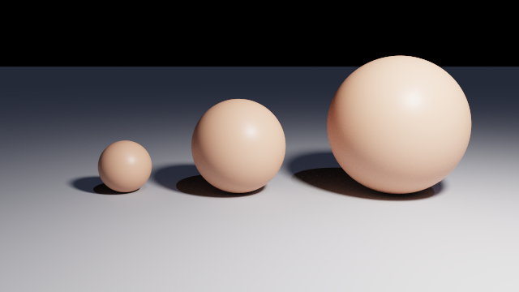

A sphere rests on the ground when its centre is exactly its own radius above it, which is what
the three above do. `sphere { }` with no fields at all is the unit sphere at the origin.

## `box`

A box with its faces on the axes, given as two opposite corners.

| Field | Type | Default | Meaning |
| --- | --- | --- | --- |
| `min` | vec3 | `[-1, -1, -1]` | the corner with the smallest x, y and z |
| `max` | vec3 | `[1, 1, 1]` | the corner with the largest |

<!-- from: scenes/reference/box.chroma -->
```js
// Wide, thin and shallow: a slab.
box {
  min:      [-1.1, 0, -0.6],
  max:      [1.1, 0.5, 0.6],
  material: clay
}
```

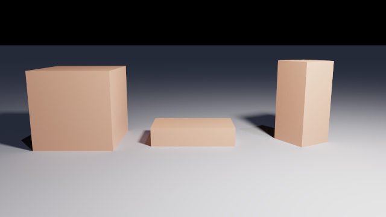

A box is axis-aligned **as written**. To tilt one, use the `rotate` modifier, which is what the
right-hand box above does.

**Refuses** a `min` with any component greater than its counterpart in `max`. Written that way
round the box would be empty, and an empty solid is a mistake in the file rather than a shape.

## `cylinder`

A cylinder between two points, capped at both ends.

| Field | Type | Default | Meaning |
| --- | --- | --- | --- |
| `base` | vec3 | `[0, 0, 0]` | the centre of one end |
| `cap` | vec3 | `[0, 1, 0]` | the centre of the other |
| `radius` | number | `1` | how wide it is |

<!-- from: scenes/reference/cylinder.chroma -->
```js
// Same base, same radius; the cap moved sideways, so the whole solid leans.
cylinder {
  base:     [2.6, 0, 0],
  cap:      [3.9, 1.9, 0.3],
  radius:   0.45,
  material: clay
}
```

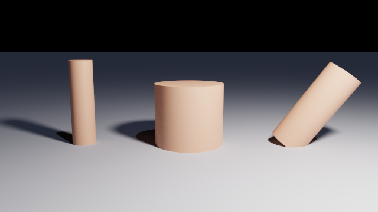

The axis is wherever the two points put it, so a tilted cylinder needs no rotation. It is a
solid rather than a tube: both ends are closed.

**Refuses** a `base` and a `cap` at the same point, which describes no axis and no volume.

## `cone`

A truncated cone: two points, and a radius at each of them.

| Field | Type | Default | Meaning |
| --- | --- | --- | --- |
| `base` | vec3 | `[0, 0, 0]` | the centre of one end |
| `baseRadius` | number | `1` | the radius there |
| `cap` | vec3 | `[0, 1, 0]` | the centre of the other end |
| `capRadius` | number | `0` | the radius there |

<!-- from: scenes/reference/cone.chroma -->
```js
// A flat top half the width of the base: a frustum.
cone {
  base:       [0, 0, 0],
  baseRadius: 0.9,
  cap:        [0, 2, 0],
  capRadius:  0.45,
  material:   clay
}
```

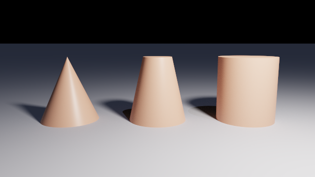

`capRadius` decides which of three shapes you get:

| `capRadius` | What comes out |
| --- | --- |
| `0`, the default | the familiar pointed cone |
| between `0` and `baseRadius` | a frustum: a cone with its point cut off |
| equal to `baseRadius` | a cylinder, described the long way round |

Writing the narrow end as the `base` describes the same solid, upside down.

**Refuses** a negative radius, a `base` and a `cap` at the same point, and both radii at zero,
which is a line rather than a solid.

## `plane`

An infinite half-space: everything on the side the normal points **away** from. It is a solid
rather than a sheet, which is what makes it both a ground and a usable CSG operand.

| Field | Type | Default | Meaning |
| --- | --- | --- | --- |
| `normal` | vec3 | `[0, 1, 0]` | which way is out. Normalised on load |
| `distance` | number | `0` | how far the surface sits along that normal |

<!-- from: scenes/reference/plane.chroma -->
```js
// The ground, with a crater cut out of it by the ball that made it.
difference {
  plane { normal: [0, 1, 0], distance: 0 }
  sphere { center: [-1.5, 0.15, 0], radius: 1.35 }

  material: stone
}

// The wall: the same node with its normal on Z.
plane {
  normal:   [0, 0, 1],
  distance: -3.4,
  material: material { color: [0.42, 0.44, 0.5], roughness: 0.8 }
}
```

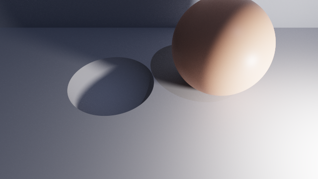

The default is the ground most scenes want: the solid is everything below `y = 0`. Turning the
normal onto another axis gives a wall or a ceiling, and `distance` slides the surface along
that normal.

The normal is normalised as the file is read, so `normal: [0, 2, 0], distance: 3` and
`normal: [0, 1, 0], distance: 3` are the same plane.

`plane` is the only shape whose inside runs to infinity. It takes no bounds and needs none.

**Refuses** a `normal` of all zeros, which points nowhere.

## `torus`

A ring lying in the XZ plane, with the Y axis through its hole.

| Field | Type | Default | Meaning |
| --- | --- | --- | --- |
| `center` | vec3 | `[0, 0, 0]` | the middle of the ring |
| `majorRadius` | number | `1` | from the centre to the middle of the tube |
| `minorRadius` | number | `0.25` | the radius of the tube itself |

<!-- from: scenes/reference/torus.chroma -->
```js
// Stood on edge, which is the only way to see the hole from the front.
torus {
  majorRadius: 0.9,
  minorRadius: 0.3,
  rotate:      [80, 0, 0],
  translate:   [2.9, 1, 0],
  material:    brass
}
```

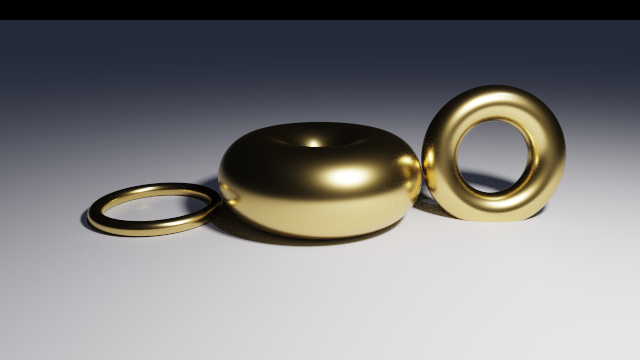

The ring always starts flat. To stand it up, rotate it, as the right-hand one above does.

A torus is the first shape here that is not convex: a ray through the hole and out the other
side is inside it twice.

**Refuses** a `majorRadius` or a `minorRadius` at or below zero, and a `minorRadius` that is
not smaller than the `majorRadius`. A ring thicker than it is wide crosses itself, and what its
inside would be has no single answer.

## `prism`

A closed contour, drawn flat in the XZ plane and swept straight up the Y axis, with a floor and
a lid.

| Field | Type | Default | Meaning |
| --- | --- | --- | --- |
| `points` | list of 2D points | **required** | the contour, in (x, z) |
| `bottom` | number | `0` | the height the sweep starts at |
| `top` | number | `1` | the height it ends at |
| `spline` | `"linear"` or `"bezier"` | `"linear"` | whether the points are corners or curves |
| `steps` | whole number, `1` to `64` | `8` | segments per curve, with `"bezier"` only |

### The two ways to write `points`

A point list may be written as a list of points, or flat, with the numbers of each point
following one another. Both mean exactly the same contour:

```js
prism { points: [[0, 0], [1, 0], [1, 1]] }   // three points, said as points
prism { points: [0, 0,  1, 0,  1, 1] }       // the same three, flat
```

Mixing the two in one field is refused: an array of pairs with a loose number in it is a typo,
and the message names the element that is wrong.

The contour **closes on its own**: the last point joins back to the first, and repeating the
first point at the end is accepted and ignored. At least three points are needed, since two
bound no area.

<!-- from: scenes/reference/prism.chroma -->
```js
// A concave contour, and a floor that is not the ground: the solid runs from y = 0.6 to y = 2.
prism {
  points:    [[-0.9, -0.9], [0.3, -0.9], [0.3, 0], [0.9, 0], [0.9, 0.9], [-0.9, 0.9]],
  bottom:    0.6,
  top:       2,
  translate: [3, 0, 0],
  material:  clay
}
```

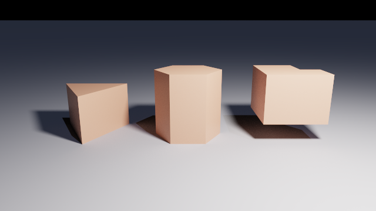

`bottom` and `top` are heights, not a thickness: a prism from `0.6` to `2` is 1.4 tall and
floats. Writing them the other way round is fine and means the same solid. The contour may be
concave, as the L above is.

### Curved edges

With `spline: "bezier"`, the same `points` field is read as **cubic Bezier curves in groups of
four points**: a start, two controls, and an end. Each curve is flattened into `steps` straight
segments while the file loads.

<!-- from: scenes/reference/prism-spline.chroma -->
```js
// The same three corners, joined by three cubic curves that bulge outwards.
prism {
  spline: "bezier",
  steps:  10,
  points: [
    // P0        control      control      P3
    [1, 0],     [1.4, 0.9],  [0.3, 1.5],  [-0.6, 1],
    [-0.6, 1],  [-1.6, 0.6], [-1.5, -0.7], [-0.4, -1],
    [-0.4, -1], [0.4, -1.5], [1.4, -0.9], [1, 0]
  ],
  bottom:    0,
  top:       1.2,
  translate: [1.9, 0, 0],
  material:  material { color: [0.35, 0.55, 0.75], roughness: 0.35 }
}
```

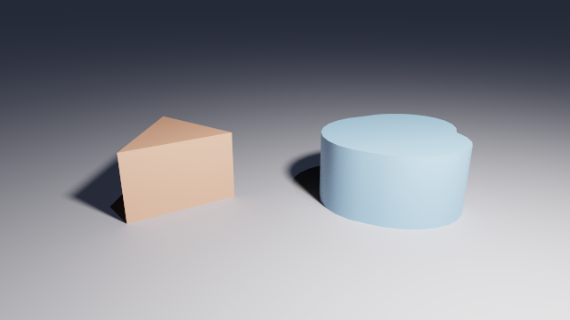

Each curve repeats the previous curve's end as its own start, which is what keeps the outline
continuous, and the last curve comes back to the first point. A curved outline also gets its
shading blended across the joints between segments, so it reads as a curve rather than as a
stack of flats; a linear outline keeps its hard corners, which are deliberate.

`steps` is what fineness costs: see [what `steps` does](#what-steps-does) under `lathe`, where
the same field behaves identically.

### Several contours, and holes

`points` may hold **more than one closed contour**, written with one more level of brackets.
Contours combine by the even-odd rule, so a contour drawn inside another is a hole through the
solid.

```js
// A square washer: an outer square, and a square hole through it.
prism {
  bottom: 0,
  top:    1,
  points: [[[-2, -2], [2, -2], [2, 2], [-2, 2]],
           [[-1, -1], [1, -1], [1, 1], [-1, 1]]]
}
```

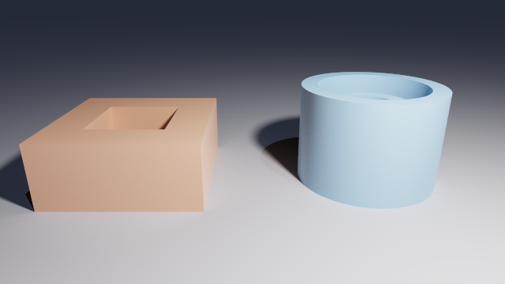

Two levels of brackets is one contour and three is a list of contours. Which one you wrote is
decided by what the first element holds, not by counting: `[[0, 0], [1, 0], [0, 1]]` is one
contour of three points, and `[[[0, 0], [1, 0], [0, 1]]]` is a list of one contour.

Each contour needs its own three points, and the message names which one is short.

**Refuses**

| Written | Reported |
| --- | --- |
| fewer than 3 points in a contour | `'prism' needs at least 3 points in 'points', found 2` |
| an odd number of loose numbers | `'prism' expects 'points' to hold pairs of (x, z) values` |
| a pair list with a loose number in it | `field 'points' expects groups of 2 numbers, and element 3 is a number` |
| `bottom` equal to `top` | `'prism' requires 'bottom' and 'top' to differ` |
| more than 64 points in all, after flattening | `'prism' has 96 points in 'points'; the limit is 64` |

## `lathe`

An outline revolved a full turn about the Y axis.

| Field | Type | Default | Meaning |
| --- | --- | --- | --- |
| `points` | list of 2D points | **required** | the outline, in (radius, y) |
| `spline` | `"linear"` or `"bezier"` | `"linear"` | whether the points are corners or curves |
| `steps` | whole number, `1` to `64` | `8` | segments per curve, with `"bezier"` only |

**The points are not (x, y) but (radius, y):** the first number is how far the outline is from
the axis at that height, the second is the height. Both spellings `prism` accepts are accepted
here, and the outline closes on its own in the same way.

<!-- from: scenes/reference/lathe.chroma -->
```js
// The same field written as points. Up the outside, over the rim, back down the inside.
lathe {
  points: [[0, 0], [0.85, 0.45], [0.9, 0.8], [0.72, 0.8], [0.68, 0.5], [0, 0.16]],
  material: ivory
}
```

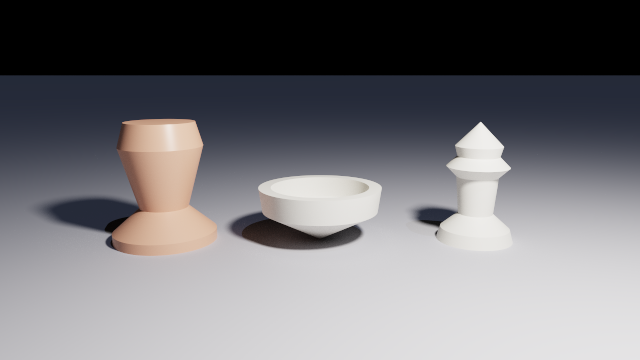

What the outline does decides whether the solid is hollow:

- an outline that runs **up the outside, over the rim and back down the inside** gives a wall
  of that thickness, which is the bowl above
- an outline that **touches the axis** at both ends gives a solid of revolution with no cavity,
  which is the pawn

### Curved outlines

`spline: "bezier"` reads `points` as cubic Bezier curves in groups of four, exactly as `prism`
does, and flattens each into `steps` segments.


The two above have the same profile. The left one is a linear outline and keeps its hard edges;
the right one is the Bezier form, whose shading is blended across the joints, so the highlight
runs continuously instead of breaking into rings.

### What `steps` does

`steps` is how many straight segments each curve becomes.

<!-- from: scenes/reference/spline-steps.chroma -->
```js
lathe {
  spline:    "bezier",
  steps:     1,
  points:    outline,
  translate: [-1.7, 0, 0],
  material:  clay
}
```

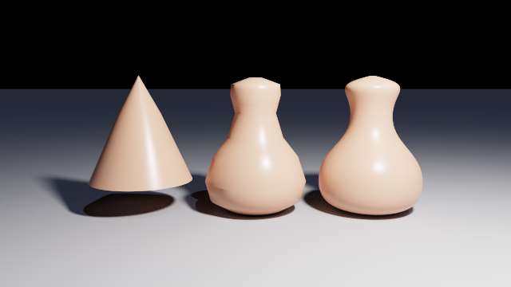

At `steps: 1` every curve is the straight line between its ends. By `steps: 16` the silhouette
is the curve the control points describe. Flattening happens while the scene loads, so a fine
value costs nothing to trace; what it spends is points, and the limit is 64 across all contours
**after** flattening. Three curves at 16 steps is 48 points, and four would be 64.

### Several contours

A lathe takes several contours in the same way a prism does, and that is how a tube is written
as its own wall:

```js
// A tube, as its own wall: an outer outline and an inner one.
lathe {
  points: [[[1.3, 0], [1.3, 2], [1.0, 2], [1.0, 0]],
           [[0.7, 0.3], [0.7, 1.5], [0.4, 1.5], [0.4, 0.3]]]
}
```

**Refuses** everything `prism` refuses, plus any point whose radius is below zero: an outline
that crosses the axis sweeps a surface that does not bound a solid.

## `sphereSweep`

The volume swept by a sphere whose centre **and radius** both change along a path: a tube, a
cable, a tentacle, a bead of solder.

| Field | Type | Default | Meaning |
| --- | --- | --- | --- |
| `spheres` | groups of 4 numbers | **required** | the path, as `x, y, z, radius` |
| `spline` | `"linear"` or `"bezier"` | `"linear"` | whether the path is straight between spheres or curved |
| `steps` | whole number, `1` to `64` | `4` | segments per curve, with `"bezier"` only |

`spheres` takes the same two spellings a point list does, in groups of four rather than two:
`[[x, y, z, r], ...]` or the flat `[x, y, z, r, ...]`.

<!-- from: scenes/reference/spheresweep.chroma -->
```js
// Four spheres, as points: the radius tapers from 0.45 to 0.12 along the way.
sphereSweep {
  spheres: [
    [-1.1, 0.45, 0.5,  0.45],
    [-0.4, 1.5,  0,    0.32],
    [ 0.5, 1.9, -0.4,  0.2],
    [ 1.2, 2.4,  0.1,  0.12]
  ],
  translate: [-2, 0, 0],
  material:  clay
}
```

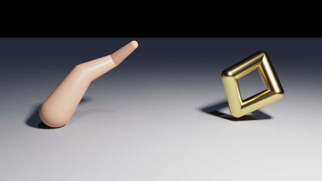

Each consecutive pair of spheres contributes the tube between them, and the joints are seamless
because two neighbouring pieces share a whole sphere rather than meeting at a face.

**A path is open**: unlike a contour it does not close on itself, so `n` spheres give `n - 1`
segments. To make a loop, repeat the first sphere at the end, which is what the right-hand
sweep above does.

### Curved paths

`spline: "bezier"` curves the path itself. `spheres` is then read as **groups of four spheres**,
sixteen numbers per curve, and each curve is flattened into `steps` segments.

<!-- from: scenes/reference/spheresweep-spline.chroma -->
```js
// Two cubic curves through the same run of numbers, each flattened into six tubes.
sphereSweep {
  spline: "bezier",
  steps:  6,
  spheres: [
    // P0                 control            control            P3
    -1.5, 0.3, 0, 0.3,   -0.5, 1.5, 0, 0.3,  0.5, 1.5, 0, 0.2,  1.5, 0.3, 0, 0.2,
     1.5, 0.3, 0, 0.2,    2.1, 0.1, 0, 0.18, 2.4, 0.9, 0, 0.14, 2.5, 1.2, 0, 0.12
  ],
  translate: [1, 0, 0],
  material:  blue
}
```

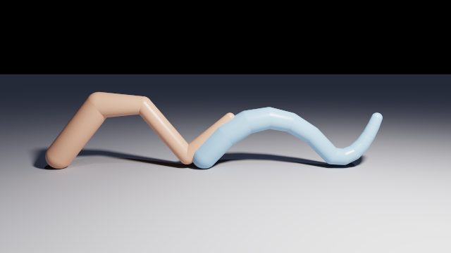

The radius is the fourth component of the same curve, so a taper follows the bend instead of
stepping at each joint.

`steps` defaults to `4` here rather than to `8`, because each step of a path is a whole tube
rather than a line segment. A path of `n` curves flattens to `1 + n * steps` spheres, and the
limit of 32 is applied **after** flattening.

**Refuses**

| Written | Reported |
| --- | --- |
| fewer than 2 spheres | `'sphereSweep' needs at least 2 spheres in 'spheres', found 1` |
| a count that is not a multiple of 4 | `'sphereSweep' expects 'spheres' to hold groups of (x, y, z, radius) values` |
| a radius at or below 0 | `'sphereSweep' requires every radius in 'spheres' to be above 0` |
| more than 32 spheres after flattening | `'sphereSweep' has 65 spheres after flattening; the limit is 32. Lower 'steps' or use fewer curves` |

## `quadric`

The solid where a general quadratic in x, y and z is at most zero:

```
A x² + B y² + C z² + D xy + E xz + F yz + G x + H y + I z + J ≤ 0
```

| Field | Type | Default | Meaning |
| --- | --- | --- | --- |
| `squared` | vec3 | `[1, 1, 1]` | `[A, B, C]`, the x², y² and z² terms |
| `mixed` | vec3 | `[0, 0, 0]` | `[D, E, F]`, the xy, xz and yz terms |
| `linear` | vec3 | `[0, 0, 0]` | `[G, H, I]`, the x, y and z terms |
| `constant` | number | `-1` | `J` |

**The inside is where the expression is negative**, which is what makes the defaults a ball
rather than everything outside one: `quadric { }` is `x² + y² + z² - 1 ≤ 0`, the unit sphere.

<!-- from: scenes/reference/quadric.chroma -->
```js
// x^2 - y^2 + z^2 - 0.35 <= 0: a hyperboloid of one sheet.
intersection {
  quadric { squared: [1, -1, 1], constant: -0.35 }
  box { }

  translate: [-1.2, 1.05, 0],
  material:  ivory
}
```

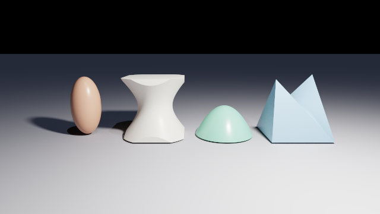

This is the family the other shapes do not reach. A few worth knowing:

| Coefficients | Shape |
| --- | --- |
| `squared: [4, 1, 4], constant: -1` | an ellipsoid: a sphere with a radius per axis |
| `squared: [1, -1, 1], constant: -0.35` | a hyperboloid of one sheet, the waisted tube |
| `squared: [1, -1, 1], constant: 0.35` | a hyperboloid of two sheets: one solid, two pieces |
| `squared: [1, 0, 1], linear: [0, 1, 0], constant: 0` | a paraboloid, opening downward |
| `mixed: [0, 1, 0], linear: [0, 1, 0], constant: 0` | a saddle |

**A quadric is usually infinite**, and unlike `plane` that is rarely what you want to look at.
Give it bounds with an `intersection`, as every shape in the picture above has:

```js
intersection {
  quadric { squared: [1, -1, 1], constant: -0.35 }
  box { min: [-1, -1, -1], max: [1, 1, 1] }
}
```

**Refuses** a `squared` and a `mixed` that are both all zeros. With no quadratic term left the
surface is a plane, which `plane` describes and bounds properly.

`quadric` is not available with the `--sdf` backend, which reports it and renders nothing.

## `blob`

A surface drawn where a **sum of fields** reaches a threshold. Components that overlap add up,
so instead of meeting at a seam they melt into one another.

| Field | Type | Default | Meaning |
| --- | --- | --- | --- |
| `threshold` | number above `0` | `1` | the value the sum has to reach for a point to be inside |
| children | `blobSphere` or `blobCylinder` | **at least one** | the components, written as child blocks |

Each component contributes `strength * (1 - (d / radius)²)²` out to its own `radius`, and
nothing at all beyond it. `d` is the distance to the component: to its centre for a
`blobSphere`, to the segment between its ends for a `blobCylinder`.

<!-- from: scenes/reference/blob.chroma -->
```js
// Two field components at the same two places: one surface, no seam.
blob {
  threshold: 0.55,

  blobSphere { center: [-0.45, 0, 0], radius: 1.1, strength: 1 }
  blobSphere { center: [ 0.45, 0, 0], radius: 1.1, strength: 1 }

  translate: [1.6, 0.9, 0],
  material:  jade
}
```

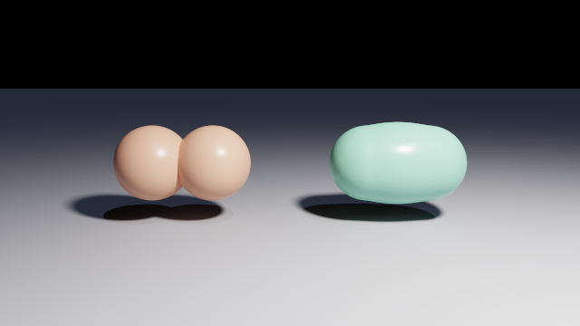

The left-hand shape is a `union` of two ordinary spheres and keeps the crease where they cross.
The right-hand one is the blob above.

**A component's `radius` is the reach of its field, not the size of the result.** The surface
always sits well inside the component that made it: one component of `radius: 1.1` and
`strength: 1` at `threshold: 0.55` produces a ball of radius 0.56.

### `blobSphere` and `blobCylinder`

| Node | Field | Type | Default | Meaning |
| --- | --- | --- | --- | --- |
| `blobSphere` | `center` | vec3 | `[0, 0, 0]` | where the field is strongest |
| | `radius` | number above `0` | `1` | how far the field reaches |
| | `strength` | number | `1` | how much it adds at its centre |
| `blobCylinder` | `base` | vec3 | `[0, 0, 0]` | one end of the segment |
| | `cap` | vec3 | `[0, 1, 0]` | the other end |
| | `radius` | number above `0` | `1` | how far the field reaches from that segment |
| | `strength` | number | `1` | how much it adds along it |

A `blobCylinder` is a capsule: rounded at both ends, because the distance is measured to the
segment. The two kinds mix freely inside one `blob`, and a sphere overlapping a cylinder merges
exactly as two spheres do.

<!-- from: scenes/reference/blob-cylinder.chroma -->
```js
blob {
  threshold: 0.5,

  blobCylinder { base: [0, 1.4, 0], cap: [0, 0.1, 0],     radius: 0.55 }
  blobCylinder { base: [0, 1.4, 0], cap: [-1.1, 0.1, 0],  radius: 0.55 }
  blobCylinder { base: [0, 1.4, 0], cap: [0.5, 0.1, 0.9], radius: 0.55 }

  translate: [-1.8, 0, 0],
  material:  jade
}
```

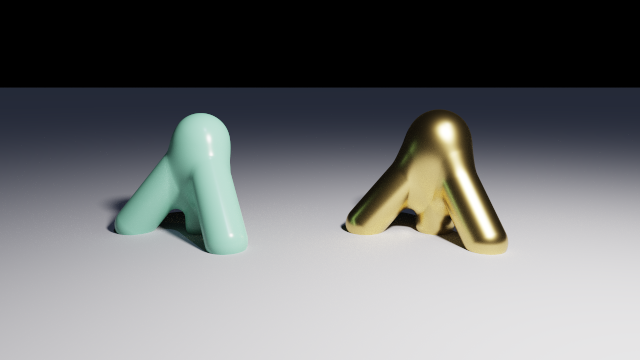

### What `threshold` does

Raising `threshold` pulls the surface in towards the components, and far enough pulls a shape
apart into separate pieces.

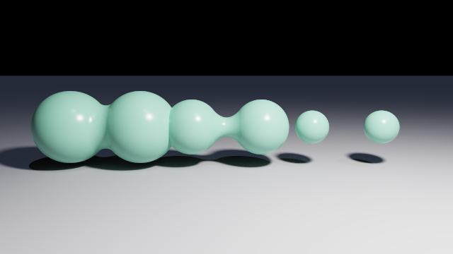

Left to right: `0.25`, where the two fields overlap far enough out that the surface is one drop;
`0.5`, where it has been drawn in to a waist between the two centres; and `0.8`, which the sum
halfway between them no longer reaches, so the surface that joined them is gone and one blob has
become two balls.

Where the surface ends up also depends on how far apart the components are: two that sit close
together add up to more than either alone everywhere between them, and no threshold will part
them.

### What a negative `strength` does

A component with a negative `strength` **subtracts** field where it overlaps a positive one,
which presses a smooth dent into the surface rather than cutting one out of it.

<!-- from: scenes/reference/blob-strength.chroma -->
```js
// The same three, and a negative one pressed into the top of the middle.
blob {
  threshold: 0.5,

  blobSphere { center: [-0.5, 0, 0], radius: 1.1 }
  blobSphere { center: [ 0.5, 0, 0], radius: 1.1 }
  blobSphere { center: [ 0, 0.55, 0], radius: 1.1 }
  blobSphere { center: [ 0, 1.1, 0.35], radius: 0.9, strength: -1 }

  translate: [1.8, 1, 0],
  material:  jade
}
```

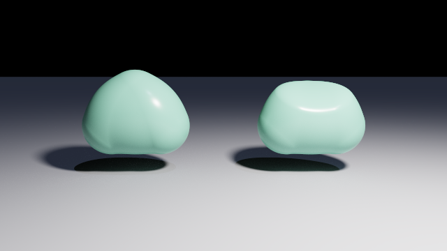

A negative component on its own describes nothing: with no positive field around it the sum
never reaches the threshold.

**Refuses**

| Written | Reported |
| --- | --- |
| a `blob` with no components | `'blob' needs at least one component` |
| `threshold` at or below 0 | `'blob' requires a 'threshold' above 0` |
| a component `radius` at or below 0 | `'blobSphere' requires a 'radius' above 0` |
| a `blobCylinder` whose ends are one point | `'blobCylinder' requires 'base' and 'cap' to be different points; a component with both ends at one place is a 'blobSphere'` |
| any other child | `'blob' takes 'blobSphere' and 'blobCylinder' components` |
| more than 16 components | `'blob' has 17 components; the limit is 16` |

## `mesh`

Triangles loaded from a file, treated as a solid.

| Field | Type | Default | Meaning |
| --- | --- | --- | --- |
| `file` | string | **required** | path to the model, in quotes |
| `close` | `true` or `false` | `false` | fill the holes in a model that is not closed |
| `smooth` | `true` or `false` | `false` | shade with interpolated normals instead of per face |
| `maxSpans` | whole number, `1` to `32` | `4` | how many separate stretches of one ray may be inside |

The path is resolved **against the scene file that wrote it**, never against the directory the
renderer was started from, so a folder of scenes beside a folder of models keeps working
wherever it is run from.

<!-- from: scenes/reference/mesh.chroma -->
```js
// A Wavefront .obj, closed at load so that it has an inside.
mesh {
  file:      "../assets/teapot.obj",
  close:     true,
  smooth:    true,
  material:  clay,
  translate: [-0.217, 0, 0],
  scale:     0.44,
  translate: [-1.9, 0, 0]
}
```

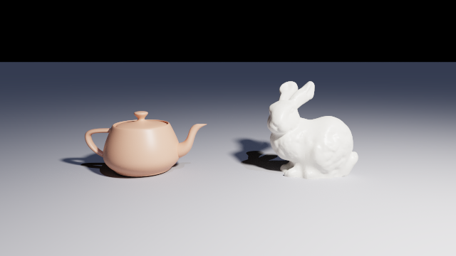

### The two formats

The extension decides which reader is used, and nothing else does.

| Extension | What is read | What is ignored |
| --- | --- | --- |
| `.obj` | Wavefront text: `v` positions, `vn` normals, `f` faces of any length | `vt`, `g`, `o`, `s`, `usemtl`, `mtllib`, and anything else. Materials in the file never reach the scene |
| `.stl` | both encodings, binary and text, told apart by the file's own size | the per-facet normal, since the winding already says which way a triangle faces |

Details worth knowing before exporting a model:

- **A face with more than three vertices is triangulated** as a fan from its first vertex.
  That is right for a convex face; a concave quad may come out wrong.
- **`.obj` face indices** may be `v`, `v/vt`, `v//vn` or `v/vt/vn`, one-based, and a negative
  index counts back from the end.
- **`.obj` normals are folded onto positions**: where a file gives one normal per position,
  which is what a smoothed export does, `smooth: true` reproduces it exactly; where it gives
  several, they are averaged.
- **`.stl` has no shared vertices**, so its corners are welded when it loads. That is what lets
  a format with no topology be checked for closedness at all.
- The **same file used twice is loaded, checked and uploaded once**.

### A mesh has to be a solid

Every shape in this language needs a well-defined inside, and most models published on the
internet do not have one. The file is checked before anything else happens to it:

| What is wrong | What it says | Repairable |
| --- | --- | --- |
| a hole: an edge with only one triangle on it | `the mesh is not closed: 160 boundary edges, the first at ...` | yes, with `close: true` |
| an edge whose two triangles run the same way | `the mesh is wound inconsistently: ... the first at ...` | no |
| an edge with three or more triangles on it | `the mesh is not manifold: ... the first at ...` | no |

Each message names a count and the position of the first offender, so the model can be found
and fixed in the tool that made it. `close: true` fills every hole with a fan of triangles round
its own centre, which is what lets the Utah teapot, published open at its rim, be used at all.
The other two are refused whatever `close` says.

### What `smooth` does

`smooth` changes the shading and nothing else. The silhouette is the same tessellation either
way.

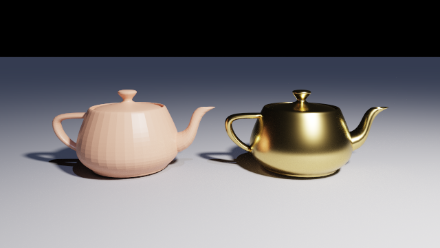

Left is the default, where every triangle shades by its own plane. Right is `smooth: true`,
where normals are interpolated across each triangle, taken from the file where it supplies them
and derived from the faces around each vertex where it does not.

### What `maxSpans` is for

`maxSpans` is how many separate stretches of one ray may lie inside the mesh. A ray through a
teapot enters the body, leaves it, enters the spout and leaves again, which is two. Four is
enough for every model in `scenes/`.

A ray that crosses more often than this loses its last stretches, which shows as a slice
missing from the solid. **If a concave model renders with a gap, raise it.**

**Refuses** a file it cannot find, an extension other than `.obj` or `.stl`, a file that decodes
to no triangles, a model that fails one of the three checks above, and a model of more than
2,000,000 triangles.

`mesh` is not available with the `--sdf` backend.

## `heightField`

A landscape: a square grid of heights over the footprint `[-1, 1]` in x and z, in whatever
units the scene wrote them.

| Field | Type | Default | Meaning |
| --- | --- | --- | --- |
| `height` | function of two numbers | one of the two required | called once per sample, with the x and z of that sample |
| `heights` | square grid of numbers | one of the two required | the samples, written out |
| `resolution` | whole number, `1` to `1024` | `128` | cells on a side. With `height` only |
| `base` | number | just under the lowest sample | where the floor of the solid sits |
| `smooth` | `true` or `false` | `false` | shade with interpolated normals instead of per facet |
| `maxSpans` | whole number, `1` to `32` | `4` | how many separate stretches of one ray may be inside |

**It is a solid, not a sheet.** The shape is everything under the terrain, walled at the edges
of the footprint and floored underneath, so it stands in `union`, `intersection` and
`difference` like any sphere.

**Exactly one of `height` and `heights` is required.** Neither is not a shape, and both is two
answers to one question.

### From a function

`height` takes a function of two numbers, and the node calls it once for every sample with the
x and z of that sample rather than with its index. That is what makes `resolution` say how
finely rather than what shape: raising it refines the same landscape.

<!-- from: scenes/reference/heightfield.chroma -->
```js
// Two octaves of noise, summed in the language. Any function of two numbers will do.
function terrain(x, z) {
  return perlin(x * 1.6, z * 1.6) * 0.9 + perlin(x * 3.9, z * 3.9) * 0.3;
}

heightField {
  height:     terrain,
  resolution: 96,
  smooth:     true,
  material:   ivory,
  scale:      [1.6, 1.1, 1.6],
  translate:  [-1.9, 0, 0]
}
```

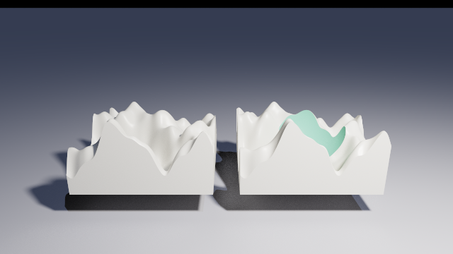

A built-in is as good as a declared function, so `height: perlin` is a landscape in one line.
The footprint is always two units across, so `scale` is how a field becomes the size the scene
wants.

The function has to take exactly two arguments and return a finite number for every sample, and
both of those are reported by name if they do not hold.

### From a grid

`heights` takes the numbers instead: an array of rows, every row the same length, and as many
rows as there are numbers in a row.

<!-- from: scenes/reference/heightfield-heights.chroma -->
```js
// Three rows of three: two cells a side, and every facet is visible.
heightField {
  heights: [
    [0, 0.4, 0],
    [0.4, 1.2, 0.4],
    [0, 0.4, 0]
  ],
  material:  clay,
  scale:     [1.4, 1, 1.4],
  translate: [1.7, 0, 0]
}
```

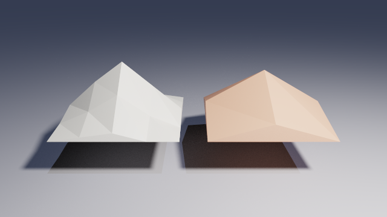

A grid of `n` rows is `n - 1` cells a side, so five rows of five is four cells. The grid is its
own resolution, and writing `resolution` beside `heights` is refused rather than ignored.

> **`heights` is for small grids.** Arrays here are values, so filling a fine grid in a loop is
> far slower than it looks. Use `height` for anything above a handful of cells a side.

### What `resolution` does

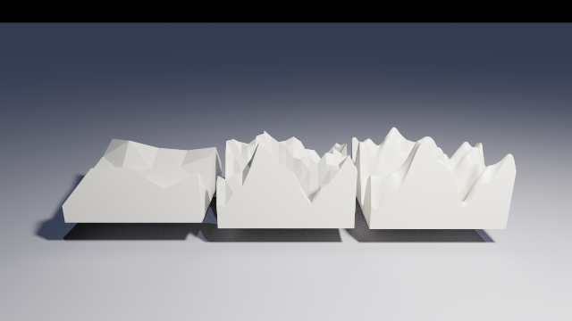

The three fields above are one function sampled at `4`, `16` and `128` cells. The default of
128 is 16,641 samples and loads instantly; the largest allowed, 1,024, is a million calls of
your function and takes a few seconds.

### What `base` does

`base` is where the floor sits, in the same units as the heights. Left out, it settles just
under the lowest sample, so a terrain is a closed solid on its own with nothing else to say.

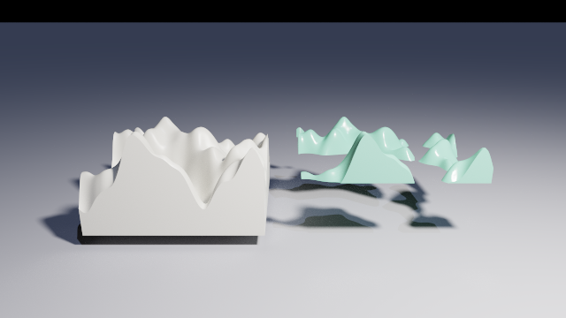

Written explicitly it means what it says, and the solid is simply absent wherever the terrain
falls below it, which is how a sea bed, a plateau or an island is cut out of a landscape that
already exists. A `base` above the tallest sample leaves no solid and is refused.

### What `smooth` does

As on a mesh, it changes the shading and not the silhouette.

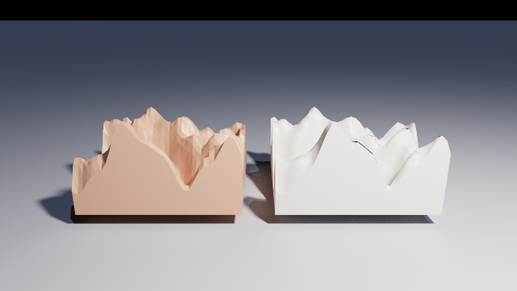

Left is the default, where each of a cell's two triangles shades by its own plane. Right is
`smooth: true`, where the normals come from differences over the grid itself.

`maxSpans` means exactly what it means on a `mesh`: a ray low over a landscape passes through
one ridge, out again and into the next. Raise it if a terrain seen edge-on renders with a gap.

**Refuses** neither source or both, a `resolution` beside `heights`, a grid that is not square,
a grid of fewer than two rows, a grid more than 1,025 rows across, a `height` that is not a
function of two numbers, a sample that is not a finite number, and a `base` above the tallest
sample.

`heightField` is not available with the `--sdf` backend.

## Limits

Nothing here is clamped: going past one of these is refused with a message naming the field.

| Shape | Limit |
| --- | --- |
| `prism`, `lathe` | 64 points across all contours, counted **after** flattening |
| `sphereSweep` | 32 spheres, counted **after** flattening |
| `blob` | 16 components, of either kind |
| `mesh` | 2,000,000 triangles |
| `heightField` | 1,024 cells a side, which is 1,050,625 samples |
| `prism`, `lathe`, `sphereSweep` | `steps` from 1 to 64 |
| `mesh`, `heightField` | `maxSpans` from 1 to 32 |

### What a shape costs

A **span** is a stretch of one ray that lies inside a solid, and how many a shape can occupy at
once is what decides how much work it is:

| Shape | Spans |
| --- | --- |
| `sphere`, `box`, `cylinder`, `cone`, `plane` | 1 |
| `torus`, `quadric` | 2 |
| `prism` | points / 2 |
| `lathe` | points |
| `blob` | components |
| `sphereSweep` | spheres - 1 |
| `mesh`, `heightField` | whatever `maxSpans` says |

Combining shapes adds their spans up: see
[scene-composition.md](scene-composition.md#what-a-scene-may-hold). The renderer prints the
widest shape in the scene when it loads, so this is a number you can read rather than work out.
